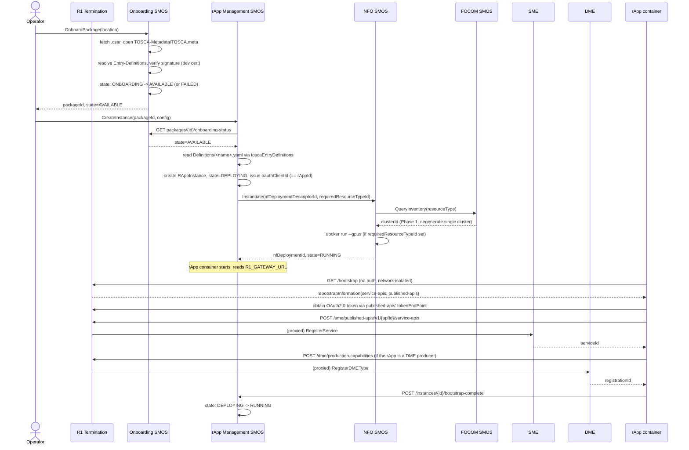

# Call Flow: rApp Onboarding → Running Instance

Stitches together: Onboarding/rApp Mgmt LLD sections 1-6, Foundational Platform LLD section 4.4, NFO+FOCOM LLD section 4.

**Key decisions this flow depends on:**
- `RAppInstance.instanceId` (via `oauth_client_id`) **is** the rAppId used in every subsequent SME/DME call — Foundational Platform LLD section 1.
- NFO always resolves `clusterId` through FOCOM before placing a workload, even though Phase 1's answer is always the same degenerate cluster — NFO+FOCOM LLD section 4.
- Bootstrap never returns an events-subscription endpoint — only `service-apis` and `published-apis` — Foundational Platform LLD section 4.1.
