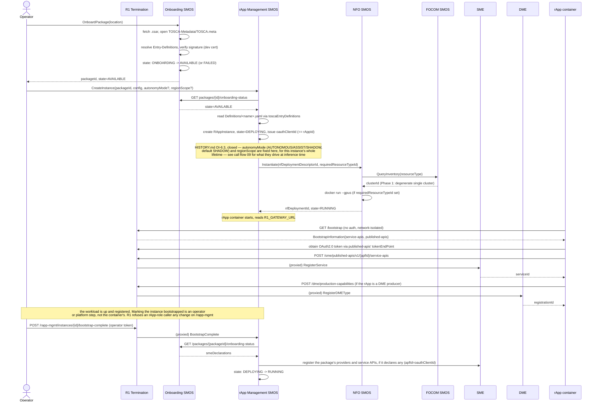

# Call Flow: rApp Onboarding → Running Instance

An operator onboards an rApp package and creates an instance of it. rApp Management
deploys the instance's workload through NFO, which places it on a FOCOM cluster, and the
running container bootstraps through R1 Termination: it registers its services with SME
(and its data types with DME when it is a producer). The instance becomes `RUNNING` when an
operator, or the platform's deployment manager, reports `bootstrap-complete` for it. The
container does not: R1 Termination refuses an rApp-role caller any change on rApp Management
(see the last bullet below). Design sources: Onboarding/rApp Mgmt LLD sections 1-6, Foundational Platform LLD section
4.4, NFO+FOCOM LLD section 4.

```mermaid
sequenceDiagram
    actor Operator
    participant R1 as R1 Termination
    participant Onb as Onboarding SMOS
    participant Rapp as rApp Management SMOS
    participant NFO as NFO SMOS
    participant Focom as FOCOM SMOS
    participant SME as SME
    participant DME as DME

    Operator->>Onb: OnboardPackage(location)
    Onb->>Onb: fetch .csar, open TOSCA-Metadata/TOSCA.meta
    Onb->>Onb: resolve Entry-Definitions, verify signature (dev cert)
    Onb->>Onb: state: ONBOARDING -> AVAILABLE (or FAILED)
    Onb-->>Operator: packageId, state=AVAILABLE

    Operator->>Rapp: CreateInstance(packageId, config, autonomyMode?, regionScope?)
    Rapp->>Onb: GET packages/{id}/onboarding-status
    Onb-->>Rapp: state=AVAILABLE
    Rapp->>Rapp: read Definitions/<name>.yaml via toscaEntryDefinitions
    Rapp->>Rapp: create RAppInstance, state=DEPLOYING, issue oauthClientId (== rAppId)
    Note over Rapp: HISTORY.md OI-6.3, closed — autonomyMode (AUTONOMOUS/ASSIST/SHADOW,<br/>default SHADOW) and regionScope are fixed here, for this instance's whole<br/>lifetime — see call flow 09 for what they drive at inference time

    Rapp->>NFO: Instantiate(nfDeploymentDescriptorId, requiredResourceTypeId)
    NFO->>Focom: QueryInventory(resourceType)
    Focom-->>NFO: clusterId (Phase 1: degenerate single cluster)
    NFO->>NFO: docker run --gpus (if requiredResourceTypeId set)
    NFO-->>Rapp: nfDeploymentId, state=RUNNING

    Note over Rapp: rApp container starts, reads R1_GATEWAY_URL

    participant Container as rApp container
    Container->>R1: GET /bootstrap (no auth, network-isolated)
    R1-->>Container: BootstrapInformation{service-apis, published-apis}
    Container->>R1: obtain OAuth2.0 token via published-apis' tokenEndPoint
    Container->>R1: POST /sme/published-apis/v1/{apfId}/service-apis
    R1->>SME: (proxied) RegisterService
    SME-->>Container: serviceId

    Container->>R1: POST /dme/production-capabilities (if the rApp is a DME producer)
    R1->>DME: (proxied) RegisterDMEType
    DME-->>Container: registrationId

    Note over Operator,Rapp: the workload is up and registered. Marking the instance bootstrapped is an operator<br/>or platform step, not the container's. R1 refuses an rApp-role caller any change on /rapp-mgmt
    Operator->>R1: POST /rapp-mgmt/instances/{id}/bootstrap-complete (operator token)
    R1->>Rapp: (proxied) BootstrapComplete
    Rapp->>Onb: GET /packages/{packageId}/onboarding-status
    Onb-->>Rapp: smeDeclarations
    Rapp->>SME: register the package's providers and service APIs, if it declares any (apfId=oauthClientId)
    Rapp->>Rapp: state: DEPLOYING -> RUNNING
```

**Key decisions this flow depends on:**
- `RAppInstance.instanceId` (via `oauth_client_id`) **is** the rAppId used in every subsequent SME/DME call — Foundational Platform LLD section 1.
- NFO always resolves `clusterId` through FOCOM before placing a workload, even though Phase 1's answer is always the same degenerate cluster — NFO+FOCOM LLD section 4.
- Bootstrap never returns an events-subscription endpoint — only `service-apis` and `published-apis` — Foundational Platform LLD section 4.1.
- `autonomyMode` and `regionScope` are fixed at `CreateInstance` for the instance's whole lifetime; call flow 09 shows what they drive (HISTORY.md OI-6.3).
- **Who sends `bootstrap-complete`.** An operator (the Operator GUI's "Mark bootstrapped" button, or the API with an operator token) or the platform's deployment manager once it sees the workload up. Not the rApp container. R1 Termination's role policy (`smo_shared/roles.py`, PR-SEC-14) lets an rApp-role caller change only what is on its allow-list, and `/rapp-mgmt` is not on it, so the call gets 403 `ROLE_NOT_PERMITTED`. The handler checks only that the instance is `DEPLOYING`, so it could not tell which instance an rApp caller is: if rApps could call it, any rApp could mark any other rApp's instance `RUNNING`. NFO has no container runtime in this build, so nothing reports the workload up by itself: the operator, or a script standing in for the deployment manager (the `tx-muting-rapp` sample's `start.sh`), does. Everything the container does itself in the diagram (the bootstrap read, the token, the SME and DME registrations) is on the rApp allow-list.
- **Standards.** Neither O-RAN.WG2.R1GAP nor O-RAN.WG2.R1AP defines `bootstrap-complete`, instance states or who reports a workload up. R1GAP clause 3.1.8 defines the rApp's own registration (it supplies its identity and credentials and receives an rApp identifier), which this SMO realises through SME invoker, provider and service registration, all of which the rApp may do. The Non-RT RIC architecture specification also allows registration "by an entity acting on its behalf" (clause 8.2.1), which is what rApp Management does with the package's SME declarations at `bootstrap-complete`. Marking an instance `RUNNING` is this SMO's own lifecycle step.
- `CreateInstance` also records the instance's use of its package with Onboarding (`usage/start`), and `TerminateInstance` stops it (`usage/stop`), so Onboarding's cascade-delete guard (call flow 06) sees every deployed instance.
