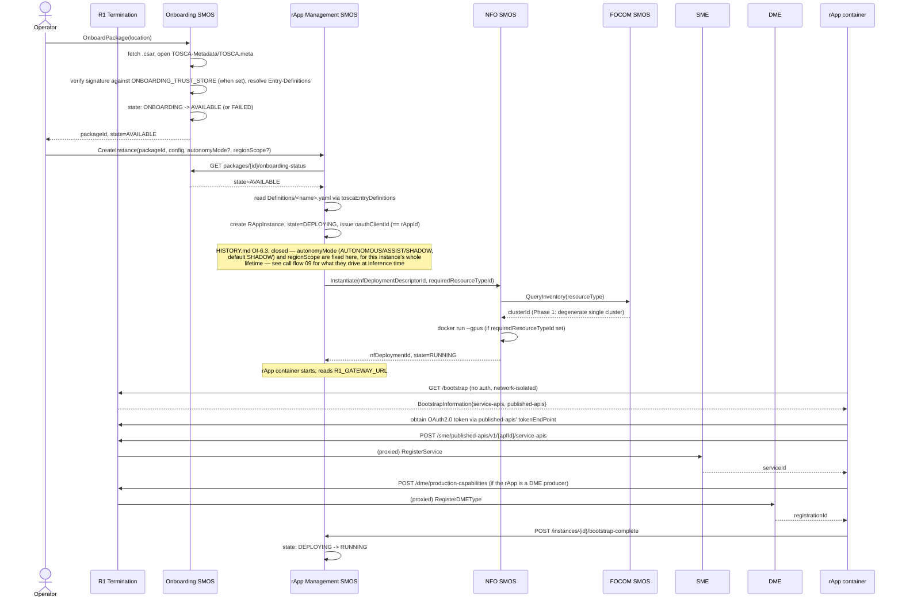

# Call Flow: rApp Onboarding → Running Instance

An operator onboards an rApp package and creates an instance of it. rApp Management
deploys the instance's workload through NFO, which places it on a FOCOM cluster, and the
running container bootstraps through R1 Termination: it registers its services with SME
(and its data types with DME when it is a producer) and then reports `bootstrap-complete`.
Design sources: Onboarding/rApp Mgmt LLD sections 1-6, Foundational Platform LLD section
4.4, NFO+FOCOM LLD section 4.

```mermaid
sequenceDiagram
    actor Operator
    participant R1 as R1 Termination
    participant Onb as Onboarding SMOS
    participant Rapp as rApp Management SMOS
    participant NFO as NFO SMOS
    participant Focom as FOCOM SMOS
    participant SME as SME
    participant DME as DME

    Operator->>Onb: OnboardPackage(location)
    Onb->>Onb: fetch .csar, open TOSCA-Metadata/TOSCA.meta
    Onb->>Onb: verify signature against ONBOARDING_TRUST_STORE (when set), resolve Entry-Definitions
    Onb->>Onb: state: ONBOARDING -> AVAILABLE (or FAILED)
    Onb-->>Operator: packageId, state=AVAILABLE

    Operator->>Rapp: CreateInstance(packageId, config, autonomyMode?, regionScope?)
    Rapp->>Onb: GET packages/{id}/onboarding-status
    Onb-->>Rapp: state=AVAILABLE
    Rapp->>Rapp: read Definitions/<name>.yaml via toscaEntryDefinitions
    Rapp->>Rapp: create RAppInstance, state=DEPLOYING, issue oauthClientId (== rAppId)
    Note over Rapp: HISTORY.md OI-6.3, closed — autonomyMode (AUTONOMOUS/ASSIST/SHADOW,<br/>default SHADOW) and regionScope are fixed here, for this instance's whole<br/>lifetime — see call flow 09 for what they drive at inference time

    Rapp->>NFO: Instantiate(nfDeploymentDescriptorId, requiredResourceTypeId)
    NFO->>Focom: QueryInventory(resourceType)
    Focom-->>NFO: clusterId (Phase 1: degenerate single cluster)
    NFO->>NFO: docker run --gpus (if requiredResourceTypeId set)
    NFO-->>Rapp: nfDeploymentId, state=RUNNING

    Note over Rapp: rApp container starts, reads R1_GATEWAY_URL

    participant Container as rApp container
    Container->>R1: GET /bootstrap (no auth, network-isolated)
    R1-->>Container: BootstrapInformation{service-apis, published-apis}
    Container->>R1: obtain OAuth2.0 token via published-apis' tokenEndPoint
    Container->>R1: POST /sme/published-apis/v1/{apfId}/service-apis
    R1->>SME: (proxied) RegisterService
    SME-->>Container: serviceId

    Container->>R1: POST /dme/production-capabilities (if the rApp is a DME producer)
    R1->>DME: (proxied) RegisterDMEType
    DME-->>Container: registrationId

    Container->>Rapp: POST /instances/{id}/bootstrap-complete
    Rapp->>Rapp: state: DEPLOYING -> RUNNING
```

**Key decisions this flow depends on:**
- `RAppInstance.instanceId` (via `oauth_client_id`) **is** the rAppId used in every subsequent SME/DME call — Foundational Platform LLD section 1.
- NFO always resolves `clusterId` through FOCOM before placing a workload, even though Phase 1's answer is always the same degenerate cluster — NFO+FOCOM LLD section 4.
- Bootstrap never returns an events-subscription endpoint — only `service-apis` and `published-apis` — Foundational Platform LLD section 4.1.
- `autonomyMode` and `regionScope` are fixed at `CreateInstance` for the instance's whole lifetime; call flow 09 shows what they drive (HISTORY.md OI-6.3).
- `CreateInstance` also records the instance's use of its package with Onboarding (`usage/start`), and `TerminateInstance` stops it (`usage/stop`), so Onboarding's cascade-delete guard (call flow 06) sees every deployed instance.
