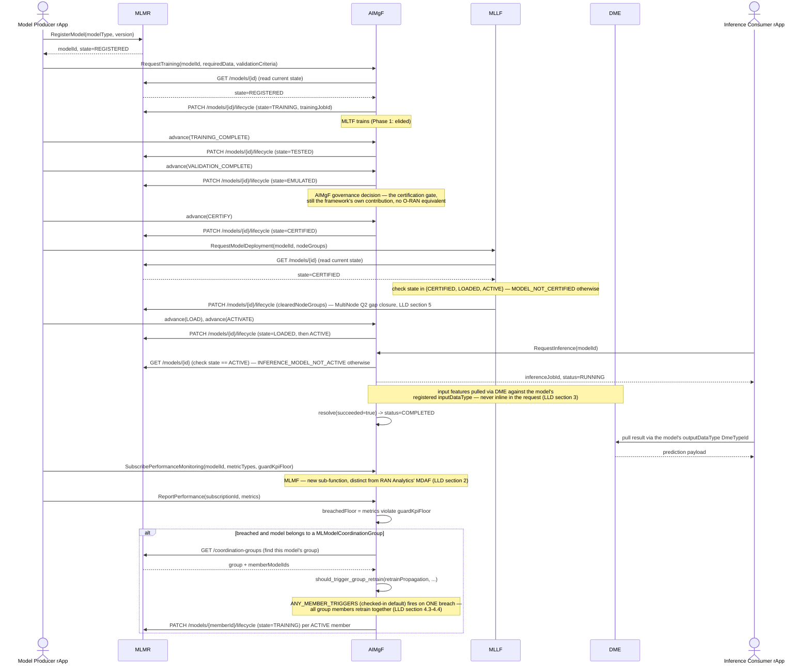

# Call Flow: AI/ML Model — Register → Train → Certify → Deploy → Infer → Monitor

Stitches together the full lifecycle AI/ML Workflow LLD sections 1-8 close: the certification
pipeline (v1.3, unchanged shape), the inference API (LLD section 3, new), and MLMF
monitoring (LLD section 2, new) feeding back into a retrain trigger.

Wave 1 of the AI Platform Service Decomposition split this flow's single
former `ai-ml-workflow` participant into three real services — MLMR
(model repository), AIMgF (lifecycle orchestration), MLLF (loading/
deployment) — talking to each other through R1 Termination like every
other cross-module call in this build, not a shared in-process ORM. See
`docs/architecture/SERVICE_OWNERSHIP_MATRIX.md` for the full ownership
split and `docs/ownership/{AIMGF,MLMR,MLLF}_OWNERSHIP.md` for each
service's own detail.

**Key decisions this flow depends on:**
- No lightweight update path — retraining always re-enters at `TRAINING`, never skips to `ACTIVE` (unchanged project design principle, confirmed by every LLD pass touching this module).
- The inference result is pulled via DME, never returned inline from the R1-facing inference API — symmetric with training never carrying the trained artifact inline either.
- `ANY_MEMBER_TRIGGERS` means a coordination group's retrain trigger is genuinely group-scoped — one member's breach retrains the shared model all members depend on, not just that member's own pipeline.
- MLMR's own row is the single source of truth for `state`/`trainingJobId`/`clearedNodeGroups` this wave — AIMgF and MLLF never keep their own copy, they read and write it through MLMR's `GET`/`PATCH /models/{id}/lifecycle` on every decision. Wave 2 deepens this into AIMgF's own full domain model.
