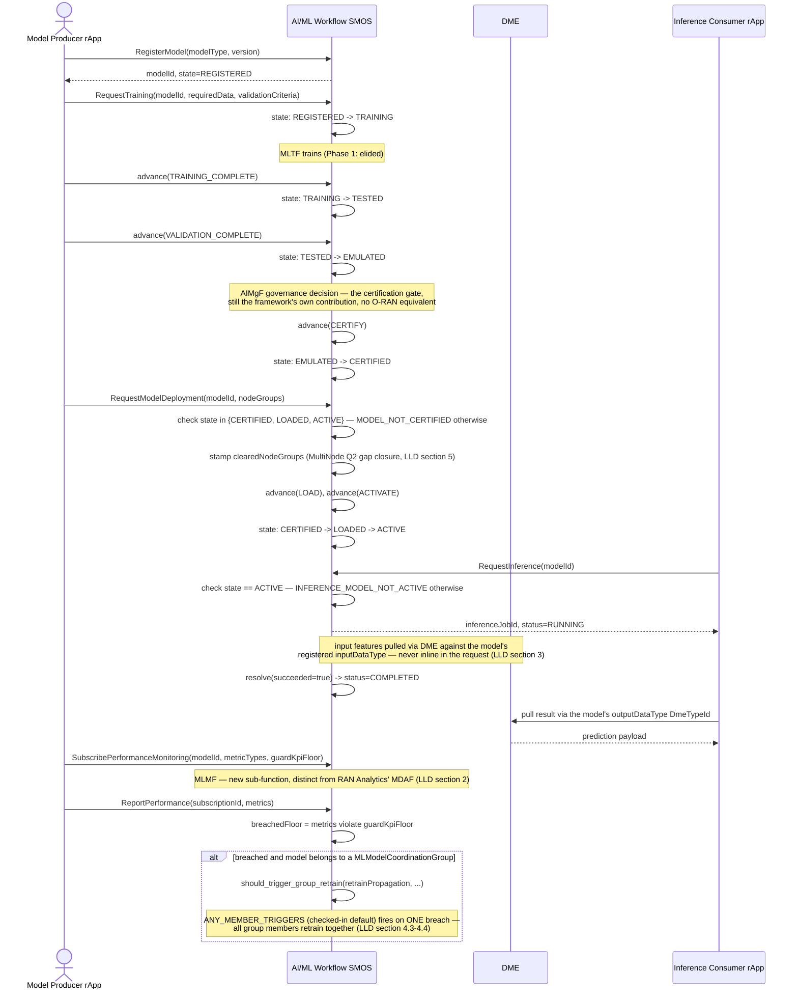

# Call Flow: AI/ML Model — Register → Train → Certify → Deploy → Infer → Monitor

Stitches together the full lifecycle AI/ML Workflow LLD sections 1-8 close: the certification
pipeline (v1.3, unchanged shape), the inference API (LLD section 3, new), and MLMF
monitoring (LLD section 2, new) feeding back into a retrain trigger.

**Key decisions this flow depends on:**
- No lightweight update path — retraining always re-enters at `TRAINING`, never skips to `ACTIVE` (unchanged project design principle, confirmed by every LLD pass touching this module).
- The inference result is pulled via DME, never returned inline from the R1-facing inference API — symmetric with training never carrying the trained artifact inline either.
- `ANY_MEMBER_TRIGGERS` means a coordination group's retrain trigger is genuinely group-scoped — one member's breach retrains the shared model all members depend on, not just that member's own pipeline.
