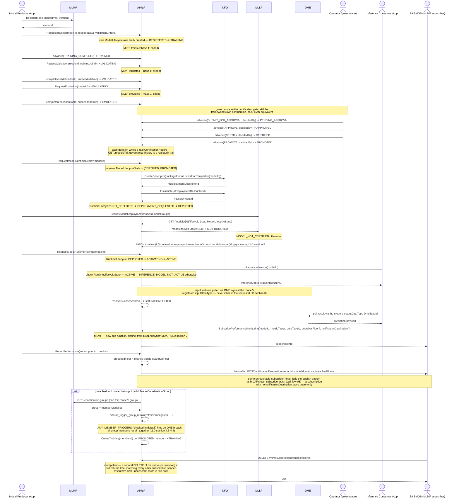

# Call Flow: AI/ML Model — Register → Train → Validate → Emulate → Certify → Deploy → Infer → Monitor

Stitches together the full lifecycle AI/ML Workflow LLD sections 1-8 close: the certification
pipeline (v1.3, unchanged shape), the inference API (LLD section 3, new), and MLMF
monitoring (LLD section 2, new) feeding back into a retrain trigger.

Wave 1 of the AI Platform Service Decomposition split this flow's single
former `ai-ml-workflow` participant into three real services — MLMR
(model repository), AIMgF (lifecycle orchestration), MLLF (loading/
deployment). Wave 2 went further: AIMgF now owns its own lifecycle state
outright (`ModelLifecycle`, 14 states — a model's own identity/
certification path) instead of writing it onto MLMR's row, and a second,
independent FSM (`RuntimeLifecycle`, 8 states) governs a model's serving
existence once PROMOTED — jointly with NFO, which AIMgF now genuinely
calls to create/scale/terminate a model's own runtime. Validation and
emulation are real request/tracking aggregates (`ValidationJob`/
`EmulationJob`) now, not folded silently into a single flat transition,
and every governance decision (Approval/Certification/Promotion/Rollback)
is a real, queryable `CertificationRecord`. See
`docs/architecture/SERVICE_OWNERSHIP_MATRIX.md` for the full ownership
split and `docs/ownership/{AIMGF,MLMR,MLLF}_OWNERSHIP.md` for each
service's own detail.

```mermaid
sequenceDiagram
    actor Producer as Model Producer rApp
    participant MLMR as MLMR
    participant AIMgF as AIMgF
    participant NFO as NFO
    participant MLLF as MLLF
    participant DME as DME
    actor Operator as Operator (governance)
    actor Consumer as Inference Consumer rApp
    actor SA as SA SMOS (MLMF subscriber)

    Producer->>MLMR: RegisterModel(modelType, version)
    MLMR-->>Producer: modelId

    Producer->>AIMgF: RequestTraining(modelId, requiredData, validationCriteria)
    Note over AIMgF: own ModelLifecycle row, lazily created — REGISTERED -> TRAINING
    Note over AIMgF: MLTF trains (Phase 1: elided)
    Producer->>AIMgF: advance(TRAINING_COMPLETE) -> TRAINED

    Producer->>AIMgF: RequestValidation(modelId, trainingJobId) -> VALIDATING
    Note over AIMgF: MLVF validates (Phase 1: elided)
    Producer->>AIMgF: complete(validationJobId, succeeded=true) -> VALIDATED

    Producer->>AIMgF: RequestEmulation(modelId) -> EMULATING
    Note over AIMgF: MLEF emulates (Phase 1: elided)
    Producer->>AIMgF: complete(emulationJobId, succeeded=true) -> EMULATED

    Note over Operator,AIMgF: governance — the certification gate, still the<br/>framework's own contribution, no O-RAN equivalent
    Operator->>AIMgF: advance(SUBMIT_FOR_APPROVAL, decidedBy) -> PENDING_APPROVAL
    Operator->>AIMgF: advance(APPROVE, decidedBy) -> APPROVED
    Operator->>AIMgF: advance(CERTIFY, decidedBy) -> CERTIFIED
    Operator->>AIMgF: advance(PROMOTE, decidedBy) -> PROMOTED
    Note over AIMgF: each decision writes a real CertificationRecord —<br/>GET /models/{id}/governance-history is a real audit trail

    Producer->>AIMgF: RequestModelRuntimeDeploy(modelId)
    Note over AIMgF: requires ModelLifecycleState in {CERTIFIED, PROMOTED}
    AIMgF->>NFO: CreateDescriptor(packageId=null, workloadTemplate={modelId})
    NFO-->>AIMgF: nfDeploymentDescriptorId
    AIMgF->>NFO: Instantiate(nfDeploymentDescriptorId)
    NFO-->>AIMgF: nfDeploymentId
    Note over AIMgF: RuntimeLifecycle: NOT_DEPLOYED -> DEPLOYMENT_REQUESTED -> DEPLOYED
    Producer->>MLLF: RequestModelDeployment(modelId, nodeGroups)
    MLLF->>AIMgF: GET /models/{id}/lifecycle (read ModelLifecycleState)
    AIMgF-->>MLLF: modelLifecycleState=CERTIFIED|PROMOTED
    Note over MLLF: MODEL_NOT_CERTIFIED otherwise
    MLLF->>AIMgF: PATCH /models/{id}/runtime/node-groups (clearedNodeGroups) — MultiNode Q2 gap closure, LLD section 5
    Producer->>AIMgF: RequestModelRuntimeActivate(modelId)
    Note over AIMgF: RuntimeLifecycle: DEPLOYED -> ACTIVATING -> ACTIVE

    Consumer->>AIMgF: RequestInference(modelId)
    Note over AIMgF: check RuntimeLifecycleState == ACTIVE — INFERENCE_MODEL_NOT_ACTIVE otherwise
    AIMgF-->>Consumer: inferenceJobId, status=RUNNING
    Note over AIMgF,DME: input features pulled via DME against the model's<br/>registered inputDataType — never inline in the request (LLD section 3)
    AIMgF->>AIMgF: resolve(succeeded=true) -> status=COMPLETED
    Consumer->>DME: pull result via the model's outputDataType DmeTypeId
    DME-->>Consumer: prediction payload

    SA->>AIMgF: SubscribePerformanceMonitoring(modelId, metricTypes, dmeTypeId, guardKpiFloor?, notificationDestination?)
    Note over AIMgF: MLMF — new sub-function, distinct from RAN Analytics' MDAF (LLD section 2)
    AIMgF-->>SA: subscriptionId
    Producer->>AIMgF: ReportPerformance(subscriptionId, metrics)
    AIMgF->>AIMgF: breachedFloor = metrics violate guardKpiFloor
    AIMgF->>SA: best-effort POST notificationDestination (reportId, modelId, metrics, breachedFloor)
    Note over AIMgF,SA: same unreachable-subscriber-never-fails-the-publish pattern<br/>as MDAF's own subscriber push (call flow 08) — a subscription<br/>with no notificationDestination stays query-only
    alt breached and model belongs to a MLModelCoordinationGroup
        AIMgF->>MLMR: GET /coordination-groups (find this model's group)
        MLMR-->>AIMgF: group + memberModelIds
        AIMgF->>AIMgF: should_trigger_group_retrain(retrainPropagation, ...)
        Note over AIMgF: ANY_MEMBER_TRIGGERS (checked-in default) fires on ONE breach —<br/>all group members retrain together (LLD section 4.3-4.4)
        AIMgF->>AIMgF: CreateTraining(memberId) per PROMOTED member -> TRAINING
    end

    SA->>AIMgF: DELETE /mlmf/subscriptions/{subscriptionId}
    Note over AIMgF: idempotent — a second DELETE of the same (or unknown) id<br/>still returns 204, matching every other subscription-shaped<br/>resource's own unsubscribe route in this build
    AIMgF-->>SA: 204
```

**Key decisions this flow depends on:**
- No lightweight update path — retraining always re-enters at `TRAINING`, never skips to `PROMOTED` (unchanged project design principle, confirmed by every LLD pass touching this module).
- The inference result is pulled via DME, never returned inline from the R1-facing inference API — symmetric with training never carrying the trained artifact inline either.
- `ANY_MEMBER_TRIGGERS` means a coordination group's retrain trigger is genuinely group-scoped — one member's breach retrains the shared model all members depend on, not just that member's own pipeline.
- ModelLifecycle and RuntimeLifecycle are deliberately independent FSMs: retraining a PROMOTED model doesn't force its runtime down, and a runtime can be scaled/terminated (jointly with NFO) without touching the model's own certification state.
- AIMgF's own `model_lifecycle` row is now the single source of truth for lifecycle/runtime state and `clearedNodeGroups` — MLMR never carries any of it, not even as a Wave 1-style structural shortcut. MLLF still owns the *decision* of which node groups a model is placed on; it just writes that decision onto AIMgF's row now instead of MLMR's.
- A model runtime has no onboarded `ApplicationPackage` behind it, unlike an rApp's own `NfDeploymentDescriptor` — NFO's `packageId` is optional since this wave for exactly that caller.
- **Closed since this flow was first written**: `MLMFSubscription` used to be create-and-read only, with no callback and no way to tear one down. It now carries an optional `notificationDestination` (same best-effort-push shape as MDAF's own subscriber notification, call flow 08) and a real `DELETE /mlmf/subscriptions/{id}`, idempotent like every other subscription-shaped resource's unsubscribe route in this build. See call flow 13 for the dedicated subscribe→notify→unsubscribe walkthrough, including the pull-only (no destination registered) case.
