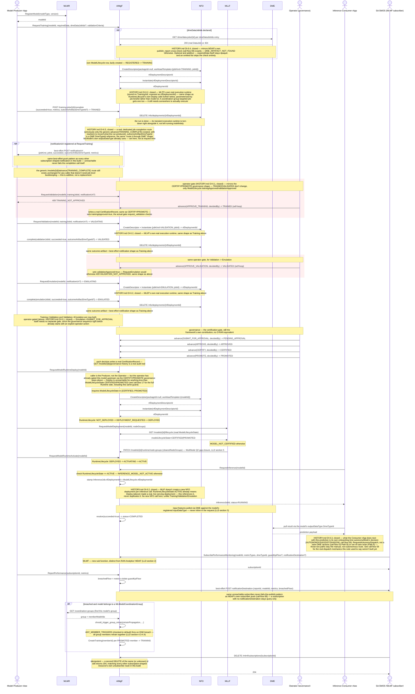

# Call Flow: AI/ML Model — Register → Train → Validate → Emulate → Certify → Deploy → Infer → Monitor

The full lifecycle of an AI/ML model (AI/ML Workflow LLD sections 1-8): the certification
pipeline, the R1-facing inference API (LLD section 3), and MLMF performance monitoring
(LLD section 2) feeding back into a retrain trigger.

Three services share the flow: MLMR (model repository), AIMgF (lifecycle orchestration)
and MLLF (loading and deployment). AIMgF owns two independent state machines on its own
`model_lifecycle` row: `ModelLifecycle` (14 states — the model's identity and
certification path) and `RuntimeLifecycle` (8 states — the model's serving existence once
PROMOTED), which AIMgF drives jointly with NFO by creating, scaling and terminating the
model's runtime. Validation and emulation are request/tracking aggregates
(`ValidationJob`/`EmulationJob`), and every governance decision
(Approval/Certification/Promotion/Rollback) is a queryable `CertificationRecord`. See the
service ownership section of `docs/ARCHITECTURE.md` (AIMgF, MLMR, MLLF) for each
service's detail.

```mermaid
sequenceDiagram
    actor Producer as Model Producer rApp
    participant MLMR as MLMR
    participant AIMgF as AIMgF
    participant NFO as NFO
    participant MLLF as MLLF
    participant DME as DME
    actor Operator as Operator (governance)
    actor Consumer as Inference Consumer rApp
    actor SA as SA SMOS (MLMF subscriber)

    Producer->>MLMR: RegisterModel(modelType, version)
    MLMR-->>Producer: modelId

    Producer->>AIMgF: RequestTraining(modelId, requiredData, dmeDataJobIds?, validationCriteria)
    opt dmeDataJobIds declared
        AIMgF->>DME: GET /dme/data-jobs/{id} per dmeDataJobIds entry
        DME-->>AIMgF: 200 (real DataJob) or 404
        Note over AIMgF,DME: HISTORY.md OI-6.4, closed — mirrors MDAF's own<br/>publish_report cross-check (call flow 08) exactly — DME_ARTIFACT_NOT_FOUND<br/>otherwise. Optional and additive — requiredData itself stays opaque,<br/>and an omitted list skips the check entirely
    end
    Note over AIMgF: own ModelLifecycle row, lazily created — REGISTERED -> TRAINING
    AIMgF->>NFO: CreateDescriptor(packageId=null, workloadTemplate={jobKind=TRAINING, jobId})
    NFO-->>AIMgF: nfDeploymentDescriptorId
    AIMgF->>NFO: Instantiate(nfDeploymentDescriptorId)
    NFO-->>AIMgF: nfDeploymentId
    Note over AIMgF,NFO: HISTORY.md OI-6.2, closed — MLTF's own real execution runtime<br/>(stored on TrainingJob, exposed as nfDeploymentId) — same shape as<br/>RuntimeLifecycle's own Deploy calls further below, parameterized by<br/>job kind/id rather than model id. A coordination-group-targeted job<br/>gets one too — it still needs somewhere to actually execute
    Producer->>AIMgF: POST /training-jobs/{id}/complete<br/>(succeeded=true, metrics, outcomeArtifactDmeTypeId?) -> TRAINED
    AIMgF->>NFO: DELETE /nfo/deployments/{nfDeploymentId}
    Note over AIMgF,NFO: the run is done — its transient execution runtime is torn<br/>down right alongside it, not left running indefinitely
    Note over AIMgF: HISTORY.md OI-6.5, closed — a real, dedicated job-completion route<br/>(previously only the generic advance(TRAINING_COMPLETE) existed, with<br/>nowhere to record what the run produced). outcomeArtifactDmeTypeId<br/>is a DME DmeTypeId reference, the same "route it through DME" shape<br/>MLModel's own outputDataType already uses — set here, not at request time
    opt notificationUri registered at RequestTraining
        AIMgF->>Producer: best-effort POST notificationUri<br/>(jobKind, jobId, succeeded, outcomeArtifactDmeTypeId, metrics)
        Note over AIMgF,Producer: same best-effort-push pattern as every other<br/>subscription-shaped notification in this build — unreachable<br/>never fails the completion call itself
    end
    Note over Producer,AIMgF: the generic /models/{id}/advance(TRAINING_COMPLETE) route still<br/>exists unchanged for any caller that doesn't need job-level<br/>bookkeeping — this is additive, not a replacement

    rect rgb(255, 240, 240)
    Note over Operator,AIMgF: operator gate (HISTORY.md OI-6.1, closed) — mirrors the<br/>CERTIFY/PROMOTE governance shape — TRAINED/VALIDATED don't change,<br/>only ModelLifecycle.trainingApproved/validationApproved
    Producer->>AIMgF: RequestValidation(modelId, trainingJobId, notificationUri?)
    AIMgF-->>Producer: 409 TRAINING_NOT_APPROVED
    Operator->>AIMgF: advance(APPROVE_TRAINING, decidedBy) -> TRAINED (self-loop)
    Note over AIMgF: writes a real CertificationRecord, same as CERTIFY/PROMOTE —<br/>sets trainingApproved=true, the actual gate request_validation checks
    end

    Producer->>AIMgF: RequestValidation(modelId, trainingJobId, notificationUri?) -> VALIDATING
    AIMgF->>NFO: CreateDescriptor + Instantiate (jobKind=VALIDATION, jobId) -> nfDeploymentId
    Note over AIMgF,NFO: HISTORY.md OI-6.2, closed — MLVF's own real execution runtime, same shape as Training above
    Producer->>AIMgF: complete(validationJobId, succeeded=true, outcomeArtifactDmeTypeId?) -> VALIDATED
    AIMgF->>NFO: DELETE /nfo/deployments/{nfDeploymentId}
    Note over AIMgF: same outcome-artifact + best-effort notification shape as Training above

    rect rgb(255, 240, 240)
    Note over Operator,AIMgF: same operator gate, for Validation -> Emulation
    Operator->>AIMgF: advance(APPROVE_VALIDATION, decidedBy) -> VALIDATED (self-loop)
    Note over AIMgF: sets validationApproved=true — RequestEmulation would<br/>otherwise 409 VALIDATION_NOT_APPROVED, same shape as above
    end

    Producer->>AIMgF: RequestEmulation(modelId, notificationUri?) -> EMULATING
    AIMgF->>NFO: CreateDescriptor + Instantiate (jobKind=EMULATION, jobId) -> nfDeploymentId
    Note over AIMgF,NFO: HISTORY.md OI-6.2, closed — MLEF's own real execution runtime, same shape as Training above
    Producer->>AIMgF: complete(emulationJobId, succeeded=true, outcomeArtifactDmeTypeId?) -> EMULATED
    AIMgF->>NFO: DELETE /nfo/deployments/{nfDeploymentId}
    Note over AIMgF: same outcome-artifact + best-effort notification shape as Training above
    Note over Producer,AIMgF: Training->Validation and Validation->Emulation are now both<br/>operator-gated (above, HISTORY.md OI-6.1, closed) — Emulation->SUBMIT_FOR_APPROVAL<br/>itself needs no separate gate, since the governance sequence right below<br/>already starts with an explicit operator action

    Note over Operator,AIMgF: governance — the certification gate, still the<br/>framework's own contribution, no O-RAN equivalent
    Operator->>AIMgF: advance(SUBMIT_FOR_APPROVAL, decidedBy) -> PENDING_APPROVAL
    Operator->>AIMgF: advance(APPROVE, decidedBy) -> APPROVED
    Operator->>AIMgF: advance(CERTIFY, decidedBy) -> CERTIFIED
    Operator->>AIMgF: advance(PROMOTE, decidedBy) -> PROMOTED
    Note over AIMgF: each decision writes a real CertificationRecord —<br/>GET /models/{id}/governance-history is a real audit trail

    Producer->>AIMgF: RequestModelRuntimeDeploy(modelId)
    Note over AIMgF: caller is the Producer, not the Operator — but the operator has<br/>already gated this model upstream via the CERTIFY/PROMOTE governance<br/>steps above — Deploy is unreachable for anything less than<br/>ModelLifecycleState CERTIFIED/PROMOTED (see call flow 17 for the full<br/>Runtime side, including this same guard)
    Note over AIMgF: requires ModelLifecycleState in {CERTIFIED, PROMOTED}
    AIMgF->>NFO: CreateDescriptor(packageId=null, workloadTemplate={modelId})
    NFO-->>AIMgF: nfDeploymentDescriptorId
    AIMgF->>NFO: Instantiate(nfDeploymentDescriptorId)
    NFO-->>AIMgF: nfDeploymentId
    Note over AIMgF: RuntimeLifecycle: NOT_DEPLOYED -> DEPLOYMENT_REQUESTED -> DEPLOYED
    Producer->>MLLF: RequestModelDeployment(modelId, nodeGroups)
    MLLF->>AIMgF: GET /models/{id}/lifecycle (read ModelLifecycleState)
    AIMgF-->>MLLF: modelLifecycleState=CERTIFIED|PROMOTED
    Note over MLLF: MODEL_NOT_CERTIFIED otherwise
    MLLF->>AIMgF: PATCH /models/{id}/runtime/node-groups (clearedNodeGroups) — MultiNode Q2 gap closure, LLD section 5
    Producer->>AIMgF: RequestModelRuntimeActivate(modelId)
    Note over AIMgF: RuntimeLifecycle: DEPLOYED -> ACTIVATING -> ACTIVE

    Consumer->>AIMgF: RequestInference(modelId)
    Note over AIMgF: check RuntimeLifecycleState == ACTIVE — INFERENCE_MODEL_NOT_ACTIVE otherwise
    AIMgF->>AIMgF: stamp InferenceJob.nfDeploymentId = ModelLifecycle.nfDeploymentId
    Note over AIMgF,NFO: HISTORY.md OI-6.2, closed — MLIF doesn't create a new NFO<br/>deployment per inference call: RuntimeLifecycleState ACTIVE already means<br/>Deploy (above) made a real, live serving deployment — this references it,<br/>never duplicates it. No new NFO call here, unlike Training/Validation/Emulation
    AIMgF-->>Consumer: inferenceJobId, status=RUNNING
    Note over AIMgF,DME: input features pulled via DME against the model's<br/>registered inputDataType — never inline in the request (LLD section 3)
    AIMgF->>AIMgF: resolve(succeeded=true) -> status=COMPLETED
    Consumer->>DME: pull result via the model's outputDataType DmeTypeId
    DME-->>Consumer: prediction payload
    Note over Consumer: HISTORY.md OI-6.3, closed — what the Consumer rApp does next<br/>with this prediction is its own onboarding-time autonomyMode's decision<br/>(AUTONOMOUS/ASSIST/SHADOW, call flow 09): RequestAutonomyDispatch, not a<br/>bare DME /actions (call flow 03 Path B) or ran-nf-oam write (Path A) —<br/>those two paths stay the manual, non-autonomous route. See call flow 09<br/>for the real dispatch mechanics this note used to say weren't built yet

    SA->>AIMgF: SubscribePerformanceMonitoring(modelId, metricTypes, dmeTypeId, guardKpiFloor?, notificationDestination?)
    Note over AIMgF: MLMF — new sub-function, distinct from RAN Analytics' MDAF (LLD section 2)
    AIMgF-->>SA: subscriptionId
    Producer->>AIMgF: ReportPerformance(subscriptionId, metrics)
    AIMgF->>AIMgF: breachedFloor = metrics violate guardKpiFloor
    AIMgF->>SA: best-effort POST notificationDestination (reportId, modelId, metrics, breachedFloor)
    Note over AIMgF,SA: same unreachable-subscriber-never-fails-the-publish pattern<br/>as MDAF's own subscriber push (call flow 08) — a subscription<br/>with no notificationDestination stays query-only
    alt breached and model belongs to a MLModelCoordinationGroup
        AIMgF->>MLMR: GET /coordination-groups (find this model's group)
        MLMR-->>AIMgF: group + memberModelIds
        AIMgF->>AIMgF: should_trigger_group_retrain(retrainPropagation, ...)
        Note over AIMgF: ANY_MEMBER_TRIGGERS (checked-in default) fires on ONE breach —<br/>all group members retrain together (LLD section 4.3-4.4)
        AIMgF->>AIMgF: CreateTraining(memberId) per PROMOTED member -> TRAINING
    end

    SA->>AIMgF: DELETE /mlmf/subscriptions/{subscriptionId}
    Note over AIMgF: idempotent — a second DELETE of the same (or unknown) id<br/>still returns 204, matching every other subscription-shaped<br/>resource's own unsubscribe route in this build
    AIMgF-->>SA: 204
```

**Key decisions this flow depends on:**
- No lightweight update path — retraining always re-enters at `TRAINING`, never skips to `PROMOTED` (a project-wide design principle).
- The inference result is pulled via DME, never returned inline from the R1-facing inference API — symmetric with training never carrying the trained artifact inline either.
- `ANY_MEMBER_TRIGGERS` means a coordination group's retrain trigger is genuinely group-scoped — one member's breach retrains the shared model all members depend on, not just that member's own pipeline.
- ModelLifecycle and RuntimeLifecycle are deliberately independent FSMs: retraining a PROMOTED model doesn't force its runtime down, and a runtime can be scaled/terminated (jointly with NFO) without touching the model's own certification state.
- AIMgF's `model_lifecycle` row is the single source of truth for lifecycle/runtime state and `clearedNodeGroups`; MLMR carries none of it. MLLF owns the *decision* of which node groups a model is placed on and writes that decision onto AIMgF's row.
- A model runtime has no onboarded `ApplicationPackage` behind it, unlike an rApp's `NfDeploymentDescriptor`, so NFO's `packageId` is optional for this caller.
- Training→Validation and Validation→Emulation are operator-gated: `APPROVE_TRAINING`/`APPROVE_VALIDATION` are governance self-loop events through `advance()` that require `decidedBy` and write a `CertificationRecord`; without them `RequestValidation`/`RequestEmulation` return 409 `TRAINING_NOT_APPROVED`/`VALIDATION_NOT_APPROVED` (HISTORY.md OI-6.1).
- `RequestTraining` accepts an optional `dmeDataJobIds` list; each id is checked against a real DME `DataJob` (`DME_ARTIFACT_NOT_FOUND` otherwise), the same check MDAF's `publish_report` applies (call flow 08). `requiredData` stays an opaque blob, and an omitted list skips the check (HISTORY.md OI-6.4).
- Training, Validation and Emulation each have a dedicated completion route (`POST /training-jobs/{id}/complete` and its validation/emulation counterparts) that records an `outcomeArtifactDmeTypeId` (a DME reference, the same shape `MLModel.outputDataType` uses) and sends a best-effort TS 28.105-style completion notification. The generic `advance()` route still serves callers that don't need job-level bookkeeping (HISTORY.md OI-6.5).
- Training, Validation and Emulation each run in a transient NFO execution runtime: `CreateDescriptor`/`Instantiate` on request and `DELETE /nfo/deployments/{id}` on completion — the same shape as RuntimeLifecycle's Deploy call, parameterized by job kind/id instead of model id. Inference does not: `RequestInference` is gated on `RuntimeLifecycleState.ACTIVE`, so a serving deployment already exists (via `RequestModelRuntimeDeploy`), and `InferenceJob.nfDeploymentId` is a read-only reference to it rather than a new deployment per call (HISTORY.md OI-6.2). Runtime sizing and stage timeouts are described in call flow 17.
- What an rApp does with an inference result is governed by its onboarding-time `autonomyMode`; `RequestAutonomyDispatch` (call flow 09) implements the AUTONOMOUS/ASSIST/SHADOW mechanics (HISTORY.md OI-6.3).
- `MLMFSubscription` carries an optional `notificationDestination` (the same best-effort push as MDAF's subscriber notification, call flow 08) and has an idempotent `DELETE /mlmf/subscriptions/{id}`. Call flow 13 walks subscribe→notify→unsubscribe, including the pull-only case where no destination is registered.
