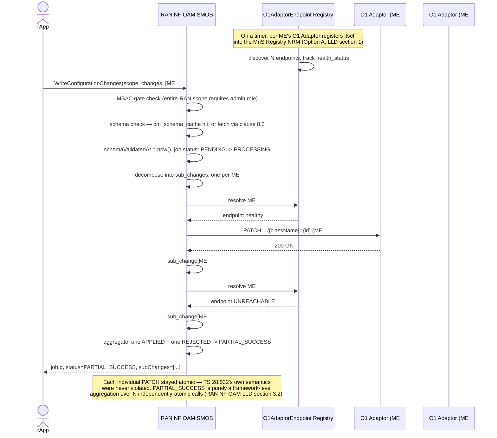

# Call Flow: Configuration Write, Schema-Checked, Fleet-Aware

Stitches together RAN NF OAM LLD sections 1-5 — the Option A endpoint registry and the
decomposed-PATCH aggregation that makes `PARTIAL_SUCCESS` real without violating
TS 28.532's own all-or-nothing `PATCH` semantics.

**Key decisions this flow depends on:**
- Under Option A, RAN NF OAM is a fleet aggregator over *N* per-ME O1 Adaptor instances, discovered via MnS Registry NRM — not a single-endpoint client, which was v1.3's Phase 1 assumption before this LLD pass.
- `PARTIAL_SUCCESS` exists in the schema but has no wire-level counterpart in TS 28.532 — it's realized entirely by decomposing one `WriteConfigurationChanges` call into independently-atomic per-ME `PATCH` calls and aggregating the outcomes.
- Alarm IDs raised anywhere in this flow would be minted fresh (UUID) at ingestion, never trusting a raising ME's native ID directly — closing R1UCR's own flagged, unresolved fleet-wide collision risk.
