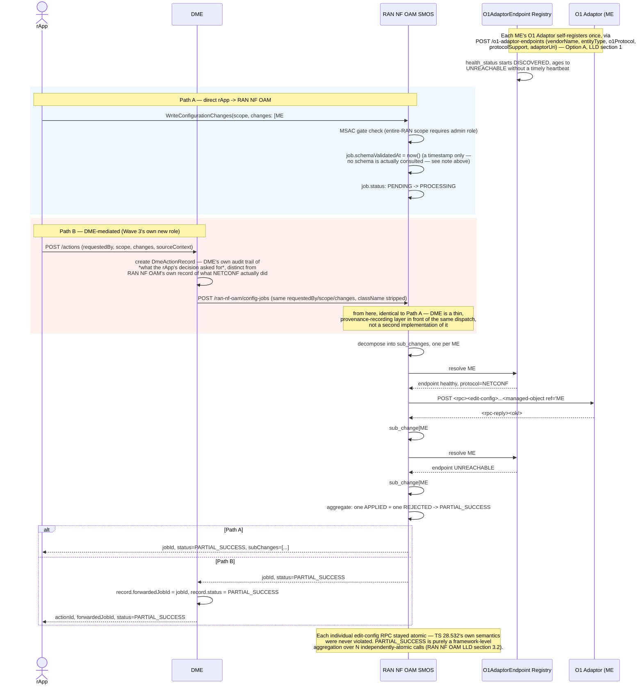

# Call Flow: Configuration Write, Fleet-Aware, Two Entry Paths

Stitches together RAN NF OAM LLD sections 1-5 — the Option A endpoint registry and the
decomposed-PATCH aggregation that makes `PARTIAL_SUCCESS` real without violating
TS 28.532's own all-or-nothing `PATCH` semantics — plus Wave 3's DME O1 action-mediation
route (`docs/ownership/DME_OWNERSHIP.md`), which gives an rApp's inference decision a
second, provenance-recording way to reach the same dispatch.

**Rewritten from this flow's first version**, which described a schema check
(`cm_schema_cache` hit/fetch) and a REST-shaped `PATCH .../{className}={id}` dispatch —
neither is what the real code does. `cm_schema_cache` is genuine, unused scaffolding (no
route in this build ever writes or reads a row in it — confirmed by grep, and even the
route's own docstring still calls it "schema check — cache hit or fetch," which is
aspirational, not accurate); every real "schema check" is just a timestamp stamp.
Dispatch is a real RFC 6241 `<edit-config>` XML RPC POSTed to the endpoint's `adaptor_uri`
(`netconf_client.py`), not a REST verb. See
`docs/architecture/O1_VENDOR_ONBOARDING_GUIDE.md` for the fuller writeup of this gap and
a sketch of what would actually close it.

**Why this flow exists, and how it relates to call flow 02**: this is the CM-write
mechanism itself — the two paths (direct rApp, or DME-mediated) by which *any* caller
gets a configuration change onto a real ME, regardless of who or what decided the change
was needed. Call flow 02 (AI/ML inference) is one possible *decision source* that can call
into Path B here — an rApp that just pulled a prediction via DME may, entirely on its own
and out-of-band, decide to call DME's `/actions` (Path B) or `ran-nf-oam` directly
(Path A) to act on it. This flow's `rApp->>DME`/`rApp->>NFOAM` entry points still have no
caller-identity check tying them back to a specific inference job — that stays true, by
design, for every rApp that isn't going through autonomy-mode dispatch at all. **Closed
since this flow was first written** (`OPEN_ITEMS.md` section 6.3): an rApp instance whose
onboarding-time `autonomyMode` is `AUTONOMOUS`/`ASSIST` now has a real, automatic,
operator-visible bridge instead — `RequestAutonomyDispatch` (call flow 09) — which
deliberately does *not* call into Path A/B here at all: an autonomy-driven outcome is
enacted as a real `Intent` (Intent Service / SO-SMOS / SA-SMOS), never a raw CM write.
Path A/B stay exactly what they always were — the manual, non-autonomous route, still the
only path for a `SHADOW` instance (nothing is ever enforced) or any rApp that simply
chooses to act on its own, out-of-band decision instead.

```mermaid
sequenceDiagram
    actor rApp
    participant DME as DME
    participant NFOAM as RAN NF OAM SMOS
    participant Registry as O1AdaptorEndpoint Registry
    participant EP1 as O1 Adaptor (ME #1)

    Note over EP1,Registry: Each ME's O1 Adaptor self-registers once, via<br/>POST /o1-adaptor-endpoints (vendorName, entityType, o1Protocol,<br/>protocolSupport, adaptorUri) — Option A, LLD section 1
    Registry->>Registry: health_status starts DISCOVERED, ages to<br/>UNREACHABLE without a timely heartbeat

    rect rgb(240, 248, 255)
    Note over rApp,NFOAM: Path A — direct rApp -> RAN NF OAM
    rApp->>NFOAM: WriteConfigurationChanges(scope, changes: [ME#1 change, ME#2 change])
    NFOAM->>NFOAM: MSAC gate check (entire-RAN scope requires admin role)
    NFOAM->>NFOAM: job.schemaValidatedAt = now() (a timestamp only —<br/>no schema is actually consulted — see note above)
    NFOAM->>NFOAM: job.status: PENDING -> PROCESSING
    end

    rect rgb(255, 240, 240)
    Note over rApp,DME: Path B — DME-mediated (Wave 3's own new role)
    rApp->>DME: POST /actions (requestedBy, scope, changes, sourceContext)
    DME->>DME: create DmeActionRecord — DME's own audit trail of<br/>*what the rApp's decision asked for*, distinct from<br/>RAN NF OAM's own record of what NETCONF actually did
    DME->>NFOAM: POST /ran-nf-oam/config-jobs (same requestedBy/scope/changes, className stripped)
    Note over NFOAM: from here, identical to Path A — DME is a thin,<br/>provenance-recording layer in front of the same dispatch,<br/>not a second implementation of it
    end

    NFOAM->>NFOAM: decompose into sub_changes, one per ME
    NFOAM->>Registry: resolve ME#1's endpoint
    Registry-->>NFOAM: endpoint healthy, protocol=NETCONF
    NFOAM->>EP1: POST <rpc><edit-config>...<managed-object ref="ME#1" operation="merge">...(RFC 6241, netconf_client.py)
    EP1-->>NFOAM: <rpc-reply><ok/>
    NFOAM->>NFOAM: sub_change[ME#1].status = APPLIED

    NFOAM->>Registry: resolve ME#2's endpoint
    Registry-->>NFOAM: endpoint UNREACHABLE
    NFOAM->>NFOAM: sub_change[ME#2].status = REJECTED (ENDPOINT_UNREACHABLE)

    NFOAM->>NFOAM: aggregate: one APPLIED + one REJECTED -> PARTIAL_SUCCESS
    alt Path A
        NFOAM-->>rApp: jobId, status=PARTIAL_SUCCESS, subChanges=[...]
    else Path B
        NFOAM-->>DME: jobId, status=PARTIAL_SUCCESS
        DME->>DME: record.forwardedJobId = jobId, record.status = PARTIAL_SUCCESS
        DME-->>rApp: actionId, forwardedJobId, status=PARTIAL_SUCCESS
    end

    Note over NFOAM: Each individual edit-config RPC stayed atomic — TS 28.532's own semantics<br/>were never violated. PARTIAL_SUCCESS is purely a framework-level<br/>aggregation over N independently-atomic calls (RAN NF OAM LLD section 3.2).
```

**Key decisions this flow depends on:**
- Under Option A, RAN NF OAM is a fleet aggregator over *N* per-ME O1 Adaptor instances, discovered via `POST /o1-adaptor-endpoints` self-registration — not a single-endpoint client, which was v1.3's Phase 1 assumption before this LLD pass. (Real MnS Registry NRM polling is a confirmed elision — this is the same lighter self-registration substitute DME's own producer registration and SME's own provider/invoker registration both already use.)
- `PARTIAL_SUCCESS` exists in the schema but has no wire-level counterpart in TS 28.532 — it's realized entirely by decomposing one `WriteConfigurationChanges` call into independently-atomic per-ME `edit-config` RPCs and aggregating the outcomes.
- **Path B never duplicates Path A's dispatch logic.** DME's `/actions` route is deliberately a thin forward — one HTTP call to the same `POST /config-jobs` Path A's own caller would hit directly — so a future dispatch-logic change (a new rejection reason, a new protocol) never needs touching in two places.
- An ME provisioned for RESTCONF (`o1_protocol != "NETCONF"`) is rejected with `PROTOCOL_NOT_SUPPORTED` on either path — there is no silent fallback to "applied," and no RESTCONF dispatch implementation exists yet in this build.
- Alarm IDs raised anywhere in this flow would be minted fresh (UUID) at ingestion, never trusting a raising ME's native ID directly — closing R1UCR's own flagged, unresolved fleet-wide collision risk.
- **Gap this rewrite surfaces, not previously documented this way**: `cm_schema_cache` (`schema_name`/`revision`/`location`/`type`/`cached_at`) is real, migrated DDL with zero real callers anywhere in this build — not a Phase-1 stub with a documented elision, just dead scaffolding whose own route docstring still describes behavior that was never wired up. `docs/architecture/O1_VENDOR_ONBOARDING_GUIDE.md` sketches the capability-registry work that would finally give it a writer and a reader.
