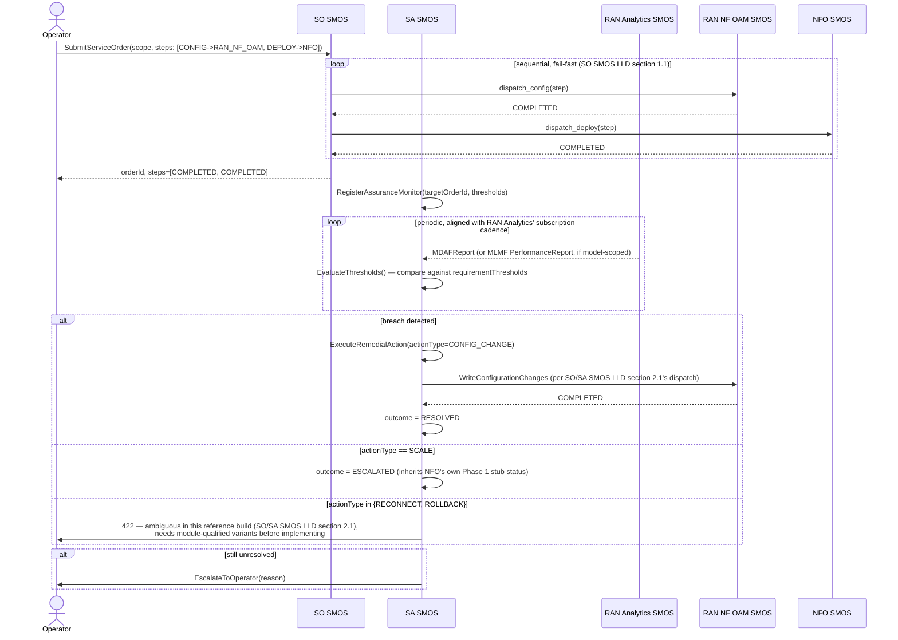

# Call Flow: Closed-Loop Assurance — Monitor → Decide → Remediate → Escalate

Stitches together SO/SA SMOS LLD sections 1-2 — the dispatch table (`so-smos/app/dispatch.py`)
and SA SMOS's honestly-incomplete `RemedialAction` dispatch.

**Key decisions this flow depends on:**
- SO SMOS never rolls back completed steps on a later failure — Phase 1 has no compensating-transaction mechanism, matching every other Phase-1-thin limitation in this framework (stated explicitly, not silently assumed).
- `RECONNECT` and `ROLLBACK` are deliberately **not** force-resolved to a single meaning — the reference build raises a clear error rather than silently picking one of several plausible targets (rApp version rollback vs. model version rollback).
- A coordination-group-scoped `AssuranceMonitor` (via `targetCoordinationGroupId`) would route through AI/ML Workflow's `should_trigger_group_retrain` instead of a single `ServiceOrder` — see call flow 02.
