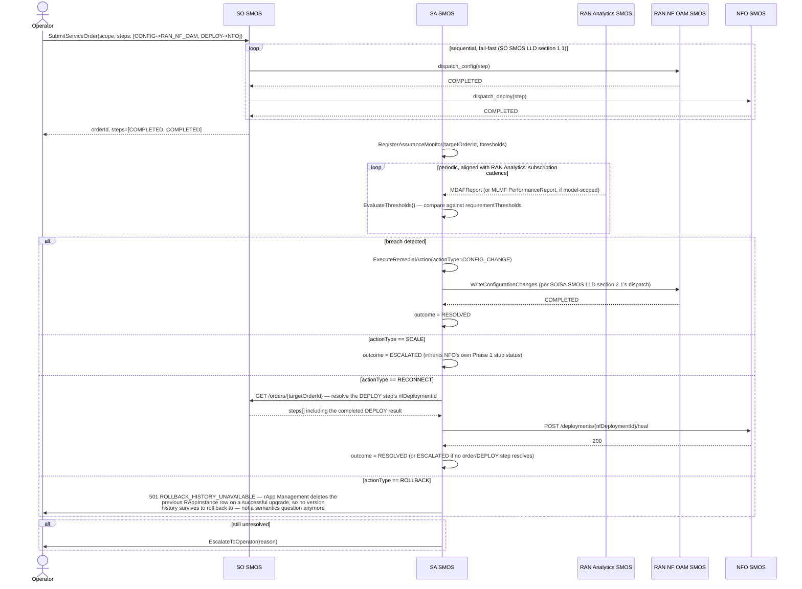

# Call Flow: Closed-Loop Assurance — Monitor → Decide → Remediate → Escalate

Stitches together SO/SA SMOS LLD sections 1-2 — the dispatch table (`so-smos/app/dispatch.py`)
and SA SMOS's honestly-incomplete `RemedialAction` dispatch.

**Key decisions this flow depends on:**
- SO SMOS never rolls back completed steps on a later failure — Phase 1 has no compensating-transaction mechanism, matching every other Phase-1-thin limitation in this framework (stated explicitly, not silently assumed).
- `RECONNECT` resolves its target the same way every other remedial action does — through the `AssuranceMonitor`'s `targetOrderId`, read back from SO SMOS's own order record — rather than needing a new resource-reference field on the monitor itself.
- `ROLLBACK` stays unsupported, but now for a concrete, checked reason (`ROLLBACK_HISTORY_UNAVAILABLE`) rather than a vague "ambiguous meaning" refusal: rApp Management's own upgrade machinery (`rapp-mgmt/app/upgrade.py`) deletes the prior `RAppInstance` row on a successful commit, so there is no version history anywhere in this build to roll back to — a rApp Management gap, not an SA SMOS design question.
- A coordination-group-scoped `AssuranceMonitor` (via `targetCoordinationGroupId`) would route through AI/ML Workflow's `should_trigger_group_retrain` instead of a single `ServiceOrder` — see call flow 02. A coordination-group-scoped `RECONNECT`/`ROLLBACK` isn't resolved by this pass either — only the `targetOrderId` path is.
