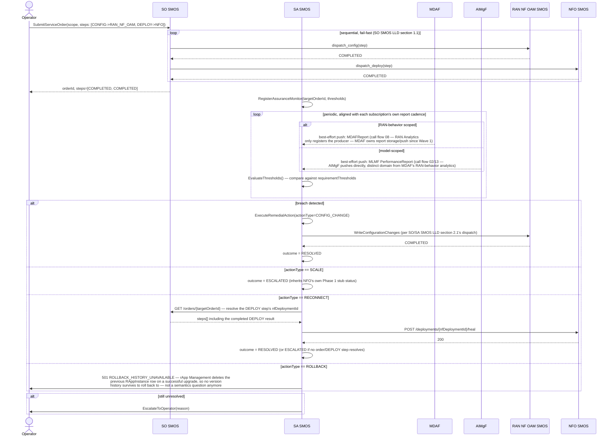

# Call Flow: Closed-Loop Assurance — Monitor → Decide → Remediate → Escalate

An SO SMOS service order is monitored by SA SMOS (SO/SA SMOS LLD sections 1-2): a threshold
breach in a pushed report triggers a `RemedialAction`, and anything left unresolved is
escalated to the operator. `CONFIG_CHANGE` and `RECONNECT` are dispatched, `SCALE` escalates,
and `ROLLBACK` is refused. The order itself runs through SO SMOS's dispatch table
(`so-smos/app/dispatch.py`).

**How this relates to call flow 03**: this is a sibling entry point into the same CM-write
mechanism, not an extension of or alternative to it. Flow 03 is the generic "how does a CM
change reach a real ME" walkthrough (Path A/B, dispatch, decomposition). This flow's
`SA->>NFOAM: WriteConfigurationChanges` line is one more caller of that route, triggered
automatically by a threshold breach instead of by an rApp's or operator's own decision.
The dispatch, decomposition and per-ME aggregation downstream of that call are identical —
see call flow 03.

```mermaid
sequenceDiagram
    actor Operator
    participant SO as SO SMOS
    participant SA as SA SMOS
    participant MDAF as MDAF
    participant AIMgF as AIMgF
    participant NFOAM as RAN NF OAM SMOS
    participant NFO as NFO SMOS

    Operator->>SO: SubmitServiceOrder(scope, steps: [CONFIG->RAN_NF_OAM, DEPLOY->NFO])
    loop sequential, fail-fast (SO SMOS LLD section 1.1)
        SO->>NFOAM: dispatch_config(step)
        NFOAM-->>SO: COMPLETED
        SO->>NFO: dispatch_deploy(step)
        NFO-->>SO: COMPLETED
    end
    SO-->>Operator: orderId, steps=[COMPLETED, COMPLETED]

    SA->>SA: RegisterAssuranceMonitor(targetOrderId, thresholds)
    loop periodic, aligned with each subscription's own report cadence
        alt RAN-behavior scoped
            MDAF-->>SA: best-effort push: MDAFReport (call flow 08 — RAN Analytics<br/>only registers the producer — MDAF owns report storage/push since Wave 1)
        else model-scoped
            AIMgF-->>SA: best-effort push: MLMF PerformanceReport (call flow 02/13 —<br/>AIMgF pushes directly, distinct domain from MDAF's RAN-behavior analytics)
        end
        SA->>SA: EvaluateThresholds() — compare against requirementThresholds
    end

    alt breach detected
        SA->>SA: ExecuteRemedialAction(actionType=CONFIG_CHANGE)
        SA->>NFOAM: WriteConfigurationChanges (per SO/SA SMOS LLD section 2.1's dispatch)
        NFOAM-->>SA: COMPLETED
        SA->>SA: outcome = RESOLVED
    else actionType == SCALE
        SA->>SA: outcome = ESCALATED (inherits NFO's own Phase 1 stub status)
    else actionType == RECONNECT
        SA->>SO: GET /orders/{targetOrderId} — resolve the DEPLOY step's nfDeploymentId
        SO-->>SA: steps[] including the completed DEPLOY result
        SA->>NFO: POST /deployments/{nfDeploymentId}/heal
        NFO-->>SA: 200
        SA->>SA: outcome = RESOLVED (or ESCALATED if no order/DEPLOY step resolves)
    else actionType == ROLLBACK
        SA->>Operator: 501 ROLLBACK_HISTORY_UNAVAILABLE — rApp Management deletes the<br/>previous RAppInstance row on a successful upgrade, so no version<br/>history survives to roll back to — not a semantics question anymore
    end

    alt still unresolved
        SA->>Operator: EscalateToOperator(reason)
    end
```

**Key decisions this flow depends on:**
- SO SMOS never rolls back completed steps on a later failure — Phase 1 has no compensating-transaction mechanism (stated explicitly, not silently assumed).
- `RECONNECT` resolves its target through the `AssuranceMonitor`'s `targetOrderId`, read back from SO SMOS's own order record (the DEPLOY step's `nfDeploymentId`), and heals that deployment through NFO — rather than needing a new resource-reference field on the monitor itself.
- `ROLLBACK` is refused for a concrete, checked reason (`ROLLBACK_HISTORY_UNAVAILABLE`, 501): rApp Management's upgrade machinery (`rapp-mgmt/app/upgrade.py`) deletes the prior `RAppInstance` row on a successful commit, so there is no version history to roll back to — a rApp Management gap, not an SA SMOS design question (OPEN_ITEMS.md OI-1-sa-rollback).
- A coordination-group-scoped `AssuranceMonitor` (`targetCoordinationGroupId`) bypasses the actionType branches entirely: it watches model performance, not an NF deployment, so its remedial action is always a group retrain through AIMgF's `POST /training-jobs` (`modelCoordinationGroupId`) — see call flow 02.
- The actor pushing reports into SA SMOS is whichever service owns them — MDAF for RAN-behavior analytics, AIMgF for model performance (MLMF). RAN Analytics only registers the producer capability (call flow 08); it never holds or pushes reports.
