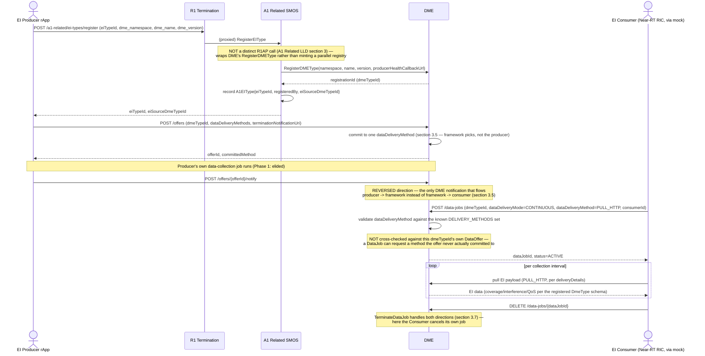

# Call Flow: A1 EI Registration → Data Consumption

Stitches together A1 Related LLD section 3 (RegisterEIType wraps DME's RegisterDMEType —
clause 9 of R1AP has no distinct 9.2) and Foundational Platform LLD section 3 (DME's
DataOffer/DataJob split).

**Key decisions this flow depends on:**
- `RegisterEIType` is a thin wrapper, not a parallel registry — A1 Related's own bookkeeping (`A1EIType`) exists purely to remember *which* DME type an EI registration maps to; the actual production-capability record lives in DME, closing the "operation with no backing object" gap A1 Related LLD section 1.2 also flags for subscriptions.
- `DataOffer.dataAvailabilityNotification` flows framework → consumer for every other DME interaction; the producer's own "data is ready" signal (`offer_data_availability`) is the one deliberate exception, flowing the opposite way (Foundational Platform LLD section 3.5).
- This flow never reaches the actual Near-RT RIC — `mock-near-rt-ric/` only implements the A1-P policy interface (RT-7's isolated segment), not an EI consumer; the Consumer actor here stands in for what a real xApp/Near-RT RIC integration would do against DME directly.
- **Gap surfaced by writing this flow, not previously documented**: `CreateDataJob` validates `dataDeliveryMethod` against the global `DELIVERY_METHODS` set only (`dme/app/main.py`), never against the specific `DataOffer` the `dmeTypeId` is actually associated with — a consumer can request `STREAMING_KAFKA` against a type whose producer only ever offered `PULL_HTTP`, and DME accepts it without complaint.
