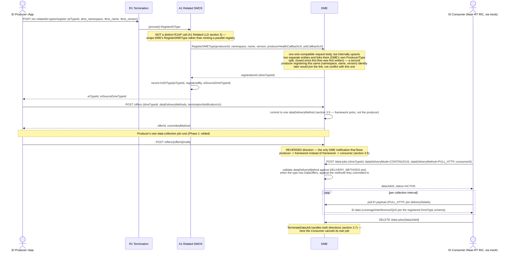

# Call Flow: A1 EI Registration → Data Consumption

An EI producer registers an EI type through A1 Related, and a consumer creates a data job
against it in DME (A1 Related LLD section 3; Foundational Platform LLD section 3).
`RegisterEIType` wraps DME's `RegisterDMEType` — clause 9 of R1AP has no distinct 9.2 — and
DME's DataOffer/DataJob split carries the rest of the flow.

```mermaid
sequenceDiagram
    actor Producer as EI Producer rApp
    participant R1 as R1 Termination
    participant A1R as A1 Related SMOS
    participant DME as DME
    actor Consumer as EI Consumer (Near-RT RIC, via mock)

    Producer->>R1: POST /a1-related/ei-types/register (eiTypeId, dme_namespace, dme_name, dme_version)
    R1->>A1R: (proxied) RegisterEIType
    Note over A1R: NOT a distinct R1AP call (A1 Related LLD section 3) —<br/>wraps DME's RegisterDMEType rather than minting a parallel registry
    A1R->>DME: RegisterDMEType(producerId, namespace, name, version, producerHealthCallbackUrl, jobCallbackUrl)
    Note over DME: one wire-compatible request body, but internally upserts<br/>two separate entities and links them (DME's own Producer/Type<br/>split, closed since this flow was first written) — a second<br/>producer registering this same (namespace, name, version) identity<br/>later would join the link, not conflict with this one
    DME-->>A1R: registrationId (dmeTypeId)
    A1R->>A1R: record A1EIType{eiTypeId, registeredBy, eiSourceDmeTypeId}
    A1R-->>Producer: eiTypeId, eiSourceDmeTypeId

    Producer->>DME: POST /offers (dmeTypeId, dataDeliveryMethods, terminationNotificationUri)
    DME->>DME: commit to one dataDeliveryMethod (section 3.5 — framework picks, not the producer)
    DME-->>Producer: offerId, committedMethod

    Note over Producer,DME: Producer's own data-collection job runs (Phase 1: elided)
    Producer->>DME: POST /offers/{offerId}/notify
    Note over DME: REVERSED direction — the only DME notification that flows<br/>producer -> framework instead of framework -> consumer (section 3.5)

    Consumer->>DME: POST /data-jobs (dmeTypeId, dataDeliveryMode=CONTINUOUS, dataDeliveryMethod=PULL_HTTP, consumerId)
    DME->>DME: validate dataDeliveryMethod against DELIVERY_METHODS and,<br/>when the type has DataOffers, against the methods they committed to
    DME-->>Consumer: dataJobId, status=ACTIVE

    loop per collection interval
        Consumer->>DME: pull EI payload (PULL_HTTP, per deliveryDetails)
        DME-->>Consumer: EI data (coverage/interference/QoS per the registered DmeType schema)
    end

    Consumer->>DME: DELETE /data-jobs/{dataJobId}
    Note over DME: TerminateDataJob handles both directions (section 3.7) —<br/>here the Consumer cancels its own job
```

**Key decisions this flow depends on:**
- `RegisterEIType` is a thin wrapper, not a parallel registry — A1 Related's own bookkeeping (`A1EIType`) exists purely to remember *which* DME type an EI registration maps to; the actual production-capability record lives in DME, closing the "operation with no backing object" gap A1 Related LLD section 1.2 also flags for subscriptions.
- `DataOffer.dataAvailabilityNotification` flows framework → consumer for every other DME interaction; the producer's own "data is ready" signal (`offer_data_availability`) is the one deliberate exception, flowing the opposite way (Foundational Platform LLD section 3.5).
- This flow never reaches the actual Near-RT RIC — `mock-near-rt-ric/` only implements the A1-P policy interface (RT-7's isolated segment), not an EI consumer; the Consumer actor here stands in for what a real xApp/Near-RT RIC integration would do against DME directly.
- `CreateDataJob` checks `dataDeliveryMethod` against the global `DELIVERY_METHODS` set and, when the type has at least one `DataOffer`, against the methods those offers committed to (`_validate_delivery_method` in `dme/app/main.py`, `DELIVERY_METHOD_NOT_OFFERED` otherwise); a type with no offer skips the second check (HISTORY.md OI-2-dataoffer-check).
- `DMEProducer` and `DMEType` are separate, many-to-many entities linked by `DMEProducerType`, matching ICS's API shape: a second producer registering the same type identity joins that type instead of conflicting (HISTORY.md SA-ICS-1). Call flow 11 walks the multi-producer case.
