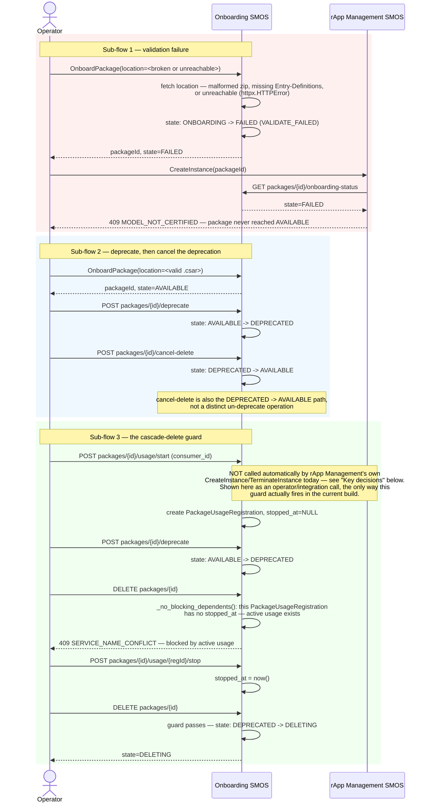

# Call Flow: Package Failure, Deprecation, and the Cascade-Delete Guard

Stitches together Onboarding/rApp Mgmt LLD section 3 (the `FAILED` terminal state v1.3
never modeled) and section 4 (the cascade-delete guard, concretized as a real guard
function in `onboarding/app/statemachine.py`, not just a stated rule).

**Key decisions this flow depends on:**
- `FAILED` is terminal within the FSM — nothing in v1.3 or the LLD proposes a recovery path out of it; a failed onboard must be retried as a brand-new `OnboardPackage` call, never resumed.
- `DeletePackage` from `FAILED` skips the cascade-delete guard entirely (Onboarding/rApp Mgmt LLD section 3) — a package that never reached `AVAILABLE` cannot have anything depending on it, so this is handled as a direct delete by the route, not through the guarded FSM transition sub-flow 3 shows.
- The guard checks two independent conditions — a blocking `AVAILABLE`/`DEPRECATED` child package, or any `PackageUsageRegistration` still missing `stopped_at` — either alone is sufficient to block deletion (Onboarding/rApp Mgmt LLD section 4).
- **Gap surfaced by writing this flow, not previously documented**: `PackageUsageRegistration` rows are never created or stopped by rApp Management's own `CreateInstance`/`TerminateInstance` — `usage/start` and `usage/stop` exist on Onboarding but nothing in this build's `RAppInstance` lifecycle calls them. The cascade-delete guard's active-usage condition is real and tested (`onboarding/tests/test_statemachine.py`), but in the current wiring it can only fire from a direct, out-of-band call to those endpoints, not from ordinary rApp deployment. Worth adding to `OPEN_ITEMS.md`: wiring `create_instance`/`terminate_instance` to call `usage/start`/`usage/stop` would close this.
