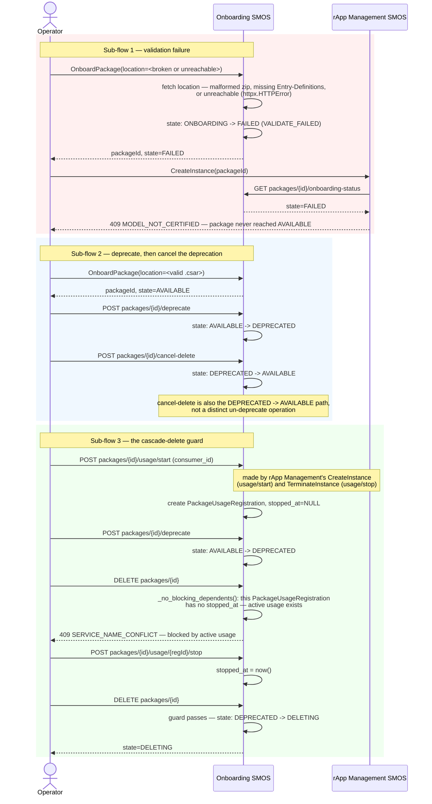

# Call Flow: Package Failure, Deprecation, and the Cascade-Delete Guard

The rApp package lifecycle's failure and removal paths (Onboarding/rApp Mgmt LLD sections
3-4): the `FAILED` terminal state, deprecation and cancel-delete, and the cascade-delete
guard, a real guard function in `onboarding/app/statemachine.py`.

**Scope note**: this flow covers the rApp *package* FSM (Onboarding/rApp Management). An
AI/ML *model's* `ModelLifecycleState` (AIMgF, call flow 02) is a different FSM; its
`DEPRECATED` and `RETIRED` states are reached through the same governance `advance()` route
CERTIFY/PROMOTE use (`aimgf/app/statemachine.py`) and are not covered here.

```mermaid
sequenceDiagram
    actor Operator
    participant Onb as Onboarding SMOS
    participant Rapp as rApp Management SMOS

    rect rgb(255, 240, 240)
    Note over Operator,Onb: Sub-flow 1 — validation failure
    Operator->>Onb: OnboardPackage(location=<broken or unreachable>)
    Onb->>Onb: fetch location — malformed zip, missing Entry-Definitions,<br/>or unreachable (httpx.HTTPError)
    Onb->>Onb: state: ONBOARDING -> FAILED (VALIDATE_FAILED)
    Onb-->>Operator: packageId, state=FAILED
    Operator->>Rapp: CreateInstance(packageId)
    Rapp->>Onb: GET packages/{id}/onboarding-status
    Onb-->>Rapp: state=FAILED
    Rapp-->>Operator: 409 MODEL_NOT_CERTIFIED — package never reached AVAILABLE
    end

    rect rgb(240, 248, 255)
    Note over Operator,Onb: Sub-flow 2 — deprecate, then cancel the deprecation
    Operator->>Onb: OnboardPackage(location=<valid .csar>)
    Onb-->>Operator: packageId, state=AVAILABLE
    Operator->>Onb: POST packages/{id}/deprecate
    Onb->>Onb: state: AVAILABLE -> DEPRECATED
    Operator->>Onb: POST packages/{id}/cancel-delete
    Onb->>Onb: state: DEPRECATED -> AVAILABLE
    Note over Onb: cancel-delete is also the DEPRECATED -> AVAILABLE path,<br/>not a distinct un-deprecate operation
    end

    rect rgb(240, 255, 240)
    Note over Operator,Onb: Sub-flow 3 — the cascade-delete guard
    Operator->>Onb: POST packages/{id}/usage/start (consumer_id)
    Note over Rapp,Onb: made by rApp Management's CreateInstance<br/>(usage/start) and TerminateInstance (usage/stop)
    Onb->>Onb: create PackageUsageRegistration, stopped_at=NULL
    Operator->>Onb: POST packages/{id}/deprecate
    Onb->>Onb: state: AVAILABLE -> DEPRECATED
    Operator->>Onb: DELETE packages/{id}
    Onb->>Onb: _no_blocking_dependents(): this PackageUsageRegistration<br/>has no stopped_at — active usage exists
    Onb-->>Operator: 409 SERVICE_NAME_CONFLICT — blocked by active usage
    Operator->>Onb: POST packages/{id}/usage/{regId}/stop
    Onb->>Onb: stopped_at = now()
    Operator->>Onb: DELETE packages/{id}
    Onb->>Onb: guard passes — state: DEPRECATED -> DELETING
    Onb-->>Operator: state=DELETING
    end
```

**Key decisions this flow depends on:**
- `FAILED` is terminal within the FSM — nothing in v1.3 or the LLD proposes a recovery path out of it; a failed onboard must be retried as a brand-new `OnboardPackage` call, never resumed.
- `DeletePackage` from `FAILED` skips the cascade-delete guard entirely (Onboarding/rApp Mgmt LLD section 3) — a package that never reached `AVAILABLE` cannot have anything depending on it, so this is handled as a direct delete by the route, not through the guarded FSM transition sub-flow 3 shows.
- The guard checks two independent conditions — a blocking `AVAILABLE`/`DEPRECATED` child package, or any `PackageUsageRegistration` still missing `stopped_at` — either alone is sufficient to block deletion (Onboarding/rApp Mgmt LLD section 4).
- `PackageUsageRegistration` rows come from ordinary rApp deployment: rApp Management's `CreateInstance` calls `usage/start` and stores the registration id, and `TerminateInstance` calls `usage/stop` (`rapp-mgmt/app/main.py`, HISTORY.md OI-2-usage-registration).
