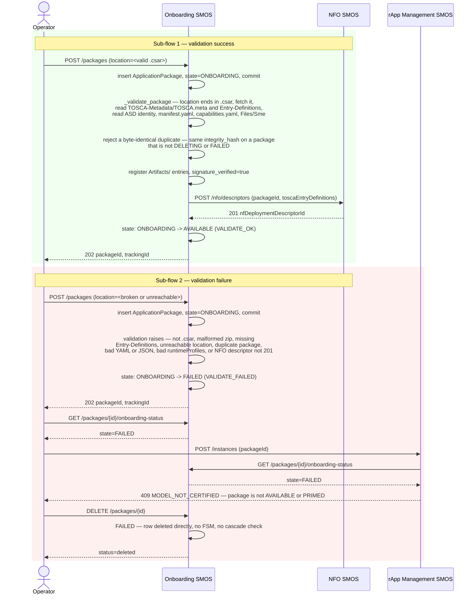
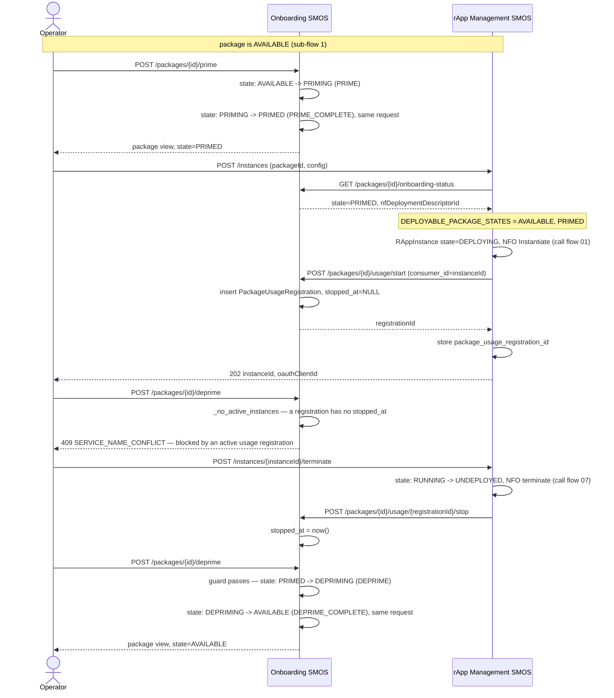
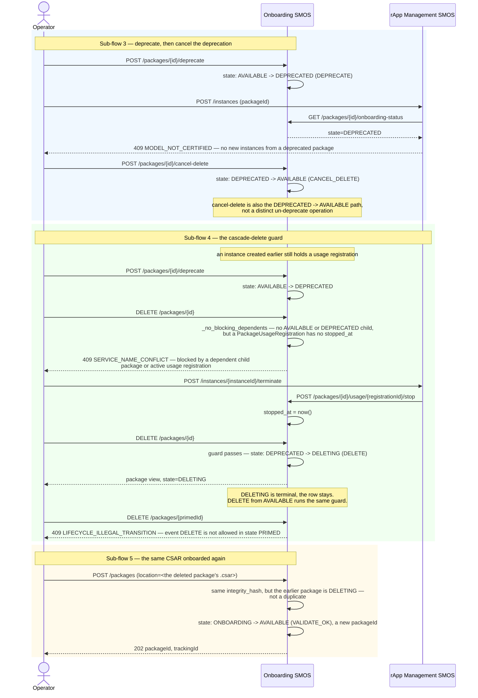

# Call Flow: rApp Package Lifecycle — Onboard → Prime → Deprecate → Delete (and Failure)

An `ApplicationPackage` moves through the Onboarding SMOS's package FSM
(`onboarding/app/statemachine.py`, Onboarding/rApp Mgmt LLD sections 3-4). Onboarding
validates the package and lands it in `AVAILABLE` or `FAILED`. An `AVAILABLE` package can be
primed (`PRIMED`) and deprimed back. rApp Management creates instances from an `AVAILABLE`
or `PRIMED` package and records each one as a usage registration. An `AVAILABLE` package can
be deprecated, un-deprecated with cancel-delete, and deleted. Deletion is guarded by the
cascade-delete guard `_no_blocking_dependents`, and depriming by the active-usage guard
`_no_active_instances`.

**Scope note**: this flow covers the rApp *package* FSM. The instance FSM it feeds is call
flow 07. An AI/ML *model's* `ModelLifecycleState` (AIMgF, call flow 02) is a different FSM.
Its `DEPRECATED` and `RETIRED` states are reached through the governance `advance()` route
(`aimgf/app/statemachine.py`) and are not covered here.

## Package FSM

| State | Events out (→ target) | Guard |
|---|---|---|
| `ONBOARDING` | `VALIDATE_OK` → `AVAILABLE`, `VALIDATE_FAILED` → `FAILED` | none |
| `AVAILABLE` | `PRIME` → `PRIMING`, `DEPRECATE` → `DEPRECATED`, `DELETE` → `DELETING` | `DELETE`: `_no_blocking_dependents` |
| `PRIMING` | `PRIME_COMPLETE` → `PRIMED` | none |
| `PRIMED` | `DEPRIME` → `DEPRIMING` | `DEPRIME`: `_no_active_instances` |
| `DEPRIMING` | `DEPRIME_COMPLETE` → `AVAILABLE` | none |
| `DEPRECATED` | `CANCEL_DELETE` → `AVAILABLE`, `DELETE` → `DELETING` | `DELETE`: `_no_blocking_dependents` |
| `DELETING` | none (terminal, the row is kept) | — |
| `FAILED` | none in the FSM. `DELETE /packages/{id}` removes the row directly | — |

- `_no_blocking_dependents` fails when a child package (`parent_package_id` = this package)
  is `AVAILABLE` or `DEPRECATED`, or when any `PackageUsageRegistration` of this package has
  no `stopped_at`.
- `_no_active_instances` fails when any `PackageUsageRegistration` of this package has no
  `stopped_at`.
- `PRIMED` has no `DEPRECATE` and no `DELETE` edge: a primed package is deprimed first.
- `PRIMING` and `DEPRIMING` are never observable: `prime` and `deprime` fire both of their
  transitions inside one request.

**Errors on the lifecycle routes** (`deprecate`, `prime`, `deprime`, `cancel-delete`,
`DELETE`): an unknown package id is 404 `PACKAGE_NOT_FOUND` (also on `onboarding-status`,
`artifacts`, `usage` and `usage/start`). An event with no edge from the package's current state
is 409 `LIFECYCLE_ILLEGAL_TRANSITION`, whose detail names the state and the event (for example
`DELETE` on a `PRIMED` package). 409 `SERVICE_NAME_CONFLICT` is reserved for a refusal by a
guard: the edge exists, but `_no_active_instances` or `_no_blocking_dependents` failed.
`usage/{registrationId}/stop` answers 404 `PACKAGE_USAGE_REGISTRATION_NOT_FOUND` for a
registration that is unknown or belongs to another package, and is idempotent for one already
stopped.

## Onboard: validation success and failure

## Prime, deploy, deprime

## Deprecate, cancel-delete, delete

**Key decisions this flow depends on:**
- `FAILED` is terminal within the FSM; a failed onboard is retried as a brand-new `OnboardPackage` call, never resumed.
- The duplicate-package check (`integrity_hash`) ignores packages in `DELETING` or `FAILED` (HISTORY.md OI-2-package-redeploy): a deleted or failed package never locks its CSAR out, while an `ONBOARDING`, `AVAILABLE`, `PRIMED` or `DEPRECATED` package with the same hash still makes a re-onboard fail.
- `DeletePackage` from `FAILED` skips the cascade-delete guard and deletes the row directly (Onboarding/rApp Mgmt LLD section 3): a package that never reached `AVAILABLE` cannot have anything depending on it.
- Every validation error, including an unreachable location and a failed NFO `CreateDescriptor`, routes to `FAILED` (`ONBOARD_VALIDATION_FAILURES` in `onboarding/app/main.py`). `OnboardPackage` answers 202 either way, and the caller reads the outcome from `onboarding-status`.
- The package row is committed in `ONBOARDING` before NFO `CreateDescriptor` is called, because NFO's `NFDeploymentDescriptor` holds a real foreign key to it.
- Priming is optional and synchronous: real ACM/DME/SME pre-provisioning is out of scope, so `prime` and `deprime` each fire both of their transitions in one request. SME registration happens per instance at `bootstrap-complete`, not at priming (call flow 07).
- rApp Management creates instances, and upgrade replacements, from `AVAILABLE` or `PRIMED` packages only (`DEPLOYABLE_PACKAGE_STATES`, `rapp-mgmt/app/provisioning.py`). `ONBOARDING`, `FAILED`, `DEPRECATED` and `DELETING` are refused with 409 `MODEL_NOT_CERTIFIED`, an unknown package with 404 `PACKAGE_NOT_FOUND`.
- The deprime guard and the cascade-delete guard read the same signal: a `PackageUsageRegistration` with no `stopped_at`. `CreateInstance` (and an upgrade's replacement) calls `usage/start` and stores the id. `TerminateInstance`, an upgrade commit (for the old instance) and an upgrade rollback or timeout (for the replacement) call `usage/stop` (HISTORY.md OI-2-usage-registration, call flow 07).
- The cascade-delete guard checks two independent conditions, a blocking `AVAILABLE`/`DEPRECATED` child package or an active usage registration. Either alone blocks deletion (Onboarding/rApp Mgmt LLD section 4).
- `GET /packages/{id}/usage` lists the registrations with an `active` flag, so an operator can see which instance blocks a deprime or a delete.
