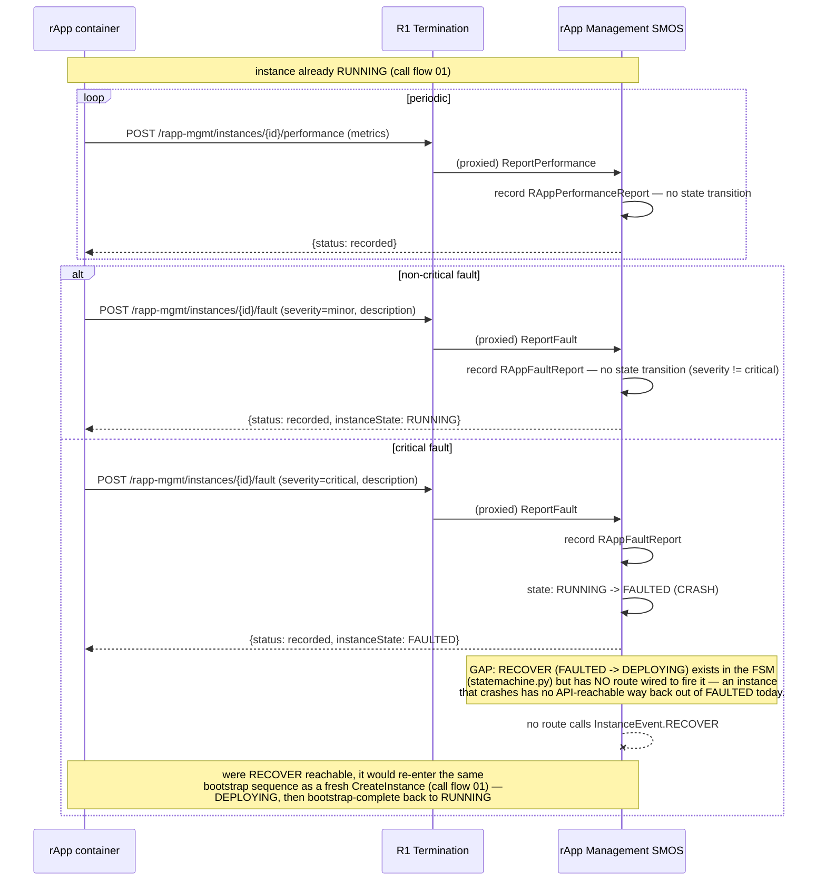

# Call Flow: rApp Fault and Performance Reporting

Stitches together Onboarding/rApp Mgmt LLD sections 5-6 — `RAppInstance`'s fault-driven
`CRASH`/`RECOVER` transitions, and performance reporting as a pure record (no FSM
transition of its own; contrast with AI/ML Workflow's `ReportPerformance`, call flow 02,
which *does* drive a retrain decision).

**Key decisions this flow depends on:**
- Only `severity == "critical"` drives a state transition — `report_fault` records every fault report regardless of severity, but only a critical one fires `CRASH`. Other severities are visible via the fault-report history without touching `RAppInstance.state`.
- `RECOVER` (`FAULTED -> DEPLOYING`) re-enters at the same point `CreateInstance` does, not directly to `RUNNING` — the instance must re-bootstrap and call `bootstrap-complete` again, matching the "no lightweight update path" principle AI/ML Workflow's retraining re-entry also follows (call flow 02).
- **Gap surfaced by writing this flow, not previously documented**: `RECOVER` is a real FSM transition (`FAULTED -> DEPLOYING`, tested directly in `rapp-mgmt/tests/test_upgrade.py::test_crash_and_manual_recovery`) but no route in `rapp-mgmt/app/main.py` ever fires it — a critically-faulted instance has no API path back to `RUNNING` in this build. Worth adding to `OPEN_ITEMS.md`: either an explicit `POST /instances/{id}/recover` route (mirroring `bootstrap-complete`'s shape) or a documented decision that recovery is operator-only via direct FSM access in a later phase.
