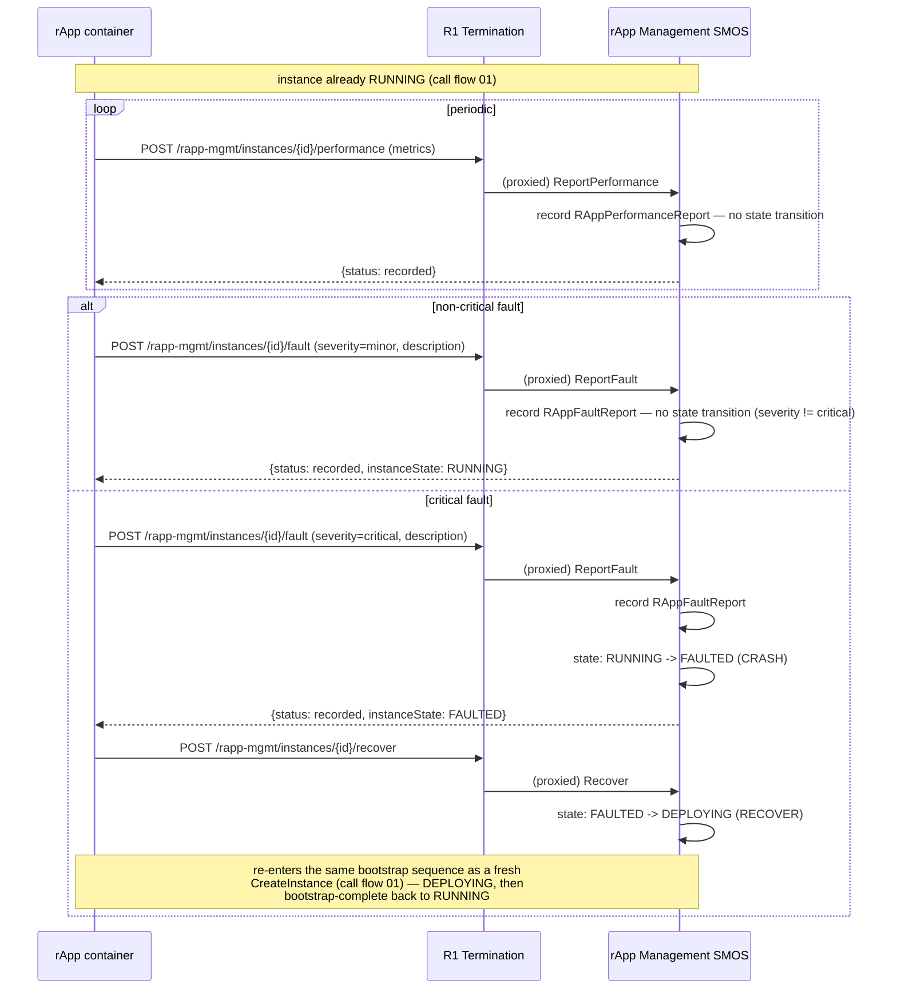

# Call Flow: rApp Fault and Performance Reporting

A running rApp instance reports performance and faults to rApp Management (Onboarding/rApp
Mgmt LLD sections 5-6). A critical fault drives `RAppInstance`'s `CRASH` transition and an
explicit recover call drives `RECOVER`; performance reporting is a pure record with no FSM
transition of its own (contrast AI/ML Workflow's `ReportPerformance`, call flow 02, which
*does* drive a retrain decision).

```mermaid
sequenceDiagram
    participant Container as rApp container
    participant R1 as R1 Termination
    participant Rapp as rApp Management SMOS

    Note over Container,Rapp: instance already RUNNING (call flow 01)

    loop periodic
        Container->>R1: POST /rapp-mgmt/instances/{id}/performance (metrics)
        R1->>Rapp: (proxied) ReportPerformance
        Rapp->>Rapp: record RAppPerformanceReport — no state transition
        Rapp-->>Container: {status: recorded}
    end

    alt non-critical fault
        Container->>R1: POST /rapp-mgmt/instances/{id}/fault (severity=minor, description)
        R1->>Rapp: (proxied) ReportFault
        Rapp->>Rapp: record RAppFaultReport — no state transition (severity != critical)
        Rapp-->>Container: {status: recorded, instanceState: RUNNING}
    else critical fault
        Container->>R1: POST /rapp-mgmt/instances/{id}/fault (severity=critical, description)
        R1->>Rapp: (proxied) ReportFault
        Rapp->>Rapp: record RAppFaultReport
        Rapp->>Rapp: state: RUNNING -> FAULTED (CRASH)
        Rapp-->>Container: {status: recorded, instanceState: FAULTED}

        Container->>R1: POST /rapp-mgmt/instances/{id}/recover
        R1->>Rapp: (proxied) Recover
        Rapp->>Rapp: state: FAULTED -> DEPLOYING (RECOVER)
        Note over Rapp,Container: re-enters the same bootstrap sequence as a fresh<br/>CreateInstance (call flow 01) — DEPLOYING, then<br/>bootstrap-complete back to RUNNING
    end
```

**Key decisions this flow depends on:**
- Only `severity == "critical"` drives a state transition — `report_fault` records every fault report regardless of severity, but only a critical one fires `CRASH`. Other severities are visible via the fault-report history without touching `RAppInstance.state`.
- `RECOVER` (`FAULTED -> DEPLOYING`) is fired by `POST /instances/{id}/recover` (`rapp-mgmt/app/main.py`, HISTORY.md OI-2-recover).
- `RECOVER` re-enters at the same point `CreateInstance` does, not directly at `RUNNING` — the instance must re-bootstrap and call `bootstrap-complete` again, matching the "no lightweight update path" principle AI/ML Workflow's retraining re-entry also follows (call flow 02).
