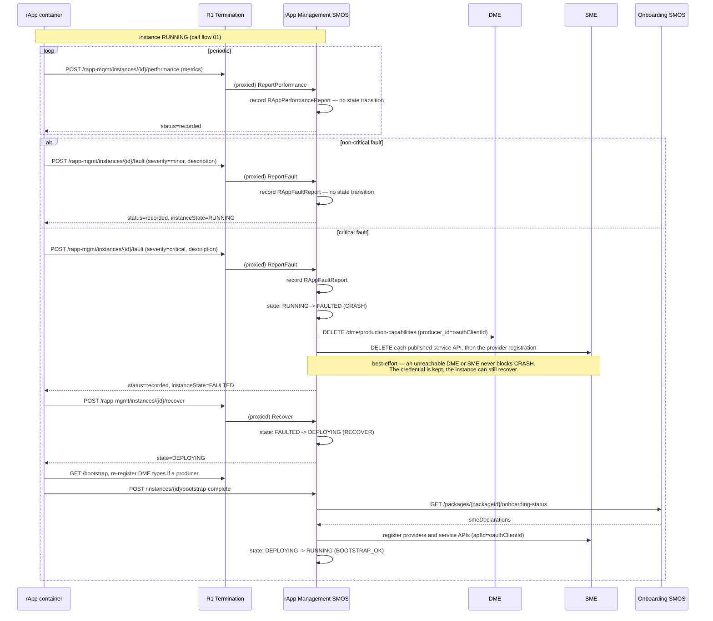
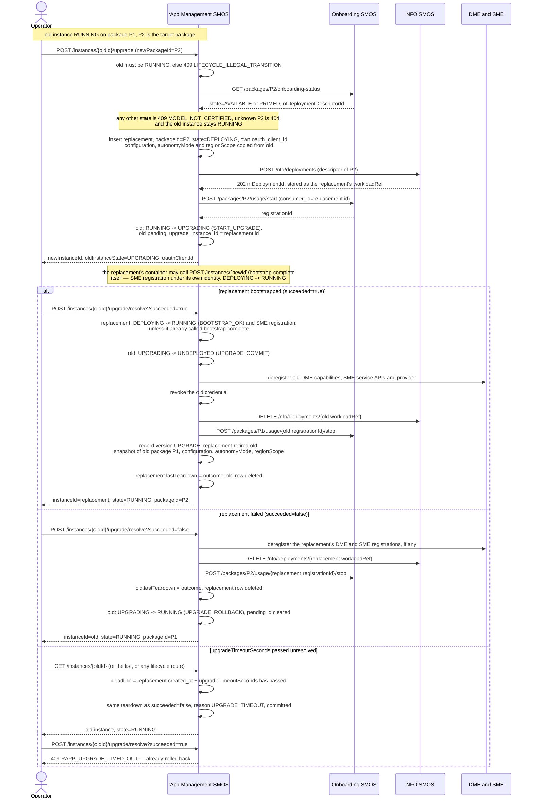
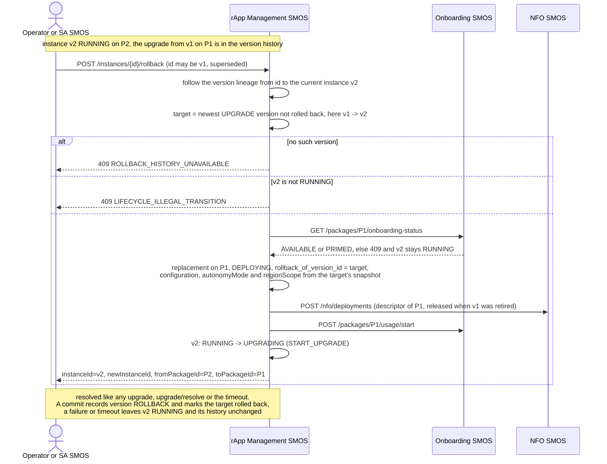
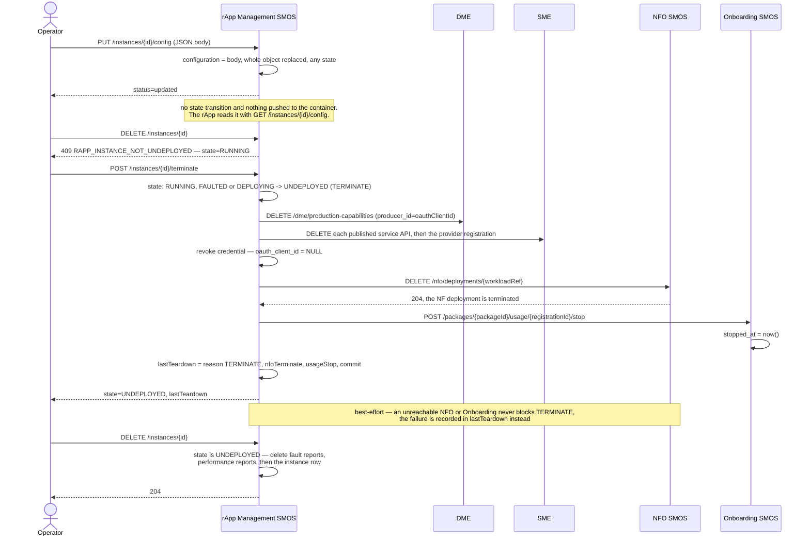

# Call Flow: rApp Instance Lifecycle — Run → Report → Fault → Recover → Upgrade → Roll back → Reconfigure → Terminate → Delete

A `RAppInstance` moves through rApp Management's instance FSM
(`rapp-mgmt/app/statemachine.py`, Onboarding/rApp Mgmt LLD sections 5-6) once
`CreateInstance` and `bootstrap-complete` have brought it to `RUNNING` (call flow 01). A
running instance reports performance and faults. A critical fault drives `CRASH` to
`FAULTED`, and `POST /instances/{id}/recover` sends it back through bootstrap. An upgrade
runs a replacement instance next to the old one and resolves to commit or rollback.
`PUT /instances/{id}/config` replaces the stored configuration. `terminate` tears the instance
down to `UNDEPLOYED`, and `DELETE` removes the row. Performance reporting is a pure record with
no FSM transition (contrast AI/ML Workflow's `ReportPerformance`, call flow 02, which drives
a retrain decision).

> Which caller may make each call below is decided by R1 Termination's role policy
> (`smo_shared/roles.py`). An rApp-role caller may not change anything on `/rapp-mgmt`, so the
> calls drawn here as made by the container (`bootstrap-complete`, `recover`, and the `performance`
> and `fault` reports) are refused to an rApp token. Today an operator or the platform makes
> `bootstrap-complete` and `recover` (call flow 01 explains why). Whether the `performance` and
> `fault` reports, which the Non-RT RIC architecture lists as rApp-facing R1 services, should be
> allowed to the rApp role is open.

## RAppInstance FSM

| State | Events out (→ target) | Action on the transition |
|---|---|---|
| `DEPLOYING` | `BOOTSTRAP_OK` → `RUNNING`, `BOOTSTRAP_FAILED` → `FAULTED`, `TERMINATE` → `UNDEPLOYED` | `TERMINATE`: deregister DME and SME, then revoke the credential |
| `RUNNING` | `START_UPGRADE` → `UPGRADING`, `TERMINATE` → `UNDEPLOYED`, `CRASH` → `FAULTED` | `TERMINATE`: deregister DME and SME, then revoke the credential. `CRASH`: deregister DME and SME |
| `UPGRADING` | `UPGRADE_COMMIT` → `UNDEPLOYED`, `UPGRADE_ROLLBACK` → `RUNNING` | `UPGRADE_COMMIT`: deregister DME and SME, then revoke the credential |
| `FAULTED` | `RECOVER` → `DEPLOYING`, `TERMINATE` → `UNDEPLOYED` | `TERMINATE`: deregister DME and SME, then revoke the credential |
| `UNDEPLOYED` | none (terminal). `DELETE /instances/{id}` removes the row | — |

No transition has a guard. Every route that leaves the FSM's own action out of a teardown —
`terminate`, an upgrade commit and an upgrade rollback or timeout — also releases the workload
(`release_instance_resources`, `rapp-mgmt/app/provisioning.py`): NFO
`DELETE /nfo/deployments/{workloadRef}` and Onboarding `usage/{registrationId}/stop`. Both are
best-effort, and their outcome (`DONE`, `SKIPPED…` or `FAILED: …`) is recorded in the row's
`lastTeardown`.

**Errors.** An event with no edge from the instance's current state answers 409
`LIFECYCLE_ILLEGAL_TRANSITION`, whose detail names the state and the event: `recover` from
anything but `FAULTED`, `bootstrap-complete` from anything but `DEPLOYING`, `terminate` from
`UPGRADING` or `UNDEPLOYED`, `upgrade` from anything but `RUNNING`, and a critical fault on an
instance that is not `RUNNING` (refused, not recorded). `terminate` on an upgrade's pending
replacement is refused the same way: the upgrade is resolved instead. Every lifecycle route
answers 404 `RAPP_INSTANCE_NOT_FOUND` for an unknown id, and `upgrade/resolve` does so too for
an instance with no pending upgrade.

`TERMINATE` is legal from `FAULTED`, so a crashed instance is retired without recovering it
first, and from `DEPLOYING`, because an instance whose container never calls
`bootstrap-complete` has no other exit and already holds an NFO deployment and a usage
registration from `CreateInstance`. It stays illegal from `UPGRADING`: an upgrade in flight is
committed or rolled back first.

## Report, fault, recover

## Upgrade: commit or rollback

## Roll back to the previous version

Every committed upgrade is recorded in `rapp_instance_version` with what the retired instance
ran. A rollback is an upgrade back to the newest version not already rolled back. SA SMOS issues
it for a rApp-instance-scoped monitor (call flow 04), and an operator can issue it from the GUI.

## Reconfigure, terminate, delete

**Key decisions this flow depends on:**
- Only `severity == "critical"` drives a state transition. `report_fault` records every report regardless of severity, and the history is readable at `GET /instances/{id}/faults` (and `/performance` for metrics, newest first). A critical fault on an instance that is not `RUNNING` is refused with 409 and not recorded.
- `CRASH`, `TERMINATE` and `UPGRADE_COMMIT` deregister the instance's DME production capabilities and SME service APIs keyed by its `oauth_client_id` (HISTORY.md OI-1-producer-reconsideration). These calls are best-effort. `TERMINATE` and `UPGRADE_COMMIT` run them before revoking the credential, because revocation clears the id they key on. `CRASH` keeps the credential so `RECOVER` can reuse the same identity.
- `TERMINATE` also terminates the NFO deployment behind `workloadRef` (the `nfDeploymentId` NFO Instantiate returned to `CreateInstance`) and stops the package usage registration. Both are best-effort and recorded in `lastTeardown` (`rapp_instance.last_teardown`). `workloadRef` is kept after teardown as the record of which deployment ran. A successfully stopped usage registration is cleared from the row.
- `TERMINATE` is legal from `RUNNING`, `FAULTED` and `DEPLOYING`. A crashed instance is retired without recovering first. `UPGRADING` must be resolved first.
- `RECOVER` (`FAULTED -> DEPLOYING`) is fired by `POST /instances/{id}/recover` (HISTORY.md OI-2-recover). It re-enters where `CreateInstance` does: the container re-bootstraps and calls `bootstrap-complete`, which re-registers the package's SME declarations. There is no lightweight path straight back to `RUNNING`, matching AI/ML Workflow's retraining re-entry (call flow 02).
- An upgrade is two rows in choreography (`rapp-mgmt/app/upgrade.py`, LLD section 6), not one row changing package in place. The replacement goes through `CreateInstance`'s own `provision_instance`: the target package must be `AVAILABLE` or `PRIMED`, and the replacement gets its own `oauth_client_id`, NFO deployment and usage registration, plus the old instance's configuration, `autonomyMode` and `regionScope`. Auto-rollback needs no manual intervention, and the old instance keeps its package, credential and identity throughout a failed attempt.
- Whichever row loses an upgrade is torn down like a `TERMINATE` before its row is deleted. On commit that is the old instance, which releases the old package's usage registration, so its deprime and delete guards (call flow 06) pass. On rollback it is the replacement. The outcome is recorded in the survivor's `lastTeardown`.
- `upgradeTimeoutSeconds` (default 300 s, HISTORY.md OI-1-upgrade-timeout) is copied to the replacement and enforced lazily, since this build has no scheduler. An unresolved upgrade whose replacement is older than the timeout is rolled back (reason `UPGRADE_TIMEOUT`) the next time either row is read or acted on, and `resolve?succeeded=true` then answers 409 `RAPP_UPGRADE_TIMED_OUT`.
- On commit, the old row passes through `UNDEPLOYED` with its credential revoked and is then deleted. What it ran (package, configuration, `autonomyMode`, `regionScope`) is kept in a `rapp_instance_version` row (HISTORY.md OI-1-sa-rollback), which also links the old instance id to its successor. `GET /instances/{id}/versions` lists the history newest first, and resolves a superseded id to the current instance.
- A rollback is an upgrade back to the newest `UPGRADE` version that has not been rolled back, so it has the same safety: the current instance keeps running until the replacement is committed, and a failed or timed-out rollback leaves it running with its history unchanged. Repeated rollbacks walk further back (v3 → v2 → v1) rather than flip-flopping between two versions, and an upgrade made after a rollback can itself be rolled back.
- `PUT /instances/{id}/config` replaces `configuration` wholesale in any state, with no schema check and no FSM event. `autonomyMode` and `regionScope` are not part of it: they are fixed at `CreateInstance` (HISTORY.md OI-6.3) and carried over by an upgrade.
- Undeploy and delete are separate operations: `terminate` keeps the row in `UNDEPLOYED`, and `DELETE /instances/{id}` is legal only from `UNDEPLOYED` (409 `RAPP_INSTANCE_NOT_UNDEPLOYED` otherwise, 404 `RAPP_INSTANCE_NOT_FOUND` for an unknown id). Delete removes the instance's fault and performance reports explicitly, in addition to their `ON DELETE CASCADE` foreign keys.
