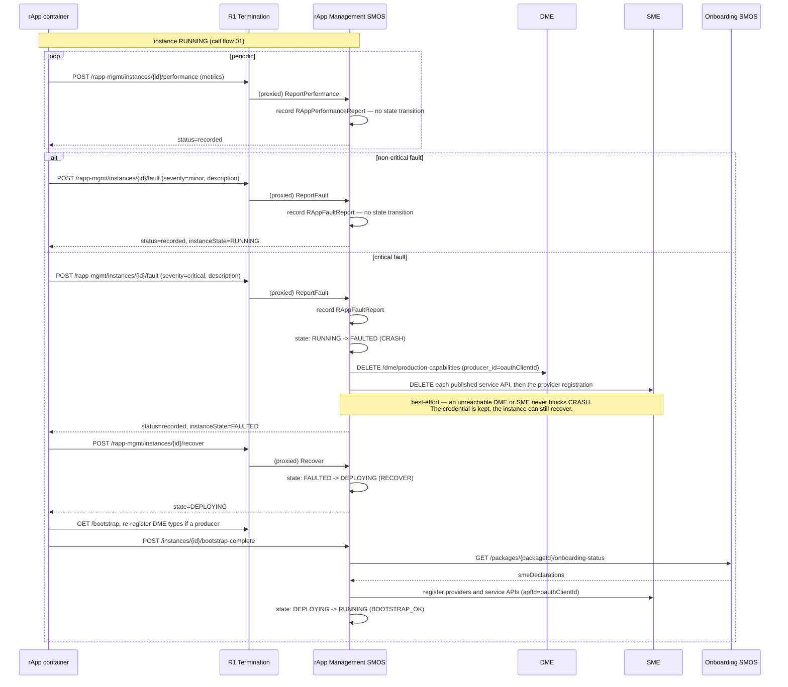
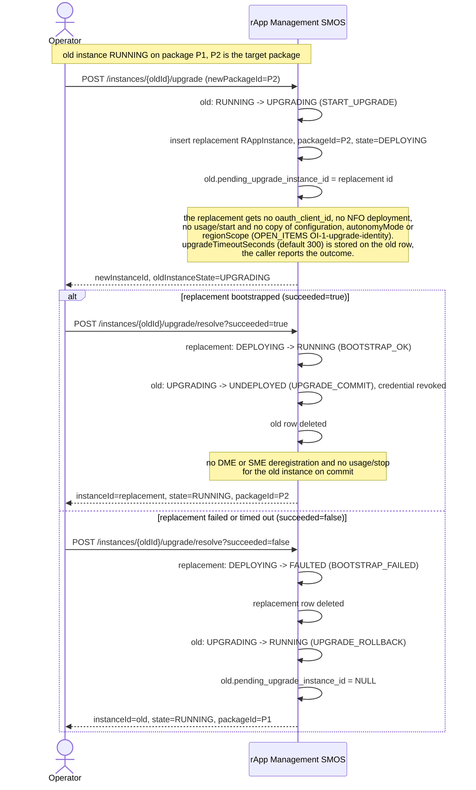
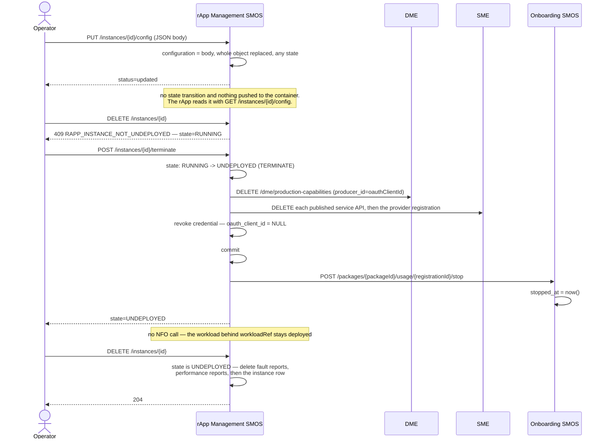

# Call Flow: rApp Instance Lifecycle — Run → Report → Fault → Recover → Upgrade → Reconfigure → Terminate → Delete

A `RAppInstance` moves through rApp Management's instance FSM
(`rapp-mgmt/app/statemachine.py`, Onboarding/rApp Mgmt LLD sections 5-6) once
`CreateInstance` and `bootstrap-complete` have brought it to `RUNNING` (call flow 01). A
running instance reports performance and faults. A critical fault drives `CRASH` to
`FAULTED`, and `POST /instances/{id}/recover` sends it back through bootstrap. An upgrade
runs a replacement instance next to the old one and resolves to commit or rollback.
`PUT /instances/{id}/config` replaces the stored configuration. `terminate` tears the instance
down to `UNDEPLOYED`, and `DELETE` removes the row. Performance reporting is a pure record with
no FSM transition (contrast AI/ML Workflow's `ReportPerformance`, call flow 02, which drives
a retrain decision).

## RAppInstance FSM

| State | Events out (→ target) | Action on the transition |
|---|---|---|
| `DEPLOYING` | `BOOTSTRAP_OK` → `RUNNING`, `BOOTSTRAP_FAILED` → `FAULTED` | none |
| `RUNNING` | `START_UPGRADE` → `UPGRADING`, `TERMINATE` → `UNDEPLOYED`, `CRASH` → `FAULTED` | `TERMINATE`: deregister DME and SME, then revoke the credential. `CRASH`: deregister DME and SME |
| `UPGRADING` | `UPGRADE_COMMIT` → `UNDEPLOYED`, `UPGRADE_ROLLBACK` → `RUNNING` | `UPGRADE_COMMIT`: revoke the credential |
| `FAULTED` | `RECOVER` → `DEPLOYING` | none |
| `UNDEPLOYED` | none (terminal). `DELETE /instances/{id}` removes the row | — |

No transition has a guard. An event with no edge from the current state raises
`IllegalTransition`, which the rApp Management routes do not map to a framework error.
`TERMINATE` and `CRASH` leave only from `RUNNING`, so a `DEPLOYING`, `UPGRADING` or `FAULTED`
instance cannot be terminated, and a non-`RUNNING` instance cannot crash.

## Report, fault, recover

## Upgrade: commit or rollback

## Reconfigure, terminate, delete

**Key decisions this flow depends on:**
- Only `severity == "critical"` drives a state transition. `report_fault` records every report regardless of severity, and the history is readable at `GET /instances/{id}/faults` (and `/performance` for metrics, newest first).
- `CRASH` and `TERMINATE` deregister the instance's DME production capabilities and SME service APIs keyed by its `oauth_client_id` (HISTORY.md OI-1-producer-reconsideration). Both are best-effort. `TERMINATE` runs them before revoking the credential, because revocation clears the id they key on. `CRASH` keeps the credential so `RECOVER` can reuse the same identity.
- `RECOVER` (`FAULTED -> DEPLOYING`) is fired by `POST /instances/{id}/recover` (HISTORY.md OI-2-recover). It re-enters where `CreateInstance` does: the container re-bootstraps and calls `bootstrap-complete`, which re-registers the package's SME declarations. There is no lightweight path straight back to `RUNNING`, matching AI/ML Workflow's retraining re-entry (call flow 02).
- An upgrade is two rows in choreography (`rapp-mgmt/app/upgrade.py`, LLD section 6), not one row changing package in place. Auto-rollback needs no manual intervention, and the old instance keeps its package, credential and identity throughout a failed attempt.
- `upgradeTimeoutSeconds` (default 300 s, HISTORY.md OI-1-upgrade-timeout) is stored on the instance. No timer enforces it: the outcome arrives through `POST /instances/{id}/upgrade/resolve?succeeded=…`.
- On commit, the old row passes through `UNDEPLOYED` with its credential revoked and is then deleted, so no version history remains (OPEN_ITEMS OI-1-sa-rollback). The replacement carries no `oauth_client_id`, so it has no SME/DME identity, and producer reconsideration does not run on `UPGRADE_COMMIT` (OPEN_ITEMS OI-1-upgrade-identity).
- `PUT /instances/{id}/config` replaces `configuration` wholesale in any state, with no schema check and no FSM event. `autonomyMode` and `regionScope` are not part of it: they are fixed at `CreateInstance` (HISTORY.md OI-6.3).
- `TerminateInstance` stops the package usage registration after its own commit, which is what lets Onboarding's deprime and cascade-delete guards pass (call flow 06, HISTORY.md OI-2-usage-registration). An instance created without a registration skips the call.
- Undeploy and delete are separate operations: `terminate` keeps the row in `UNDEPLOYED`, and `DELETE /instances/{id}` is legal only from `UNDEPLOYED` (409 `RAPP_INSTANCE_NOT_UNDEPLOYED` otherwise, 404 `RAPP_INSTANCE_NOT_FOUND` for an unknown id). Delete removes the instance's fault and performance reports explicitly, in addition to their `ON DELETE CASCADE` foreign keys.
