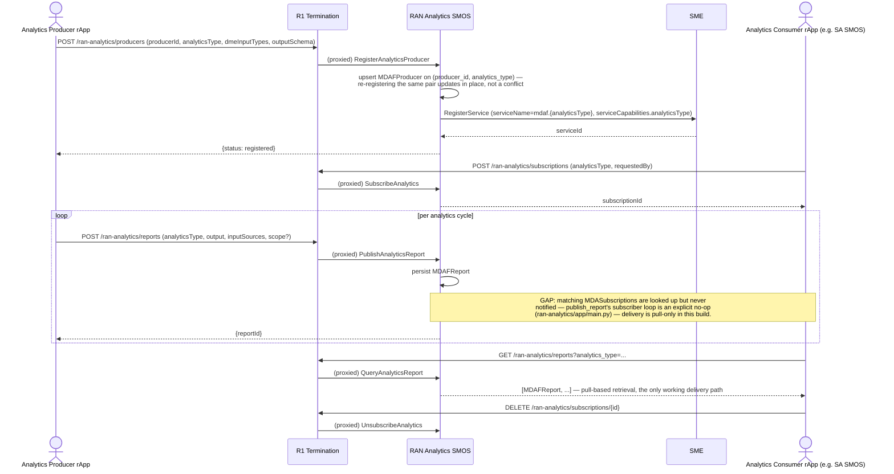

# Call Flow: RAN Analytics — Producer Registration → Report → Subscriber Query

Stitches together RAN Analytics LLD section 1: `RegisterAnalyticsProducer` closes the
producer-side gap v1.3 left entirely unmodeled (v1.3 had Subscribe/Unsubscribe/Query, but
no way for a producer to register at all), and section 2's distinction from AI/ML
Workflow's MLMF — this is RAN *behavior* analytics (MDAF), not model performance.

**Key decisions this flow depends on:**
- `MDAFProducer`'s primary key is `(producer_id, analytics_type)` — the same producer registering a second `analyticsType` is a distinct row, not an update; re-registering the *same* pair (e.g. on restart) upserts in place rather than crashing on the composite-key conflict (fixed this pass — see `smo/README.md`'s "Real bugs this pass found").
- RAN Analytics registers its producer's capability through SME (`RegisterService`), making it independently discoverable via `service-apis` like any other R1 service — not a private RAN-Analytics-only registry.
- **Existing, code-documented gap, restated here for visibility**: `PublishAnalyticsReport`'s subscriber-notification loop is a deliberate no-op (`for sub in subs: pass`) — a `MDASubscription`'s `requestedBy` is recorded but never actually called back. Every consumer in this build must poll `QueryAnalyticsReport`; a push-based delivery mechanism is unbuilt, not merely undocumented.
- This is architecturally distinct from AI/ML Workflow's MLMF (call flow 02) even though both look like "metrics in, subscribers out" — RAN Analytics' `analyticsType` describes RAN *behavior* (coverage, interference, resource utilization), never a model's own performance, which stays MLMF's domain exclusively (RAN Analytics LLD section 2).
