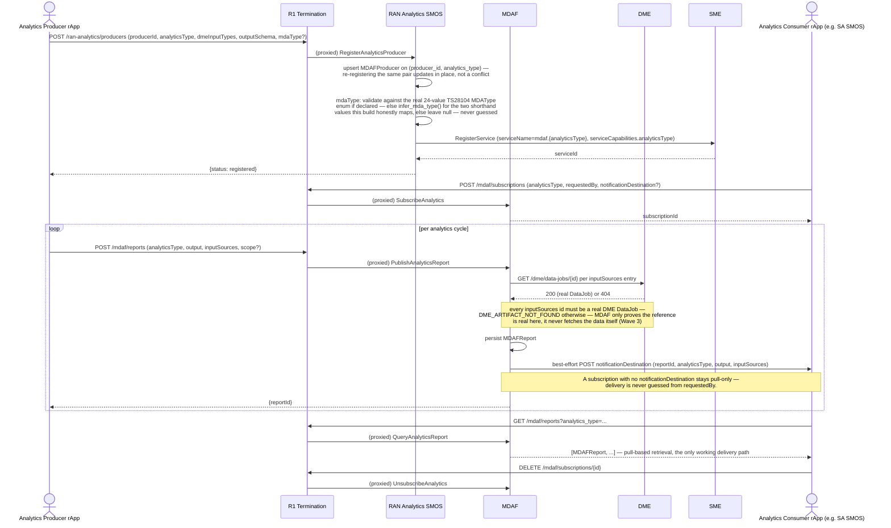

# Call Flow: RAN Analytics — Producer Registration → Report → Subscriber Query

An analytics producer registers with RAN Analytics, publishes reports to MDAF, and
subscribers receive or query them (RAN Analytics LLD sections 1-2).
`RegisterAnalyticsProducer` gives a producer a way to register at all, which v1.3 lacked
(it had only Subscribe/Unsubscribe/Query). This is RAN *behavior* analytics (MDA), not
model performance (MLMF).

Two services share the flow. RAN Analytics keeps the use-case-specific producer
registration; **MDAF** (TS 28.104's MDA NRM realization) owns report storage,
subscriptions and subscriber notification. See the MDAF section of `docs/ARCHITECTURE.md`.
Producer registration is never validated against a report or subscription, so the two
services need no cross-call.

```mermaid
sequenceDiagram
    actor Producer as Analytics Producer rApp
    participant R1 as R1 Termination
    participant RanA as RAN Analytics SMOS
    participant MDAF as MDAF
    participant DME as DME
    participant SME as SME
    actor Consumer as Analytics Consumer rApp (e.g. SA SMOS)

    Producer->>R1: POST /ran-analytics/producers (producerId, analyticsType, dmeInputTypes, outputSchema, mdaType?)
    R1->>RanA: (proxied) RegisterAnalyticsProducer
    RanA->>RanA: upsert MDAFProducer on (producer_id, analytics_type) —<br/>re-registering the same pair updates in place, not a conflict
    RanA->>RanA: mdaType: validate against the real 24-value TS28104 MDAType<br/>enum if declared — else infer_mda_type() for the two shorthand<br/>values this build honestly maps, else leave null — never guessed
    RanA->>SME: RegisterService (serviceName=mdaf.{analyticsType}, serviceCapabilities.analyticsType)
    SME-->>RanA: serviceId
    RanA-->>Producer: {status: registered}

    Consumer->>R1: POST /mdaf/subscriptions (analyticsType, requestedBy, notificationDestination?)
    R1->>MDAF: (proxied) SubscribeAnalytics
    MDAF-->>Consumer: subscriptionId

    loop per analytics cycle
        Producer->>R1: POST /mdaf/reports (analyticsType, output, inputSources, scope?)
        R1->>MDAF: (proxied) PublishAnalyticsReport
        MDAF->>DME: GET /dme/data-jobs/{id} per inputSources entry
        DME-->>MDAF: 200 (real DataJob) or 404
        Note over MDAF,DME: every inputSources id must be a real DME DataJob —<br/>DME_ARTIFACT_NOT_FOUND otherwise — MDAF only proves the reference<br/>is real here, it never fetches the data itself (Wave 3)
        MDAF->>MDAF: persist MDAFReport
        MDAF->>Consumer: best-effort POST notificationDestination (reportId, analyticsType, output, inputSources)
        Note over MDAF,Consumer: A subscription with no notificationDestination stays pull-only —<br/>delivery is never guessed from requestedBy.
        MDAF-->>Producer: {reportId}
    end

    Consumer->>R1: GET /mdaf/reports?analytics_type=...
    R1->>MDAF: (proxied) QueryAnalyticsReport
    MDAF-->>Consumer: [MDAFReport, ...] — pull-based retrieval, the only working delivery path

    Consumer->>R1: DELETE /mdaf/subscriptions/{id}
    R1->>MDAF: (proxied) UnsubscribeAnalytics
```

**Key decisions this flow depends on:**
- `MDAFProducer`'s primary key is `(producer_id, analytics_type)` — the same producer registering a second `analyticsType` is a distinct row, not an update; re-registering the *same* pair (e.g. on restart) upserts in place rather than failing on the composite-key conflict.
- RAN Analytics registers its producer's capability through SME (`RegisterService`), making it independently discoverable via `service-apis` like any other R1 service — not a private RAN-Analytics-only registry.
- `SubscribeAnalytics` accepts an optional `notificationDestination` (the same shape as Intent Service's subscription callbacks), and each published report is best-effort POSTed to every matching subscriber that registered one — an unreachable subscriber never fails the publish. A subscriber with no destination stays pull-only via `QueryAnalyticsReport`; delivery is never guessed from `requestedBy`.
- This is architecturally distinct from MLMF (call flow 02, AIMgF) even though both look like "metrics in, subscribers out" — `analyticsType` describes RAN *behavior* (coverage, interference, resource utilization), never a model's own performance, which stays MLMF's domain exclusively (RAN Analytics LLD section 2).
- `analyticsType` is a free string — callers use informal shorthand, not TS 28.104's 24 closed wire values. An optional `mdaType` is validated against the real enum when a caller declares one, and is inferred for the two shorthand values with an unambiguous spec correspondence; anything else stays `null` rather than being fabricated (HISTORY.md SA-MDA-2).
