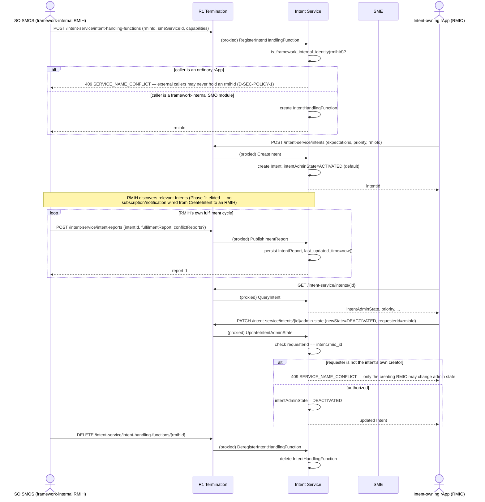

# Call Flow: Intent Registration → Fulfilment Reporting → Admin-State Control

Stitches together Intent Service (formerly Policy Mgmt) LLD sections 1-3: `QueryIntent` and
`UpdateIntentAdminState` close operations v1.3 never had (`intentAdminState` existed with
nothing that could change it), and `DeregisterIntentHandlingFunction` restores
register/deregister symmetry `RegisterIntentHandlingFunction` alone left broken.

**Key decisions this flow depends on:**
- `RegisterIntentHandlingFunction` is framework-internal only (D-SEC-POLICY-1) — `is_framework_internal_identity()` rejects any ordinary rApp attempting to register as an RMIH; only SO SMOS / SA SMOS are legitimate callers in this build.
- `UpdateIntentAdminState` is RMIO-only, checked against the `Intent`'s own `rmioId` at creation time — an RMIH that fulfils an Intent can report on it (`PublishIntentReport`) but cannot deactivate it; only the Intent's creator can.
- **Gap worth noting, not previously called out**: nothing in this build notifies an RMIH when a new `Intent` matching its `intentHandlingCapabilityList` is created — `CreateIntent` and `RegisterIntentHandlingFunction` both exist, but the matching/dispatch step between them (an RMIH discovering which Intents it should act on) is unbuilt. `intent_handling_scope` is modeled on `IntentHandlingFunction` but `RegisterIntentHandlingFunction`'s own request body never sets it, and nothing reads it — a column with no code path touching it at all.
- `intentExpectations` stays an opaque `JSON` blob throughout — TS 28.312's own expectation grammar isn't in this build's source corpus, so it's carried, never interpreted (matches the model's own inline comment).
