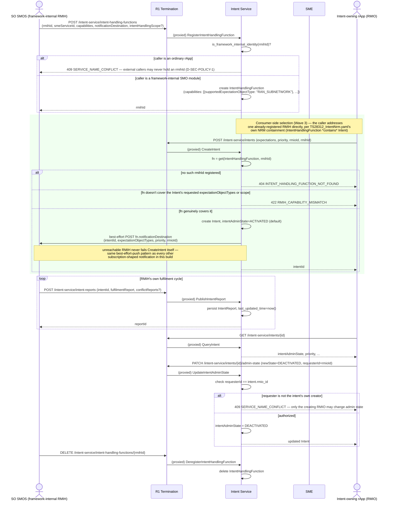

# Call Flow: Intent Registration → Fulfilment Reporting → Admin-State Control

Stitches together Intent Service (formerly Policy Mgmt) LLD sections 1-3: `QueryIntent` and
`UpdateIntentAdminState` close operations v1.3 never had (`intentAdminState` existed with
nothing that could change it), and `DeregisterIntentHandlingFunction` restores
register/deregister symmetry `RegisterIntentHandlingFunction` alone left broken.

**Rewritten from this flow's first version**, which described `CreateIntent` as an
unaddressed call that (per its own stated "gap") had no way to ever reach an RMIH.
That's no longer true: Wave 3 replaced the former producer-side push-after-creation
matching with the spec's own implied consumer-side selection — the caller now names one
already-registered `IntentHandlingFunction` directly, and creation is rejected
(`RMIH_CAPABILITY_MISMATCH`, 422) if that RMIH doesn't actually cover what the Intent
asks for. `README.md`'s own "Two open architectural questions" list still described this
as open until this pass, even though its top summary already correctly called it closed —
fixed there too.

```mermaid
sequenceDiagram
    actor SO as SO SMOS (framework-internal RMIH)
    participant R1 as R1 Termination
    participant Policy as Intent Service
    participant SME as SME
    actor RMIO as Intent-owning rApp (RMIO)

    SO->>R1: POST /intent-service/intent-handling-functions<br/>(rmihId, smeServiceId, capabilities, notificationDestination, intentHandlingScope?)
    R1->>Policy: (proxied) RegisterIntentHandlingFunction
    Policy->>Policy: is_framework_internal_identity(rmihId)?
    alt caller is an ordinary rApp
        Policy-->>SO: 409 SERVICE_NAME_CONFLICT — external callers may never hold an rmihId (D-SEC-POLICY-1)
    else caller is a framework-internal SMO module
        Policy->>Policy: create IntentHandlingFunction<br/>(capabilities: [{supportedExpectationObjectType: "RAN_SUBNETWORK"}, ...])
        Policy-->>SO: rmihId
    end

    rect rgb(240, 255, 240)
    Note over RMIO,Policy: Consumer-side selection (Wave 3) — the caller addresses<br/>one already-registered RMIH directly, per TS28312_IntentNrm.yaml's<br/>own NRM containment (IntentHandlingFunction *contains* Intent)
    RMIO->>R1: POST /intent-service/intents (expectations, priority, rmioId, rmihId)
    R1->>Policy: (proxied) CreateIntent
    Policy->>Policy: fn = get(IntentHandlingFunction, rmihId)
    alt no such rmihId registered
        Policy-->>RMIO: 404 INTENT_HANDLING_FUNCTION_NOT_FOUND
    else fn doesn't cover the Intent's requested expectationObjectTypes or scope
        Policy-->>RMIO: 422 RMIH_CAPABILITY_MISMATCH
    else fn genuinely covers it
        Policy->>Policy: create Intent, intentAdminState=ACTIVATED (default)
        Policy->>SO: best-effort POST fn.notificationDestination<br/>(intentId, expectationObjectTypes, priority, rmioId)
        Note over Policy,SO: unreachable RMIH never fails CreateIntent itself —<br/>same best-effort-push pattern as every other<br/>subscription-shaped notification in this build
        Policy-->>RMIO: intentId
    end
    end

    loop RMIH's own fulfilment cycle
        SO->>R1: POST /intent-service/intent-reports (intentId, fulfilmentReport, conflictReports?)
        R1->>Policy: (proxied) PublishIntentReport
        Policy->>Policy: persist IntentReport, last_updated_time=now()
        Policy-->>SO: reportId
    end

    RMIO->>R1: GET /intent-service/intents/{id}
    R1->>Policy: (proxied) QueryIntent
    Policy-->>RMIO: intentAdminState, priority, ...

    RMIO->>R1: PATCH /intent-service/intents/{id}/admin-state (newState=DEACTIVATED, requesterId=rmioId)
    R1->>Policy: (proxied) UpdateIntentAdminState
    Policy->>Policy: check requesterId == intent.rmio_id
    alt requester is not the intent's own creator
        Policy-->>RMIO: 409 SERVICE_NAME_CONFLICT — only the creating RMIO may change admin state
    else authorized
        Policy->>Policy: intentAdminState = DEACTIVATED
        Policy-->>RMIO: updated Intent
    end

    SO->>R1: DELETE /intent-service/intent-handling-functions/{rmihId}
    R1->>Policy: (proxied) DeregisterIntentHandlingFunction
    Policy->>Policy: delete IntentHandlingFunction
```

**Key decisions this flow depends on:**
- `RegisterIntentHandlingFunction` is framework-internal only (D-SEC-POLICY-1) — `is_framework_internal_identity()` rejects any ordinary rApp attempting to register as an RMIH; only SO SMOS / SA SMOS are legitimate callers in this build.
- `UpdateIntentAdminState` is RMIO-only, checked against the `Intent`'s own `rmioId` at creation time — an RMIH that fulfils an Intent can report on it (`PublishIntentReport`) but cannot deactivate it; only the Intent's creator can.
- **Closed since this flow was first written**: `CreateIntent` used to be an unaddressed call with no dispatch to any RMIH at all. It's now consumer-side selection, matching TS28312_IntentNrm.yaml's own containment model: `rmihId` is required, `_validate_rmih_can_handle` checks the named function's `intentHandlingCapabilityList` (`supportedExpectationObjectType`) against the Intent's own requested expectation object types, and its `intentHandlingScope` (now actually read, not just modeled and ignored) against the Intent's own requested scope — either mismatch is a real `RMIH_CAPABILITY_MISMATCH` (422) at creation time, not a silent accept. A scope-less RMIH matches any scope; an Intent with no expectation object types skips that half of the check.
- `intentExpectations` stays an opaque `JSON` blob throughout — TS 28.312's own expectation grammar isn't in this build's source corpus, so it's carried, never interpreted (matches the model's own inline comment). Only one field is read out of it directly: `expectationObject.objectType`, the one TS28312 field this build's capability matching actually needs.
