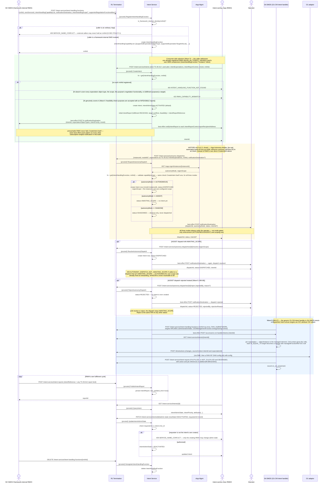

# Call Flow: Intent Registration → Fulfilment Reporting → Admin-State Control

Intent registration, fulfilment reporting and admin-state control in Intent Service
(formerly Policy Mgmt; Intent Service LLD sections 1-3): `RegisterIntentHandlingFunction`
and `DeregisterIntentHandlingFunction` for RMIHs, `CreateIntent` addressed to one RMIH,
`PublishIntentReport`, `QueryIntent` and `UpdateIntentAdminState`.

`CreateIntent` uses consumer-side selection: the caller names one already-registered
`IntentHandlingFunction` (`rmihId`), and creation is rejected (`RMIH_CAPABILITY_MISMATCH`,
422) if that RMIH doesn't cover what the Intent asks for (see "RMIH selection" in
`docs/ARCHITECTURE.md`).

**Who creates an Intent, and why.** There are two paths:
- **Direct.** Any rApp acting as the Intent's owner (RMIO, identified by `rmioId`) may call
  `CreateIntent` for its own reasons; this flow is deliberately generic about why, the same
  way call flow 03 is generic about why a CM change is written.
- **Autonomy dispatch.** `RequestAutonomyDispatch` hands an inference outcome (call flow 02)
  to Intent Service under the rApp instance's `autonomyMode`, fixed at `CreateInstance`
  (call flow 01): `AUTONOMOUS` creates an Intent immediately within the instance's
  pre-configured region scope; `ASSIST` holds it for an operator to resolve (scope) or
  reject; `SHADOW` computes it but never dispatches (HISTORY.md OI-6.3).

A dispatched Intent whose targets are `IOC.attribute` CM values is enacted by SA SMOS's
generic O1-CM intent handler, which writes the changes through DME `/actions` and reports
fulfilment back to Intent Service.

```mermaid
sequenceDiagram
    actor SO as SO SMOS (framework-internal RMIH)
    participant R1 as R1 Termination
    participant Policy as Intent Service
    participant RappMgmt as rApp Mgmt
    actor RMIO as Intent-owning rApp (RMIO)
    actor Operator as Operator
    participant SA as SA SMOS (O1-CM intent handler)
    participant O1 as O1 adaptor

    SO->>R1: POST /intent-service/intent-handling-functions<br/>(rmihId, smeServiceId, intentHandlingCapabilityList, notificationDestination, intentHandlingScope?, supportedNegotiationFunctionalities?)
    R1->>Policy: (proxied) RegisterIntentHandlingFunction
    Policy->>Policy: is_framework_internal_identity(rmihId)?
    alt caller is an ordinary rApp
        Policy-->>SO: 409 SERVICE_NAME_CONFLICT — external callers may never hold an rmihId (D-SEC-POLICY-1)
    else caller is a framework-internal SMO module
        Policy->>Policy: create IntentHandlingFunction<br/>(intentHandlingCapabilityList: [{supportedExpectationObjectType, supportedExpectationTargetInfoList}, ...])
        Policy-->>SO: rmihId
    end

    rect rgb(240, 255, 240)
    Note over RMIO,Policy: Consumer-side selection (Wave 3) — the caller addresses<br/>one already-registered RMIH directly, per TS28312_IntentNrm.yaml's<br/>own NRM containment (IntentHandlingFunction *contains* Intent)
    RMIO->>R1: POST /intent-service/intents (strict TS 28.312: userLabel, intentExpectations, intentReportControl, rmioId, rmihId)
    R1->>Policy: (proxied) CreateIntent
    Policy->>Policy: fn = get(IntentHandlingFunction, rmihId)
    alt no such rmihId registered
        Policy-->>RMIO: 404 INTENT_HANDLING_FUNCTION_NOT_FOUND
    else fn doesn't cover every expectation object type, the scope, the purpose's negotiation functionality, or (fulfilment purposes) a target
        Policy-->>RMIO: 422 RMIH_CAPABILITY_MISMATCH
    else fn genuinely covers it (Wave 6: feasibility-check purposes are accepted with an INFEASIBLE report)
        Policy->>Policy: create Intent, intentAdminState=ACTIVATED (default)
        Policy->>Policy: initial IntentReport (fulfilment RECEIVED, target conflicts, feasibility) = intentReportReference
        Policy->>SO: best-effort POST fn.notificationDestination<br/>(intentId, expectationObjectTypes, intentPriority, rmioId)
        Policy->>RMIO: best-effort notifyIntentReport to each intentReportControl.reportRecipientAddress
        Note over Policy,SO: unreachable RMIH never fails CreateIntent itself —<br/>same best-effort-push pattern as every other<br/>subscription-shaped notification in this build
        Policy-->>RMIO: intentId
    end
    end

    rect rgb(255, 250, 230)
    Note over RMIO,RappMgmt: HISTORY.md OI-6.3, closed — rApp Autonomy Modes: the real,<br/>automated hand-off from an AI/ML inference outcome (call flow 02) to<br/>an Intent, instead of RMIO's own direct CreateIntent above
    RMIO->>R1: POST /intent-service/autonomy-dispatches<br/>(instanceId, modelId?, expectations as TS 28.312 IntentExpectations, rmihId, notificationDestination?)
    R1->>Policy: (proxied) RequestAutonomyDispatch
    Policy->>RappMgmt: GET /rapp-mgmt/instances/{instanceId}
    RappMgmt-->>Policy: autonomyMode, regionScope
    Policy->>Policy: fn = get(IntentHandlingFunction, rmihId) — validate capability/scope — same check CreateIntent itself runs, for all three modes
    alt autonomyMode == AUTONOMOUS
        Policy->>Policy: create Intent now (rmioId=instanceId), status=DISPATCHED<br/>regionScope = the instance's own pre-configured scope
    else autonomyMode == ASSIST
        Policy->>Policy: status=AWAITING_SCOPE — no Intent yet
    else autonomyMode == SHADOW
        Policy->>Policy: status=SHADOWED — observe-only, never dispatched
    end
    Policy->>Operator: best-effort POST notificationDestination<br/>(dispatchId, autonomyMode, status, intentId?)
    Note over Policy,Operator: all three modes always notify the operator — not mode-gated,<br/>only enforcement (AUTONOMOUS/ASSIST) and scoping vary
    Policy-->>RMIO: dispatchId, status, intentId?
    end

    opt ASSIST dispatch left AWAITING_SCOPE
    Operator->>R1: POST /intent-service/autonomy-dispatches/{id}/resolve (regionScope)
    R1->>Policy: (proxied) ResolveAutonomyDispatch
    Policy->>Policy: create Intent now, status=DISPATCHED
    Policy->>Operator: best-effort POST notificationDestination — again, dispatch resolved
    Policy-->>Operator: dispatchId, status=DISPATCHED, intentId
    Note over Policy: 409 AUTONOMY_DISPATCH_NOT_AWAITING_SCOPE if called on a<br/>dispatch that isn't AWAITING_SCOPE — AUTONOMOUS's own scope was<br/>already fixed at onboarding, SHADOW is never resolvable at all
    end

    opt ASSIST dispatch rejected instead (Wave 8, W8-08)
    Operator->>R1: POST /intent-service/autonomy-dispatches/{id}/reject (rejectedBy, reason?)
    R1->>Policy: (proxied) RejectAutonomyDispatch
    Policy->>Policy: status=REJECTED — no Intent is ever created
    Policy->>Operator: best-effort POST notificationDestination — dispatch rejected
    Policy-->>Operator: dispatchId, status=REJECTED, rejectedBy, rejectionReason
    Note over Policy: until resolve or reject, the dispatch stays AWAITING_SCOPE.<br/>Reject is the same 409 on any other status
    end

    rect rgb(235, 245, 255)
    Note over SA,O1: Wave 8 (W8-07) — the generic O1-CM intent handler in SA SMOS enacts<br/>a dispatched Intent whose targets are IOC.attribute CM values
    SA->>R1: POST /intent-service/intent-handling-functions (rmihId=sa-smos, RAN_SUBNETWORK,<br/>targets NRCellDU.administrativeState, CESManagementFunction.energySavingControl)
    Policy->>SA: best-effort POST /sa-smos/o1-cm-handler/intents (intentId)
    SA->>R1: GET /intent-service/intents/{intentId}
    SA->>SA: per expectation — objectInstance is the managed element, Cell context gives the cells,<br/>each IS_EQUAL_TO target becomes a change with managedFunctionRef IOC=cell
    SA->>R1: POST /dme/actions (changes, sourceContext intentId and expectationId)
    R1->>O1: (via DME, then a RAN NF OAM config job) edit-config
    SA->>R1: POST /intent-service/intent-reports (FULFILLED, or NOT_FULFILLED and DEGRADED,<br/>with action and job references in additionalFulfilmentInfo)
    SA->>SA: record o1_cm_enactment
    end

    loop RMIH's own fulfilment cycle
        SO->>R1: POST /intent-service/intent-reports (intentReference + any TS 28.312 report kind)
        R1->>Policy: (proxied) PublishIntentReport
        Policy->>Policy: persist IntentReport, last_updated_time=now()
        Policy-->>SO: reportId
    end

    RMIO->>R1: GET /intent-service/intents/{id}
    R1->>Policy: (proxied) QueryIntent
    Policy-->>RMIO: intentAdminState, intentPriority, attributes{...}

    RMIO->>R1: PATCH /intent-service/intents/{id}/admin-state (newState=DEACTIVATED, requesterId=rmioId)
    R1->>Policy: (proxied) UpdateIntentAdminState
    Policy->>Policy: check requesterId == intent.rmio_id
    alt requester is not the intent's own creator
        Policy-->>RMIO: 409 SERVICE_NAME_CONFLICT — only the creating RMIO may change admin state
    else authorized
        Policy->>Policy: intentAdminState = DEACTIVATED
        Policy-->>RMIO: updated Intent
    end

    SO->>R1: DELETE /intent-service/intent-handling-functions/{rmihId}
    R1->>Policy: (proxied) DeregisterIntentHandlingFunction
    Policy->>Policy: delete IntentHandlingFunction
```

**Key decisions this flow depends on:**
- `RegisterIntentHandlingFunction` is framework-internal only (D-SEC-POLICY-1) — `is_framework_internal_identity()` rejects any ordinary rApp attempting to register as an RMIH; only SO SMOS / SA SMOS are legitimate callers in this build.
- `UpdateIntentAdminState` is RMIO-only, checked against the `Intent`'s own `rmioId` at creation time — an RMIH that fulfils an Intent can report on it (`PublishIntentReport`) but cannot deactivate it; only the Intent's creator can.
- `CreateIntent` follows TS28312_IntentNrm.yaml's containment model (IntentHandlingFunction *contains* Intent): `rmihId` is required, and the named function must cover every requested expectation object type (`supportedExpectationObjectType` in its `intentHandlingCapabilityList`), the requested `intentHandlingScope`, the negotiation functionality the `intentMgmtPurpose` needs, and — for fulfilment purposes — a feasible target. Any mismatch is `RMIH_CAPABILITY_MISMATCH` (422) at creation time. A scope-less RMIH matches any scope; a feasibility-check purpose is accepted with an INFEASIBLE report instead of rejected.
- `intentExpectations` is validated against TS 28.312's structured `IntentExpectation` model and its expectation families (`intent-service/app/ts28312.py`, `ts28312_families.py`); eight value datatypes are accepted without inner-structure checks (OPEN_ITEMS.md SA-INTENT-partial). Capability matching reads `expectationObject.objectType`.
- `RequestAutonomyDispatch` validates the same way for all three modes, up front — even `SHADOW` "computes" the Intent it would have produced, so a dispatch addressed to a non-existent or incapable RMIH is rejected exactly as `AUTONOMOUS`/`ASSIST` are. An `AutonomyDispatch` row is created regardless of mode — distinct from `Intent` itself since not every mode produces one.
- **Design choice, not an oversight**: an `AUTONOMOUS`/`ASSIST` dispatch does *not* route through SO SMOS's `DISPATCH_TABLE` (call flow 10) — that table composes explicit, operator-driven multi-step `ServiceOrder`s; an autonomy dispatch is an rApp instance's real-time reaction to its own inference outcome, so it calls Intent Service, the module that owns Intent creation, directly.
- `AutonomyDispatch.rmioId` on the Intent it creates is the dispatching `instanceId` itself (stringified) — the identity behind an autonomy-driven Intent is the rApp instance that triggered it, the same role a direct `CreateIntent` caller's `rmioId` plays.
