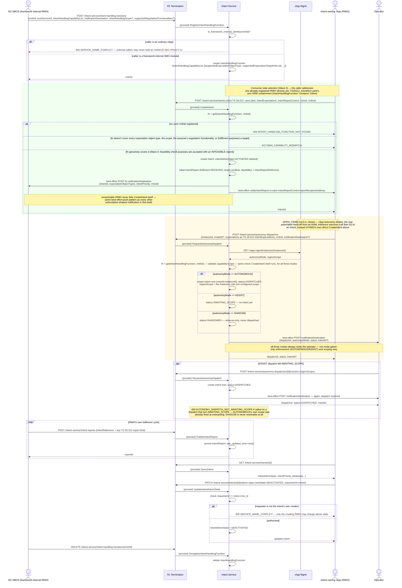

# Call Flow: Intent Registration → Fulfilment Reporting → Admin-State Control

Stitches together Intent Service (formerly Policy Mgmt) LLD sections 1-3: `QueryIntent` and
`UpdateIntentAdminState` close operations v1.3 never had (`intentAdminState` existed with
nothing that could change it), and `DeregisterIntentHandlingFunction` restores
register/deregister symmetry `RegisterIntentHandlingFunction` alone left broken.

**Rewritten from this flow's first version**, which described `CreateIntent` as an
unaddressed call that (per its own stated "gap") had no way to ever reach an RMIH.
That's no longer true: Wave 3 replaced the former producer-side push-after-creation
matching with the spec's own implied consumer-side selection — the caller now names one
already-registered `IntentHandlingFunction` directly, and creation is rejected
(`RMIH_CAPABILITY_MISMATCH`, 422) if that RMIH doesn't actually cover what the Intent
asks for. `README.md`'s own "Two open architectural questions" list still described this
as open until this pass, even though its top summary already correctly called it closed —
fixed there too.

**Who creates an Intent, and when, and why**: `CreateIntent`'s only real caller identity
is `rmioId` — any rApp acting as the Intent's owner (RMIO) may call it directly, for
whatever reason that rApp has; this flow stays deliberately generic about *why* that
direct path is used, the same way call flow 03 is deliberately generic about *why* a CM
change is being written. **Closed since this flow was first written** (`OPEN_ITEMS.md`
section 6.3): a second, real, automated path now exists alongside it —
`RequestAutonomyDispatch`, closing the gap where an inference-driven rApp had no hand-off
from "inference completed" (call flow 02) to "Intent created" beyond its own private,
unaudited choice. An rApp instance's `autonomyMode` (rApp Mgmt's own `RAppInstance`, fixed
at onboarding — call flow 01) now decides what happens to an inference outcome it wants
enacted: `AUTONOMOUS` creates a real Intent immediately at a pre-configured region scope;
`ASSIST` holds it for an operator to scope first; `SHADOW` computes it but never dispatches
— see the new block below. The direct `CreateIntent` path above is unchanged and still
exists for any caller that isn't going through autonomy-mode dispatch at all.

```mermaid
sequenceDiagram
    actor SO as SO SMOS (framework-internal RMIH)
    participant R1 as R1 Termination
    participant Policy as Intent Service
    participant RappMgmt as rApp Mgmt
    actor RMIO as Intent-owning rApp (RMIO)
    actor Operator as Operator

    SO->>R1: POST /intent-service/intent-handling-functions<br/>(rmihId, smeServiceId, intentHandlingCapabilityList, notificationDestination, intentHandlingScope?, supportedNegotiationFunctionalities?)
    R1->>Policy: (proxied) RegisterIntentHandlingFunction
    Policy->>Policy: is_framework_internal_identity(rmihId)?
    alt caller is an ordinary rApp
        Policy-->>SO: 409 SERVICE_NAME_CONFLICT — external callers may never hold an rmihId (D-SEC-POLICY-1)
    else caller is a framework-internal SMO module
        Policy->>Policy: create IntentHandlingFunction<br/>(intentHandlingCapabilityList: [{supportedExpectationObjectType, supportedExpectationTargetInfoList}, ...])
        Policy-->>SO: rmihId
    end

    rect rgb(240, 255, 240)
    Note over RMIO,Policy: Consumer-side selection (Wave 3) — the caller addresses<br/>one already-registered RMIH directly, per TS28312_IntentNrm.yaml's<br/>own NRM containment (IntentHandlingFunction *contains* Intent)
    RMIO->>R1: POST /intent-service/intents (strict TS 28.312: userLabel, intentExpectations, intentReportControl, rmioId, rmihId)
    R1->>Policy: (proxied) CreateIntent
    Policy->>Policy: fn = get(IntentHandlingFunction, rmihId)
    alt no such rmihId registered
        Policy-->>RMIO: 404 INTENT_HANDLING_FUNCTION_NOT_FOUND
    else fn doesn't cover every expectation object type, the scope, the purpose's negotiation functionality, or (fulfilment purposes) a target
        Policy-->>RMIO: 422 RMIH_CAPABILITY_MISMATCH
    else fn genuinely covers it (Wave 6: feasibility-check purposes are accepted with an INFEASIBLE report)
        Policy->>Policy: create Intent, intentAdminState=ACTIVATED (default)
        Policy->>Policy: initial IntentReport (fulfilment RECEIVED, target conflicts, feasibility) = intentReportReference
        Policy->>SO: best-effort POST fn.notificationDestination<br/>(intentId, expectationObjectTypes, intentPriority, rmioId)
        Policy->>RMIO: best-effort notifyIntentReport to each intentReportControl.reportRecipientAddress
        Note over Policy,SO: unreachable RMIH never fails CreateIntent itself —<br/>same best-effort-push pattern as every other<br/>subscription-shaped notification in this build
        Policy-->>RMIO: intentId
    end
    end

    rect rgb(255, 250, 230)
    Note over RMIO,RappMgmt: OPEN_ITEMS.md 6.3, closed — rApp Autonomy Modes: the real,<br/>automated hand-off from an AI/ML inference outcome (call flow 02) to<br/>an Intent, instead of RMIO's own direct CreateIntent above
    RMIO->>R1: POST /intent-service/autonomy-dispatches<br/>(instanceId, modelId?, expectations as TS 28.312 IntentExpectations, rmihId, notificationDestination?)
    R1->>Policy: (proxied) RequestAutonomyDispatch
    Policy->>RappMgmt: GET /rapp-mgmt/instances/{instanceId}
    RappMgmt-->>Policy: autonomyMode, regionScope
    Policy->>Policy: fn = get(IntentHandlingFunction, rmihId) — validate capability/scope — same check CreateIntent itself runs, for all three modes
    alt autonomyMode == AUTONOMOUS
        Policy->>Policy: create Intent now (rmioId=instanceId), status=DISPATCHED<br/>regionScope = the instance's own pre-configured scope
    else autonomyMode == ASSIST
        Policy->>Policy: status=AWAITING_SCOPE — no Intent yet
    else autonomyMode == SHADOW
        Policy->>Policy: status=SHADOWED — observe-only, never dispatched
    end
    Policy->>Operator: best-effort POST notificationDestination<br/>(dispatchId, autonomyMode, status, intentId?)
    Note over Policy,Operator: all three modes always notify the operator — not mode-gated,<br/>only enforcement (AUTONOMOUS/ASSIST) and scoping vary
    Policy-->>RMIO: dispatchId, status, intentId?
    end

    opt ASSIST dispatch left AWAITING_SCOPE
    Operator->>R1: POST /intent-service/autonomy-dispatches/{id}/resolve (regionScope)
    R1->>Policy: (proxied) ResolveAutonomyDispatch
    Policy->>Policy: create Intent now, status=DISPATCHED
    Policy->>Operator: best-effort POST notificationDestination — again, dispatch resolved
    Policy-->>Operator: dispatchId, status=DISPATCHED, intentId
    Note over Policy: 409 AUTONOMY_DISPATCH_NOT_AWAITING_SCOPE if called on a<br/>dispatch that isn't AWAITING_SCOPE — AUTONOMOUS's own scope was<br/>already fixed at onboarding, SHADOW is never resolvable at all
    end

    loop RMIH's own fulfilment cycle
        SO->>R1: POST /intent-service/intent-reports (intentReference + any TS 28.312 report kind)
        R1->>Policy: (proxied) PublishIntentReport
        Policy->>Policy: persist IntentReport, last_updated_time=now()
        Policy-->>SO: reportId
    end

    RMIO->>R1: GET /intent-service/intents/{id}
    R1->>Policy: (proxied) QueryIntent
    Policy-->>RMIO: intentAdminState, intentPriority, attributes{...}

    RMIO->>R1: PATCH /intent-service/intents/{id}/admin-state (newState=DEACTIVATED, requesterId=rmioId)
    R1->>Policy: (proxied) UpdateIntentAdminState
    Policy->>Policy: check requesterId == intent.rmio_id
    alt requester is not the intent's own creator
        Policy-->>RMIO: 409 SERVICE_NAME_CONFLICT — only the creating RMIO may change admin state
    else authorized
        Policy->>Policy: intentAdminState = DEACTIVATED
        Policy-->>RMIO: updated Intent
    end

    SO->>R1: DELETE /intent-service/intent-handling-functions/{rmihId}
    R1->>Policy: (proxied) DeregisterIntentHandlingFunction
    Policy->>Policy: delete IntentHandlingFunction
```

**Key decisions this flow depends on:**
- `RegisterIntentHandlingFunction` is framework-internal only (D-SEC-POLICY-1) — `is_framework_internal_identity()` rejects any ordinary rApp attempting to register as an RMIH; only SO SMOS / SA SMOS are legitimate callers in this build.
- `UpdateIntentAdminState` is RMIO-only, checked against the `Intent`'s own `rmioId` at creation time — an RMIH that fulfils an Intent can report on it (`PublishIntentReport`) but cannot deactivate it; only the Intent's creator can.
- **Closed since this flow was first written**: `CreateIntent` used to be an unaddressed call with no dispatch to any RMIH at all. It's now consumer-side selection, matching TS28312_IntentNrm.yaml's own containment model: `rmihId` is required, `_validate_rmih_can_handle` checks the named function's `intentHandlingCapabilityList` (`supportedExpectationObjectType`) against the Intent's own requested expectation object types, and its `intentHandlingScope` (now actually read, not just modeled and ignored) against the Intent's own requested scope — either mismatch is a real `RMIH_CAPABILITY_MISMATCH` (422) at creation time, not a silent accept. A scope-less RMIH matches any scope; an Intent with no expectation object types skips that half of the check.
- `intentExpectations` stays an opaque `JSON` blob throughout — TS 28.312's own expectation grammar isn't in this build's source corpus, so it's carried, never interpreted (matches the model's own inline comment). Only one field is read out of it directly: `expectationObject.objectType`, the one TS28312 field this build's capability matching actually needs.
- **Closed since this flow was first written** (`OPEN_ITEMS.md` section 6.3): `RequestAutonomyDispatch` validates the same way for all three modes, up front — even `SHADOW` "computes" the Intent it would have produced, so a dispatch addressed to a non-existent or incapable RMIH is rejected the same way `AUTONOMOUS`/`ASSIST` already are, not silently accepted just because nothing real ends up dispatched. A real `AutonomyDispatch` row is created regardless of mode — distinct from `Intent` itself since not every mode actually produces one.
- **Design choice, not an oversight**: an `AUTONOMOUS`/`ASSIST` dispatch does *not* route through SO SMOS's own `DISPATCH_TABLE` (call flow 10, `OPEN_ITEMS.md` section 6.6) — that table composes explicit, operator-driven multi-step `ServiceOrder`s; an autonomy dispatch is a different actor's own real-time decision (an rApp instance, reacting to its own inference outcome), so it calls `Intent Service` directly, the module that already owns Intent creation, rather than indirecting through infrastructure built for a different caller and a different trigger.
- `AutonomyDispatch.rmioId` on the Intent it creates is the dispatching `instanceId` itself (stringified) — the real identity behind an autonomy-driven Intent is the rApp instance that triggered it, the same role a direct `CreateIntent` caller's own `rmioId` already plays.
