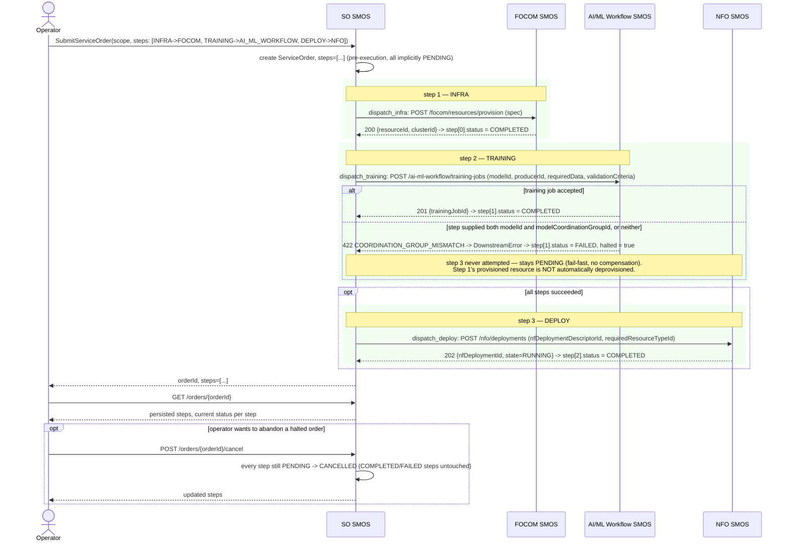

# Call Flow: SO SMOS Multi-Step Order — INFRA → TRAINING → DEPLOY

Stitches together SO/SA SMOS LLD section 1's full dispatch table (`so-smos/app/dispatch.py`)
across three of its five entries in one order, showing the fail-fast halt at whichever
step actually fails — not just the two-step CONFIG→NFO example call flow 04 already covers.

**Key decisions this flow depends on:**
- Fail-fast with **no compensation**: if `TRAINING` fails after `INFRA` already succeeded, the provisioned FOCOM resource from step 1 is never automatically torn down — SO/SA SMOS LLD section 1.1 explicitly chose sequential fail-fast over a saga/compensating-transaction pattern for Phase 1. Cleanup after a partial failure is an operator (or SA SMOS remedial-action) responsibility, not something `execute_order` does itself.
- `CancelOrder` only ever touches steps still `PENDING` — a `COMPLETED` step's real-world effect (e.g. the FOCOM resource from step 1) is untouched by cancellation; cancelling the *order* is not the same as rolling back what already happened.
- Every dispatcher (`dispatch_infra`, `dispatch_training`, `dispatch_deploy`, plus `dispatch_config`/`dispatch_policy` shown in call flows 04/10) shares the same `_ensure_ok` status-code check — a downstream 4xx/5xx raises `DownstreamError`, which `execute_order`'s `except Exception` catches uniformly. This is what makes fail-fast real rather than cosmetic (see `smo/README.md`'s "Real bugs this pass found" — this exact check was originally missing).
