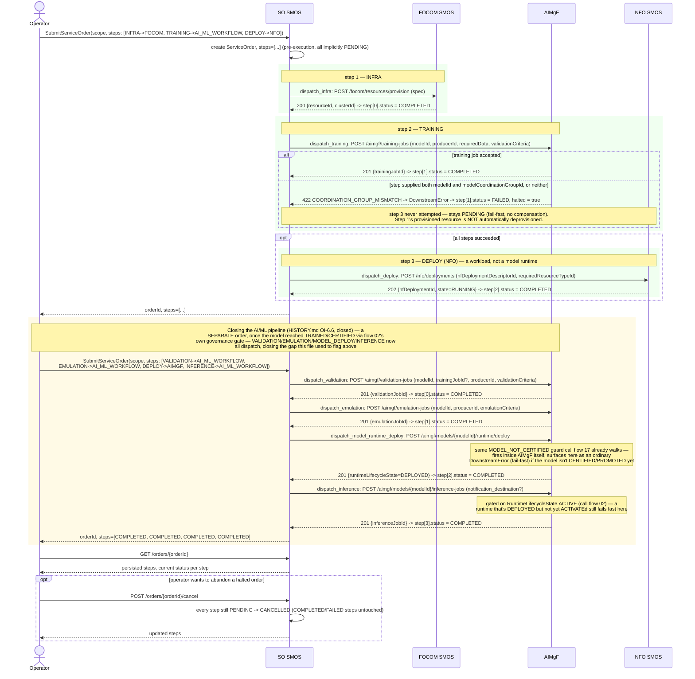

# Call Flow: SO SMOS Multi-Step Order — INFRA → TRAINING → DEPLOY

One SO SMOS service order composing three entries of the dispatch table
(`so-smos/app/dispatch.py`, SO/SA SMOS LLD section 1) — INFRA → TRAINING → DEPLOY — and the
fail-fast halt at whichever step fails. Call flow 04 covers the two-step CONFIG → DEPLOY
case.

**Relation to call flow 02's AI/ML pipeline**: `DISPATCH_TABLE` also has entries for the
rest of that pipeline — `("VALIDATION", "AI_ML_WORKFLOW")`, `("EMULATION",
"AI_ML_WORKFLOW")`, `("DEPLOY", "AIMGF")` (model-runtime deploy, distinct from the
`("DEPLOY", "NFO")` workload deploy in step 3) and `("INFERENCE", "AI_ML_WORKFLOW")` — so
an operator can drive every AI/ML step as SO SMOS order steps, not only by calling AIMgF
directly (HISTORY.md OI-6.6). The "Closing the AI/ML pipeline" block below composes them in
one order.

```mermaid
sequenceDiagram
    actor Operator
    participant SO as SO SMOS
    participant Focom as FOCOM SMOS
    participant AIML as AIMgF
    participant NFO as NFO SMOS

    Operator->>SO: SubmitServiceOrder(scope, steps: [INFRA->FOCOM, TRAINING->AI_ML_WORKFLOW, DEPLOY->NFO])
    SO->>SO: create ServiceOrder, steps=[...] (pre-execution, all implicitly PENDING)

    rect rgb(240, 255, 240)
    Note over SO,Focom: step 1 — INFRA
    SO->>Focom: dispatch_infra: POST /focom/resources/provision (spec)
    Focom-->>SO: 200 {resourceId, clusterId} -> step[0].status = COMPLETED
    end

    rect rgb(240, 255, 240)
    Note over SO,AIML: step 2 — TRAINING
    SO->>AIML: dispatch_training: POST /aimgf/training-jobs (modelId, producerId, requiredData, validationCriteria)
    alt training job accepted
        AIML-->>SO: 201 {trainingJobId} -> step[1].status = COMPLETED
    else step supplied both modelId and modelCoordinationGroupId, or neither
        AIML-->>SO: 422 COORDINATION_GROUP_MISMATCH -> DownstreamError -> step[1].status = FAILED, halted = true
        Note over SO,NFO: step 3 never attempted — stays PENDING (fail-fast, no compensation).<br/>Step 1's provisioned resource is NOT automatically deprovisioned.
    end
    end

    opt all steps succeeded
        rect rgb(240, 255, 240)
        Note over SO,NFO: step 3 — DEPLOY (NFO) — a workload, not a model runtime
        SO->>NFO: dispatch_deploy: POST /nfo/deployments (nfDeploymentDescriptorId, requiredResourceTypeId)
        NFO-->>SO: 202 {nfDeploymentId, state=RUNNING} -> step[2].status = COMPLETED
        end
    end

    SO-->>Operator: orderId, steps=[...]

    rect rgb(255, 250, 230)
    Note over Operator,AIML: Closing the AI/ML pipeline (HISTORY.md OI-6.6, closed) — a<br/>SEPARATE order, once the model reached TRAINED/CERTIFIED via flow 02's<br/>own governance gate — VALIDATION/EMULATION/MODEL_DEPLOY/INFERENCE now<br/>all dispatch, closing the gap this file used to flag above
    Operator->>SO: SubmitServiceOrder(scope, steps: [VALIDATION->AI_ML_WORKFLOW,<br/>EMULATION->AI_ML_WORKFLOW, DEPLOY->AIMGF, INFERENCE->AI_ML_WORKFLOW])
    SO->>AIML: dispatch_validation: POST /aimgf/validation-jobs (modelId, trainingJobId?, producerId, validationCriteria)
    AIML-->>SO: 201 {validationJobId} -> step[0].status = COMPLETED
    SO->>AIML: dispatch_emulation: POST /aimgf/emulation-jobs (modelId, producerId, emulationCriteria)
    AIML-->>SO: 201 {emulationJobId} -> step[1].status = COMPLETED
    SO->>AIML: dispatch_model_runtime_deploy: POST /aimgf/models/{modelId}/runtime/deploy
    Note over AIML: same MODEL_NOT_CERTIFIED guard call flow 17 already walks —<br/>fires inside AIMgF itself, surfaces here as an ordinary<br/>DownstreamError (fail-fast) if the model isn't CERTIFIED/PROMOTED yet
    AIML-->>SO: 201 {runtimeLifecycleState=DEPLOYED} -> step[2].status = COMPLETED
    SO->>AIML: dispatch_inference: POST /aimgf/models/{modelId}/inference-jobs (notification_destination?)
    Note over AIML: gated on RuntimeLifecycleState.ACTIVE (call flow 02) — a<br/>runtime that's DEPLOYED but not yet ACTIVATEd still fails fast here
    AIML-->>SO: 201 {inferenceJobId} -> step[3].status = COMPLETED
    SO-->>Operator: orderId, steps=[COMPLETED, COMPLETED, COMPLETED, COMPLETED]
    end

    Operator->>SO: GET /orders/{orderId}
    SO-->>Operator: persisted steps, current status per step

    opt operator wants to abandon a halted order
        Operator->>SO: POST /orders/{orderId}/cancel
        SO->>SO: every step still PENDING -> CANCELLED (COMPLETED/FAILED steps untouched)
        SO-->>Operator: updated steps
    end
```

**Key decisions this flow depends on:**
- Fail-fast with **no compensation**: if `TRAINING` fails after `INFRA` already succeeded, the provisioned FOCOM resource from step 1 is never automatically torn down — SO/SA SMOS LLD section 1.1 explicitly chose sequential fail-fast over a saga/compensating-transaction pattern for Phase 1. Cleanup after a partial failure is an operator (or SA SMOS remedial-action) responsibility, not something `execute_order` does itself.
- `CancelOrder` only ever touches steps still `PENDING` — a `COMPLETED` step's real-world effect (e.g. the FOCOM resource from step 1) is untouched by cancellation; cancelling the *order* is not the same as rolling back what already happened.
- Every dispatcher in `DISPATCH_TABLE` shares the same `_ensure_ok` status-code check — a downstream 4xx/5xx raises `DownstreamError`, which `execute_order`'s `except Exception` catches uniformly. This is what makes fail-fast real rather than cosmetic.
- `("DEPLOY", "NFO")` and `("DEPLOY", "AIMGF")` share a `stepType` but differ on `targetModule` — the same disambiguation every other `(stepType, targetModule)` pair relies on. A caller that gets the `targetModule` wrong (e.g. `AIMGF` when a workload deploy was meant) hits `"no dispatcher for (...)"` rather than silently routing to the wrong service, since the two are distinct keys, not a fallback pair.
- The AI/ML dispatchers (`dispatch_validation`/`dispatch_emulation`/`dispatch_model_runtime_deploy`/`dispatch_inference`) add no logic of their own — each is a thin forward to the AIMgF route call flows 02/17 document (same request-body shapes, same guards enforced AIMgF-side), the same "Path B never duplicates Path A's dispatch logic" principle call flow 03 states for DME's O1 action-mediation route.
