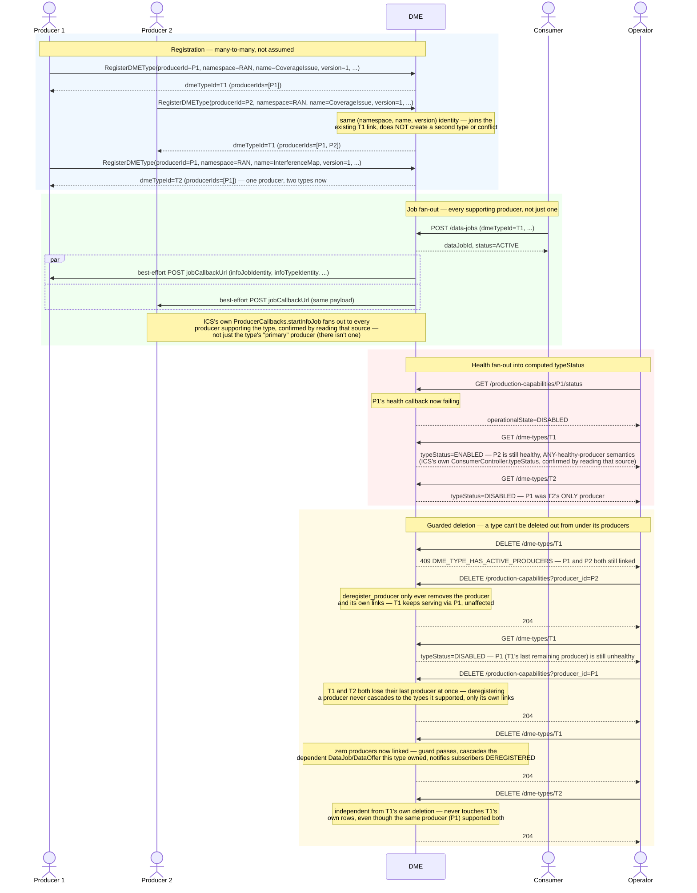

# Call Flow: DME Producer/Type — Many-to-Many Registration, Health Fan-Out, Guarded Deletion

DME keeps producers and types as separate, many-to-many entities, matching ICS's
`InfoProducer`/`InfoType` (`ProducerCallbacks`/`ConsumerController`): `DMEProducer`,
`DMEType` and the `DMEProducerType` link are three real rows (HISTORY.md SA-ICS-1; see the
DME section of `docs/ARCHITECTURE.md`). This flow walks what a single-producer model can't
express: one type served by two producers, one producer serving two types, and what
happens to each when health and deletion cross those links.

**P1/P2 are generic on purpose** — this flow is about the many-to-many mechanism itself,
not any one producer's domain. A working instance of "Producer 1" is `ran-nf-oam`'s
`subscribe_pm` route, which calls this same `RegisterDMEType` (namespace=RAN,
name=`PMCounters.{counterType}`, producerId=ran-nf-oam) to register *itself* as a DME
producer whenever an operator creates a PM subscription — see call flow 20. That
registration covers PM counters only. RAN NF OAM's other O1 axes — MnS transport (NETCONF,
call flow 03) and IOC data-model conformance (per-vendor own/spec/combined, call flow 21) —
are described under "O1 vendor onboarding" in `docs/ARCHITECTURE.md`. The axis-2 presence
guard does apply here: when the ME's vendor has a registered capability, `subscribe_pm`
requires it to implement PM (`O1_SERVICE_NOT_SUPPORTED` otherwise).

**Key decisions this flow depends on:**
- `RegisterDMEType` is a genuine upsert on two independent keys — `(producer_id)` for the producer row, `(namespace, name, version)` for the type row — joined by `DMEProducerType`. Re-registering an already-known pair (e.g. on restart) is a no-op join, not a conflict; a *new* producer against an *existing* type identity joins that same type rather than erroring.
- Job push/stop fans out to **every** producer supporting a type (`_producers_for_type`), matching ICS's `ProducerCallbacks.startInfoJob`/`stopInfoJob` — best-effort per producer, the same unreachable-subscriber-never-fails pattern as every other push in this build.
- `typeStatus` is ENABLED if **any** supporting producer is healthy, computed live at read time (no scheduler exists anywhere in this build) — a type doesn't go DISABLED just because one of its several producers degrades.
- Deleting a type is guarded (`DME_TYPE_HAS_ACTIVE_PRODUCERS`, 409) — ICS's `deleteInfoType` semantics. Deleting a *producer* is never guarded (idempotent, always succeeds) — it only removes that producer's own links, mirroring ICS's `deleteInfoProducer`, which never touches info-types at all.
- A producer that supports multiple types loses **all** of them at once on deregistration — there is no per-link "unlink this producer from just this one type" route; the only ways a type's producer count reaches zero are every supporting producer deregistering, or (for a brand-new type) never having had one.
