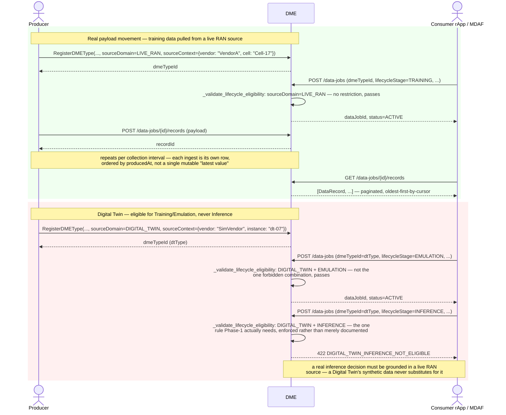

# Call Flow: DME Real Data Movement + Lifecycle-Stage Eligibility

DME's data plane for the pull case: producers ingest real payloads as `DataRecord` rows on
a `DataJob`, and consumers page through them. Each `DMEType` declares its
`source_domain` (`LIVE_RAN` or `DIGITAL_TWIN`) and `source_context`, and each `DataJob` its
`lifecycle_stage`, so the multi-vendor/multi-Digital-Twin principle is enforced at
`CreateDataJob` time rather than left to caller discipline. See "DME source provenance and
eligibility" in `docs/ARCHITECTURE.md`.

**Key decisions this flow depends on:**
- `DataRecord` rows are append-only per `DataJob`, ordered by `producedAt` — there is no single mutable "current value" a producer overwrites; a consumer pulling twice sees every record produced since its last read (subject to pagination), not just the latest.
- The eligibility check reads `DMEType.source_domain` (set at registration) and the `DataJob`'s requested `lifecycleStage` — both are optional; a type or job that declares neither skips the check, the same permissive default other optional cross-references use (`_validate_job_definition_schema` skips an unknown type; `_validate_delivery_method` skips the offer check for a type with no `DataOffer`).
- Only one combination is forbidden — `DIGITAL_TWIN` + `INFERENCE` (`DIGITAL_TWIN_INFERENCE_NOT_ELIGIBLE`, 422) — not "Digital Twin data is second-class everywhere." `TRAINING`, `TESTING`, `EMULATION` and `CLOSED_LOOP_FEEDBACK` are all legitimate for a Digital Twin source; only a live inference decision must trace back to a real RAN source.
- `sourceContext` is a flexible JSON dict (vendor/product/release/instance/node/cell — whichever a producer populates), not eight forced columns, since nothing queries most of them individually. The vendor capability registry (call flow 21) lives in RAN NF OAM and is keyed by the managed element's vendor, not by this field.
- Job push (`_push_job_to_producers`, call flow 11) and record ingestion are separate mechanisms — registering a `DataJob` notifies every supporting producer, but records arrive only when a producer posts them to `POST /data-jobs/{id}/records`. RAN NF OAM does so for PM counters whenever an NF delivers a PM report (`POST /pm-reports`, used by the reference rApps in call flows 22–25); other producers' collection loops are outside this build (Phase 1: elided).
