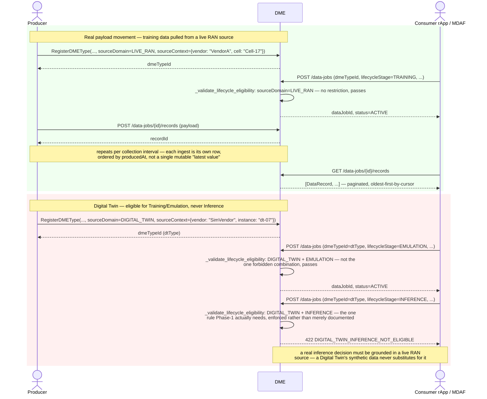

# Call Flow: DME Real Data Movement + Lifecycle-Stage Eligibility

Stitches together `docs/ownership/DME_OWNERSHIP.md`'s Wave 3 data-plane revision: DME
previously brokered only job/offer *metadata*, leaving real data movement to whatever the
negotiated delivery method did entirely outside DME. `DataRecord` closes that gap for the
pull case with a genuine DB-backed store — and `lifecycle_stage` + `source_domain` turn
the multi-vendor/multi-Digital-Twin principle from a documented constraint into something
actually enforced at `CreateDataJob` time, not left to caller discipline.

**Key decisions this flow depends on:**
- `DataRecord` rows are append-only per `DataJob`, ordered by `producedAt` — there is no single mutable "current value" a producer overwrites; a consumer pulling twice sees every record produced since its last read (subject to pagination), not just the latest.
- The eligibility check reads `DMEType.source_domain` (set at registration) and the `DataJob`'s own requested `lifecycleStage` — both are optional; a type or job that never declares either skips the check entirely, the same permissive default every other optional cross-reference in this build uses (`_validate_job_definition_schema`'s own type-existence check, `_validate_delivery_method`'s own DELIVERY_METHODS check).
- Only one combination is actually forbidden — `DIGITAL_TWIN` + `INFERENCE` — not "Digital Twin data is second-class everywhere." `TRAINING`, `TESTING`, `EMULATION`, and `CLOSED_LOOP_FEEDBACK` are all legitimate for a Digital Twin source; only a live inference decision must trace back to a real RAN source.
- `sourceContext` is a flexible JSON dict (vendor/product/release/instance/node/cell — whichever a producer actually populates), not eight forced columns — nothing in this build yet needs to query most of them individually, and a future per-vendor capability registry (`docs/architecture/O1_VENDOR_ONBOARDING_GUIDE.md`) would read this same field rather than needing a schema change.
- Job push (`_push_job_to_producers`, call flow 11) and record ingestion are two separate mechanisms — registering a `DataJob` fans out a job-start notification to every supporting producer, but nothing in this build automatically drives a producer to then call `POST /records`; a producer's own collection loop (out of scope, Phase 1: elided) is what actually calls it, same as every other "Phase 1: elided" collection pipeline in this build.
