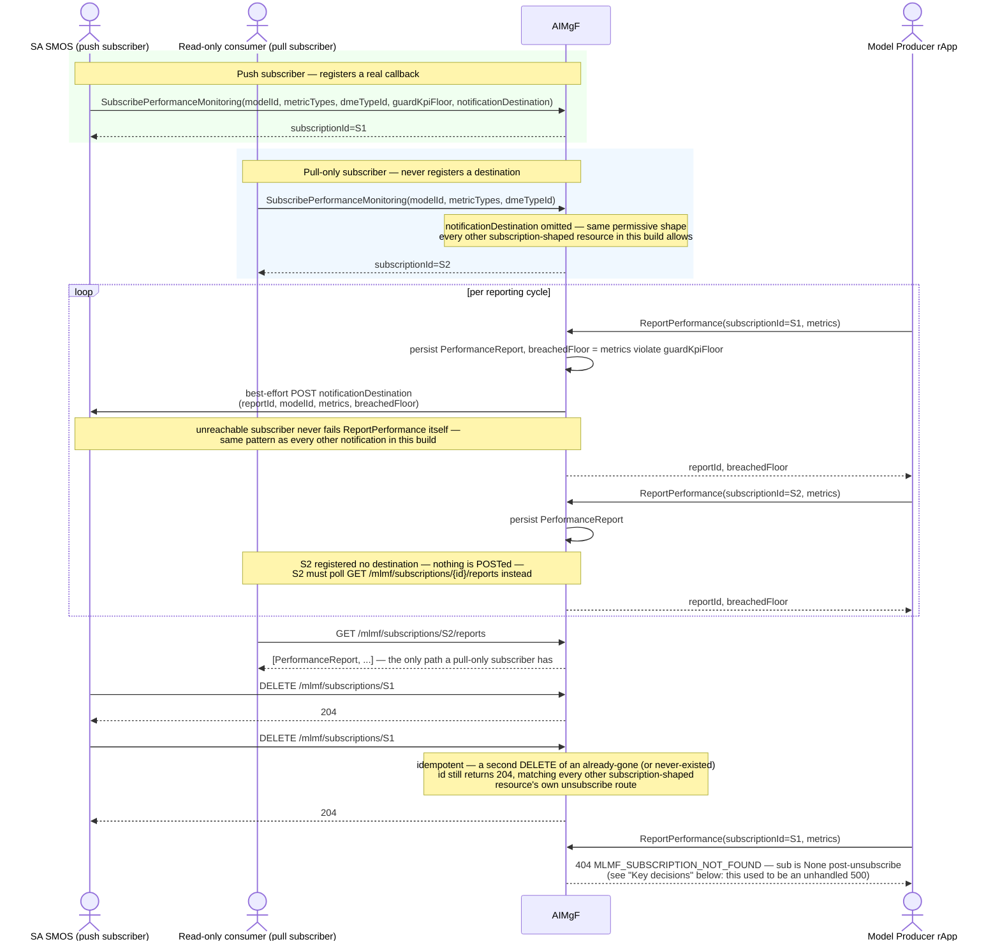

# Call Flow: MLMFSubscription — Subscribe → Notify → Unsubscribe

Stitches together `SPEC_AUDIT.md`'s AI/ML Workflow section, `MLMFSubscription` finding,
closed: every other subscription-shaped resource in this build (DME's type subscriptions,
MDAF's analytics subscriptions, A1 Related's EI jobs, Intent Service's RMIH registration)
notifies a real destination and can be torn down with a real `DELETE`; `MLMFSubscription`
previously could only be created and read. This flow is the dedicated subscribe→notify→
unsubscribe walkthrough call flow 02 only touches in passing.

**Key decisions this flow depends on:**
- `SubscribePerformanceMonitoring` requires `dmeTypeId` — an MLMF subscription is always scoped to a specific DME data type feeding the model's own performance signal, not a bare `modelId` alone.
- `notificationDestination` is optional on creation, exactly like DME's `DMETypeSubscription`, MDAF's own subscriptions, and A1 Related's EI jobs — a purely poll-based consumer (the `Auditor` actor here) is a first-class, fully-supported shape, not a degraded one.
- The push is best-effort per report, not per subscription lifetime — an unreachable `SA` on one `ReportPerformance` call doesn't disable future pushes; each call tries independently and swallows its own `httpx.HTTPError`.
- `DELETE /mlmf/subscriptions/{id}` is idempotent by construction (`if sub is not None: delete`), matching every other subscription-shaped resource's own unsubscribe route in this build (DME's type subscriptions, MDAF's, A1 Related's, Intent Service's RMIH deregistration) — deleting twice, or deleting an id that never existed, is never an error.
- **Closed since this flow was first written**: `report_performance` (`aimgf/app/main.py`) used to read `sub.guard_kpi_floor`/`sub.notification_destination` straight off `db.get(MLMFSubscription, subscription_id)` with no null-check in between — `ReportPerformance` against an unsubscribed or never-existed `subscriptionId` raised an unhandled `AttributeError` (a bare 500), not a clean 404. Now a real `MLMF_SUBSCRIPTION_NOT_FOUND` (404), matching every comparable cross-reference elsewhere in this build.
