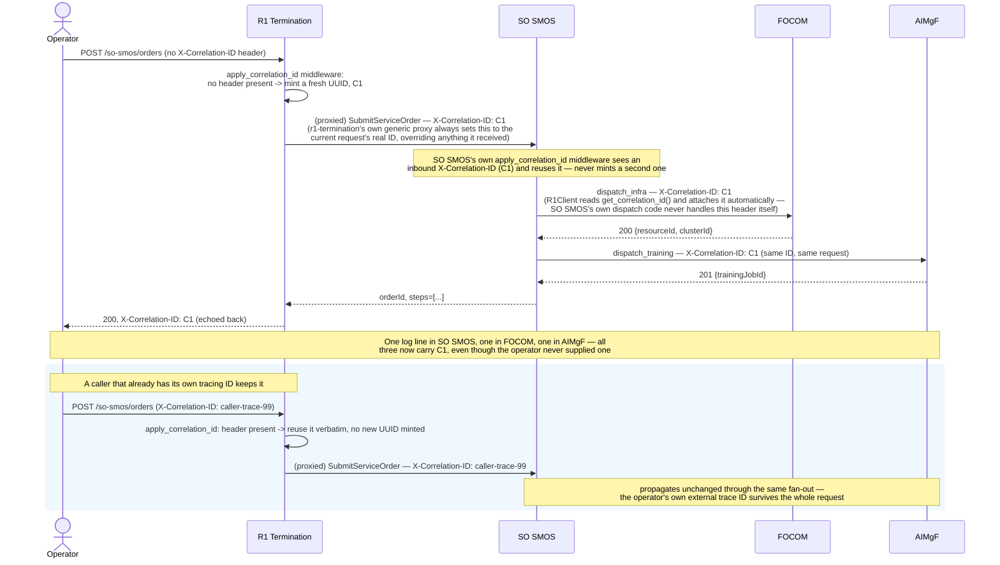

# Call Flow: Correlation-ID Propagation Across a Multi-Service Fan-Out

How one inbound request's fan-out across several services is tied together in logs and
traces by an `X-Correlation-ID` header (`shared/smo_shared/correlation.py`; see "R1 API
conventions" in `docs/ARCHITECTURE.md`). The flow shows the mechanics directly rather than
a business scenario, reusing call flow 10's three-step `ServiceOrder`
(`INFRA`→`TRAINING`→`DEPLOY`) as the fan-out that makes propagation observable.

**Key decisions this flow depends on:**
- The ID lives in a `ContextVar`, not a request parameter every handler has to thread through — `get_correlation_id()` reads whatever the current request's middleware set, and `R1Client` (every service's cross-service caller) attaches it automatically to every outbound call. Dispatchers (`dispatch_infra`/`dispatch_training`/`dispatch_deploy`, call flow 10) and route handlers need no code to participate.
- **r1-termination is the one place that overrides rather than reuses** — its generic proxy always forwards `get_correlation_id()`'s value (the ID *this* request was assigned or reused), even if the original inbound call carried a different, stale or malformed header of its own. Every other service's `apply_correlation_id` middleware reuses an inbound header verbatim if present.
- Deliberately not in any OpenAPI schema — a header injected by middleware on every route isn't a per-operation contract element, and declaring it as a formal parameter on every operation of every service would be a large, cosmetic diff with no behavior gain. The generated specs in `docs/openapi/` therefore don't mention it.
- No formal 3GPP/O-RAN spec defines a header for this exact purpose — `TS29500_CustomHeaders.abnf`'s `3gpp-Sbi-Correlation-Info` is a different concept (subscriber-identity correlation: imsi/msisdn/impu, not request tracing). `X-Correlation-ID` is this build's HTTP-native name for the same idea `smo-teiv`'s CloudEvent `correlationid` tracks over a different transport.
