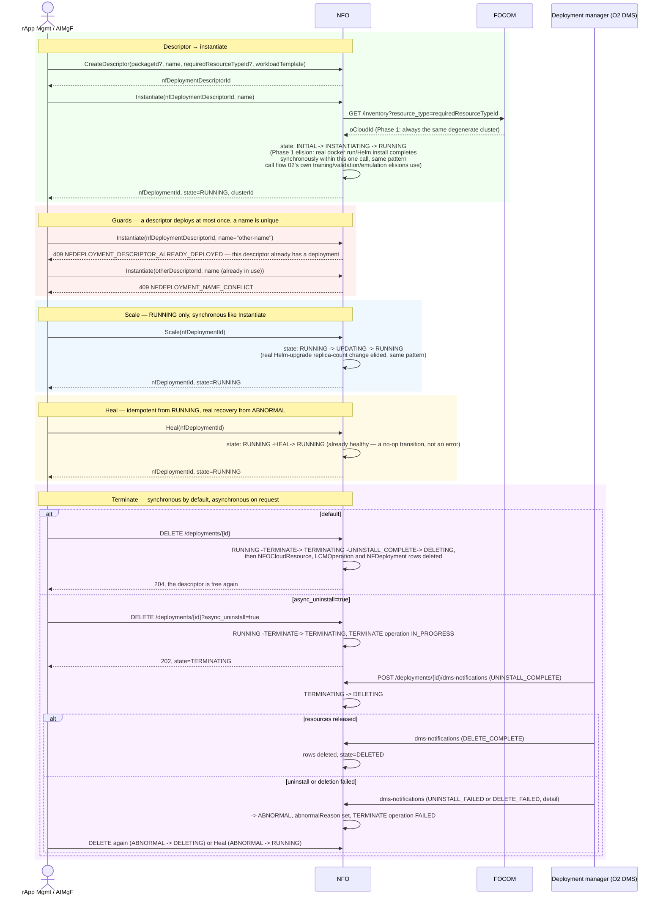

# Call Flow: NFO Workload Lifecycle — Instantiate → Scale → Heal → Terminate (synchronous or DMS-completed)

NFO's full workload surface — CreateDescriptor, Instantiate, Scale, Heal and Terminate —
over its 7-state `DeploymentState` FSM (`nfo/app/statemachine.py`, following
`o2dms/domain/states.py`'s reference shape under this build's state names; NFO+FOCOM LLD
section 4), including the two Instantiate guards. Its callers are rApp Management (call
flow 01), AIMgF's model and execution runtimes (call flows 02 and 17), SO SMOS's DEPLOY step
(call flow 10) and SA SMOS's RECONNECT remedial action (call flow 04).

**Key decisions this flow depends on:**
- FOCOM's inventory is always queried before placement, even though Phase 1's answer is always the same degenerate cluster — the same "ask the real dependency, don't hardcode the Phase-1 answer" discipline call flow 01 establishes for FOCOM.
- `ALREADY_DEPLOYED` and `NAME_CONFLICT` are two independent guards, checked in that order: a descriptor can only ever back one deployment, and every deployment's name is globally unique regardless of which descriptor it came from.
- Scale and Heal both fire their FSM events within one request (`RUNNING -> UPDATING -> RUNNING`, `ABNORMAL -> RUNNING` or `RUNNING -> RUNNING`) rather than staying observably mid-transition — the same synchronous elision Instantiate and Terminate use, since no real Helm/K8s operation backs any of them.
- `DELETING` and `ABNORMAL` are reached through the API (HISTORY.md OI-3-nfo-abnormal). An asynchronous Terminate rests in `TERMINATING`, then `DELETING`, until the deployment manager reports; an uninstall or deletion failure, or a `RUNTIME_FAILURE` on a running workload, leaves it `ABNORMAL` with `abnormalReason`. `Heal` recovers an `ABNORMAL` deployment; `Terminate` retires it; a `DELETING` deployment re-`Terminate`d flips to `ABNORMAL` as a defensive catch-all.
- Terminate is synchronous by default because every SMO caller expects the deployment gone and its descriptor free when the call returns (an rApp rollback re-deploys a released descriptor). While a deployment is `TERMINATING`, `DELETING` or `ABNORMAL`, its descriptor stays deployed.
