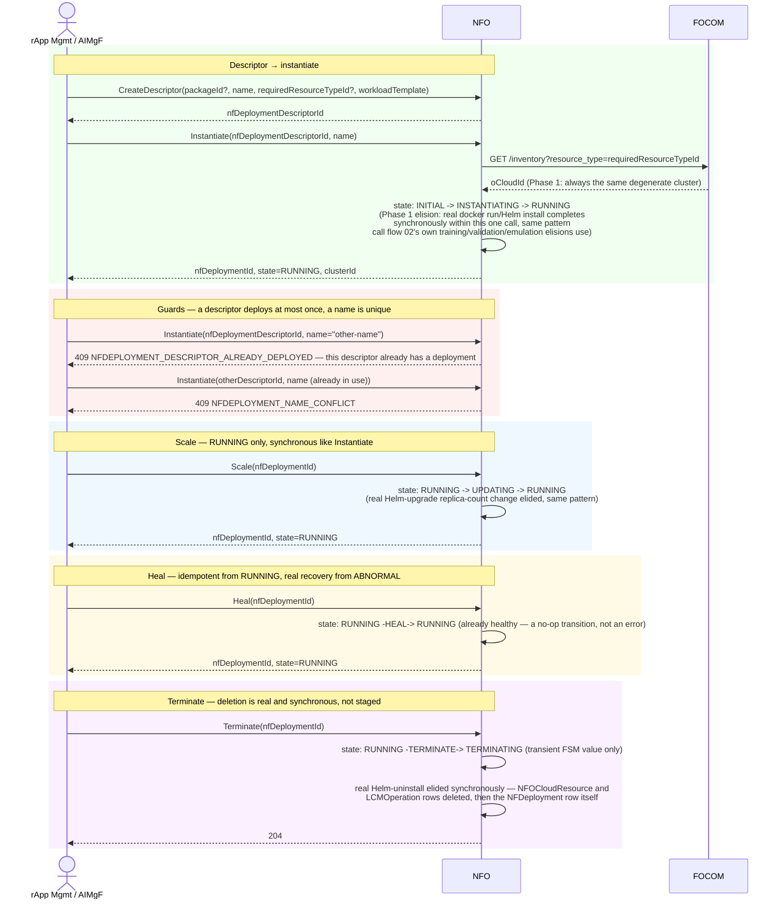

# Call Flow: NFO Workload Lifecycle — Instantiate → Scale → Heal → Terminate

Stitches together NFO+FOCOM LLD section 4 and `app/statemachine.py`'s real 7-state
`DeploymentState` FSM (`o2dms/domain/states.py`'s own reference shape, kept under this
build's existing state names). Only `instantiate`/`terminate` get touched briefly inside
call flows 01/02/10 today — this is NFO's own dedicated walkthrough of its full 5-operation
surface, including two guard rejections and a real, honestly-documented FSM dead end.

**Key decisions this flow depends on:**
- FOCOM's inventory is always queried before placement, even though Phase 1's answer is always the same degenerate cluster — the same "ask the real dependency, don't hardcode the Phase-1 answer" discipline call flow 01 already establishes for FOCOM.
- `ALREADY_DEPLOYED` and `NAME_CONFLICT` are two independent guards, checked in that order: a descriptor can only ever back one deployment, and every deployment's name is globally unique regardless of which descriptor it came from.
- Scale and Heal both fire two FSM events within one request (`RUNNING -> UPDATING -> RUNNING`, `ABNORMAL -> RUNNING` or `RUNNING -> RUNNING`) rather than staying observably mid-transition — the same synchronous-elision pattern Instantiate and Terminate both already use, since no real Helm/K8s operation backs any of them yet.
- **A genuinely dead-end FSM branch, surfaced by writing this flow, not previously documented this way**: `DeploymentState.DELETING` and `DeploymentState.ABNORMAL` are both real states with real dispatch logic mirroring the reference's own `dms_lcm_nfdeployment.py` exactly (`ABNORMAL` recoverable via `Heal`, `DELETING` re-`Terminate`d flips to `ABNORMAL` as a defensive catch-all) — but neither is reachable by any sequence of real API calls in this build. Every `Terminate` call that computes `DELETING` as an intermediate FSM value falls straight through to synchronous row deletion in that same request (matching Instantiate/Scale's own synchronous elision), so a second `Terminate` call can never actually find a row still sitting in `DELETING` to trigger the `ABNORMAL` catch-all, and nothing else in this build ever sets `ABNORMAL` either. This build's own unit tests (`test_main.py`) exercise both branches only by writing `state = "DELETING"`/`"ABNORMAL"` directly via a raw DB session, never by driving two real HTTP calls in sequence — confirming this isn't an oversight in the tests, it's the only way those branches are reachable at all today. Worth adding to `OPEN_ITEMS.md` if `Terminate` ever becomes genuinely asynchronous (a real Helm uninstall that doesn't complete within one request) — that's exactly the condition under which a second `Terminate` racing the first would become possible.
