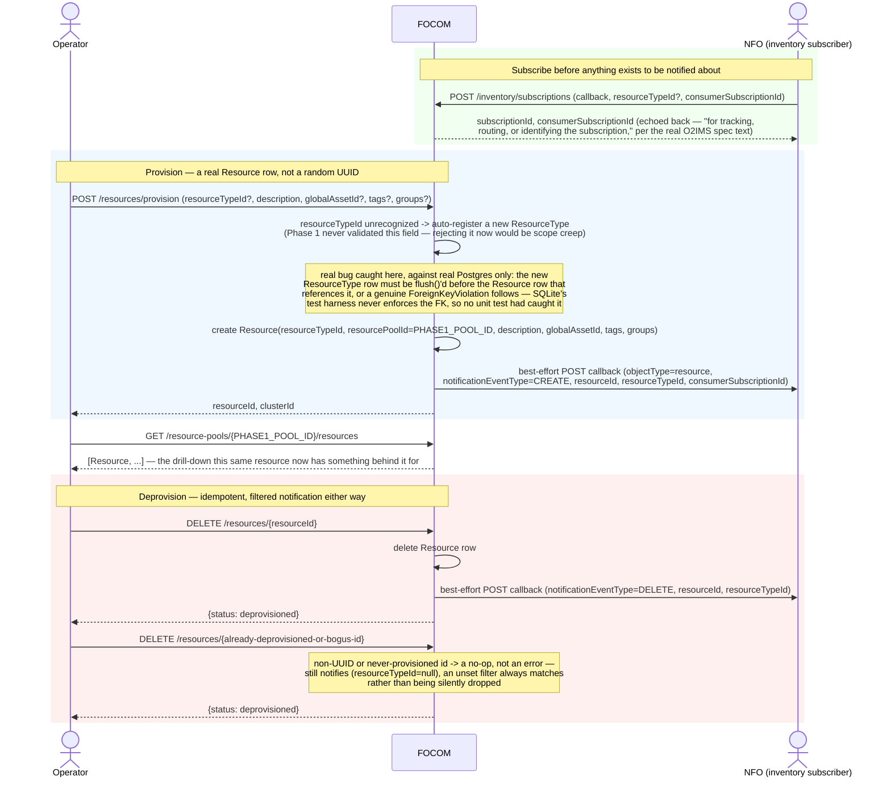

# Call Flow: FOCOM Resource/Inventory Lifecycle — Subscribe → Provision → Notify → Deprovision

FOCOM's resource and inventory lifecycle (NFO+FOCOM LLD section 4): a consumer subscribes
to inventory changes with a callback, a resource is provisioned and deprovisioned, and each
change is notified to the matching subscriptions (HISTORY.md OI-5-focom-subscription).
Call flow 10 uses `provision_resource` as its INFRA step.

**Key decisions this flow depends on:**
- `consumerSubscriptionId` is stored *and* echoed back on every notification — the O2IMS spec's own text says it exists "for tracking, routing, or identifying the subscription used to report the event," not just to be recorded and forgotten (HISTORY.md SA-FOCOM-5).
- Notification is best-effort and filtered, not broadcast: a subscription with a `resourceTypeId` filter only hears about matching resources; one with no filter hears about everything, including a deprovision against an id FOCOM never actually provisioned (`resourceTypeId=null` on that notification, matching an unset filter always matching rather than being silently dropped).
- Provisioning an unrecognized `resourceTypeId` auto-registers it rather than rejecting the request — Phase 1 never validated this field, so rejecting it would be a behavior change, not just filling in a schema gap. O2IMS treats `ResourceType` as read-only; tightening this is OPEN_ITEMS.md SA-FOCOM-9.
- Deprovisioning a never-provisioned or malformed `resourceId` is a deliberate no-op, not an error — mirroring DME's idempotent unsubscribe/deregister routes and NFO's idempotent double-terminate-on-missing-row shape (call flow 15).
- A fresh `ResourceType` auto-registered and then referenced by a new `Resource` row in the same request needs an explicit `flush()` between the two inserts (the same pattern NFO's `Instantiate` uses between its own dependent inserts); without it Postgres raises a `ForeignKeyViolation` that SQLite's test harness, which doesn't enforce the FK, never shows.
