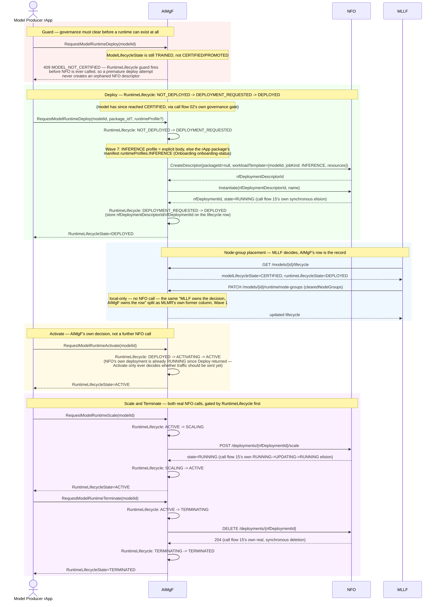

# Call Flow: Model Runtime Lifecycle — Deploy → Node-Groups → Activate → Scale → Terminate

AIMgF's `RuntimeLifecycle` FSM — the 8-state machine governing a model's *serving*
existence, independent of the 14-state `ModelLifecycle` governing its *certification*
path (call flow 02 shows both at a high level; see "AIMgF state machines" and "AIMgF NFO
invocation" in `docs/ARCHITECTURE.md`). This is the runtime side's dedicated walkthrough,
including its guard and its calls into NFO; call flow 15 shows what NFO does with them.

**Every stage is producer-driven, with no operator or GUI step.**
`RequestModelRuntimeDeploy/Activate/Scale/Terminate` take no operator identity or
approval, only the `MODEL_NOT_CERTIFIED` guard, which checks `ModelLifecycleState` — already
operator-gated upstream via CERTIFY/PROMOTE (call flow 02). Training and Validation have an
operator gate (`APPROVE_TRAINING`/`APPROVE_VALIDATION`, HISTORY.md OI-6.1); whether runtime
transitions should get one too is undecided (OPEN_ITEMS.md OI-6.1-runtime-gate).

**Key decisions this flow depends on:**
- Every execution runtime is sized from its execution mode's runtime profile — `workloadTemplate.resources` = {cpu, memory, gpu} — taken from an explicit `runtimeProfile` or from the rApp package's manifest `runtimeProfiles[<MODE>]` (W7-03). The same applies to the transient Training/Validation/Emulation runtimes (call flow 02), each with its own mode. Execution timeouts (W7-04: Training 30 min, Validation 15 min, Emulation 30 min, Inference 5 s) fail an overdue run cleanly; see "Runtime profiles and timeouts" in `docs/STANDARDS.md`.
- `RuntimeLifecycle` and `ModelLifecycle` are deliberately independent FSMs sharing one row — retraining a `PROMOTED` model doesn't force its runtime down, and a runtime can be scaled/terminated without touching the model's certification state.
- The `MODEL_NOT_CERTIFIED` guard fires *before* any NFO call — `deploy_model_runtime` checks `ModelLifecycleState` first, so a premature or duplicate deploy attempt never creates an orphaned `NFDeploymentDescriptor`/`NFDeployment` that would then need cleanup.
- Deploy, Scale and Terminate are the RuntimeLifecycle transitions that call NFO through `R1Client`: Deploy creates a descriptor and instantiates it, Scale calls `/deployments/{id}/scale`, Terminate calls `DELETE /deployments/{id}`. Each lands in call flow 15's dispatch, including its synchronous elision and its unreachable `ABNORMAL`/`DELETING` branches, since it's the same NFO code either caller reaches.
- `update_node_groups` never calls NFO — MLLF owns the *decision* of node-group placement and AIMgF's row is where that decision is written.
- Activate never re-contacts NFO — by the time Deploy returns, NFO's deployment is already `RUNNING` (Phase 1's synchronous elision, call flow 15); Activate is purely AIMgF's own gate on whether `RequestInference` may reach this model yet.
