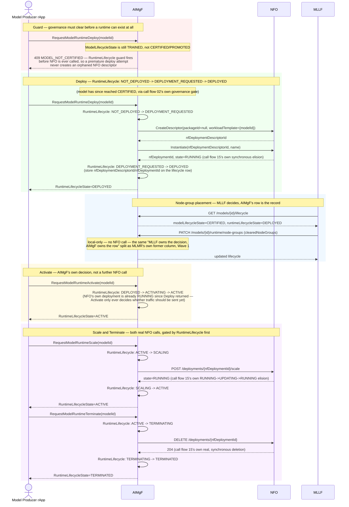

# Call Flow: Model Runtime Lifecycle — Deploy → Node-Groups → Activate → Scale → Terminate

Stitches together AIMgF's own `RuntimeLifecycle` FSM (`AIMGF_OWNERSHIP.md`'s "NFO
invocation" sections) — the 8-state machine governing a model's *serving* existence,
deliberately independent of the 14-state `ModelLifecycle` governing its *certification*
path (call flow 02 shows both together at a high level; this is the Runtime side's own
dedicated walkthrough, including its one real guard and its two genuine cross-service
calls into NFO — see call flow 15 for what NFO itself does with them).

**Every stage here really is Producer-driven, with no operator/GUI step** — that's not an
omission in this diagram, it's what the code does: `RequestModelRuntimeDeploy/Activate/
Scale/Terminate` take no operator identity or approval at all, only the `MODEL_NOT_CERTIFIED`
guard (which itself only checks `ModelLifecycleState`, already operator-gated upstream via
CERTIFY/PROMOTE in call flow 02). Once a model is CERTIFIED/PROMOTED, its *runtime*
lifecycle — deploy, activate, scale, terminate — is entirely the producer's own call, with
no further operator involvement or GUI-driven step anywhere in this build. Whether Runtime
transitions should also gain an operator gate (the same way call flow 02's own Training/
Validation/Emulation transitions are slated to) hasn't been decided — it's a candidate for
the same `OPEN_ITEMS.md` DECISION item, not folded into it, since the user's own gating
decision so far only covers the certification path, not the runtime path.

**Key decisions this flow depends on:**
- `RuntimeLifecycle` and `ModelLifecycle` are deliberately independent FSMs sharing one row — retraining a `PROMOTED` model doesn't force its runtime down, and a runtime can be scaled/terminated without touching the model's own certification state (already stated in call flow 02; this flow is the concrete walkthrough of the side that claim is about).
- The `MODEL_NOT_CERTIFIED` guard fires *before* any NFO call — `deploy_model_runtime` checks `ModelLifecycleState` first, so a premature or duplicate deploy attempt never creates an orphaned `NFDeploymentDescriptor`/`NFDeployment` that would then need cleanup.
- Scale and Terminate are the only two RuntimeLifecycle transitions that make a real cross-service call — both go through `R1Client` to NFO's own `/deployments/{id}/scale`/`DELETE /deployments/{id}`, landing exactly in call flow 15's own dispatch (including its own synchronous-elision behavior and its dead-end `ABNORMAL`/`DELETING` branches, which apply here identically since it's the same NFO code either caller reaches).
- `update_node_groups` never calls NFO at all — MLLF owns the *decision* of node-group placement, AIMgF's row is just where that decision is written, the same producer/owner split Wave 1 already established when this same column moved off MLMR's own row onto AIMgF's.
- Activate never re-contacts NFO — by the time `Deploy` returns, NFO's own deployment is already `RUNNING` (Phase 1's synchronous elision, call flow 15); `Activate` is purely AIMgF's own gate on whether `RequestInference` should be allowed to reach this model yet.
