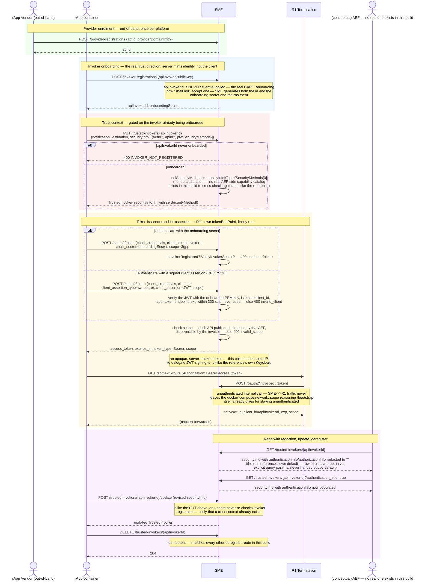

# Call Flow: SME CAPIF Security Lifecycle — Onboard → Trust → Token → Introspect → Update

SME's CAPIF security surface: Provider (APF) enrolment, API Invoker onboarding, the CAPIF
trust-context (`TrustedInvoker`) registry, and the `/oauth2/token` + `/oauth2/introspect`
pair behind R1 Termination's advertised `tokenEndPoint` (HISTORY.md OI-2-oauth2,
OI-5-sme-provider-enrolment, SA-SME-1, SA-SME-2). This is the security exchange that other
flows' `Container->>R1: obtain OAuth2.0 token` line (call flow 01) abbreviates. A requested
scope is checked against the published APIs before a token is issued, and an invoker onboarded
with a PEM key can authenticate with a signed client assertion instead of its secret
(HISTORY.md OI-2-oauth2-scope, SA-SME-1-public-key, OI-5-sme-filters).

**Key decisions this flow depends on:**
- Invoker onboarding flips the trust direction from what a naive implementation would do: the client supplies only its public key; the server generates and returns both `apiInvokerId` and `onboardingSecret`. A self-asserted invoker identity or a client-chosen secret would be the wrong trust model entirely, not just a missing validation.
- `register_trusted_invoker` (`PUT`) is gated on the invoker already being onboarded; `update_trusted_invoker` (`POST .../update`) is not — it only requires a trust context to already exist, matching the reference's own asymmetric behavior between the two endpoints.
- `selSecurityMethod` is adapted, not fabricated: the CAPIF core cross-checks a requested security method against a published `AefProfile`'s declared support; this build has no AEF publishing that catalog, so it takes the invoker's first preference instead of inventing a match.
- `GetTrustedInvokersApiInvokerId` redacts `authenticationInfo`/`authorizationInfo` to empty strings by default — a caller must explicitly ask for each via its own query parameter to see the raw value, mirroring the reference's default-deny shape rather than handing out secrets to anyone who can read the record.
- `/oauth2/introspect` is deliberately unauthenticated — the same network-isolation reasoning applied to `/bootstrap` (call flow 01): this is R1 Termination checking a token on the SME<->R1 internal link, never exposed past the docker-compose network boundary.
- This build issues opaque, server-tracked tokens (`IssuedAccessToken`, looked up by hash) rather than self-contained signed JWTs — the reference delegates signing to an external Keycloak instance this build has no equivalent of; introspection is the substitute.
- A `3gpp#aefId:apiName` scope is granted only if every API is published, exposed by that AEF and discoverable by the invoker; otherwise 400 `invalid_scope`. Introspection returns the granted scope. SMO's own clients request `smo-internal` / `smo-gui`, granted as-is.
- An RFC 7523 client assertion is verified with the invoker's onboarded PEM key and can be exchanged once (its `jti` is recorded until it expires). An invoker onboarded with an opaque label can only use its secret.
- Onboarding, key update and offboarding emit `API_INVOKER_ONBOARDED` / `_UPDATED` / `_OFFBOARDED`; offboarding revokes the invoker's tokens and drops its trust context.
