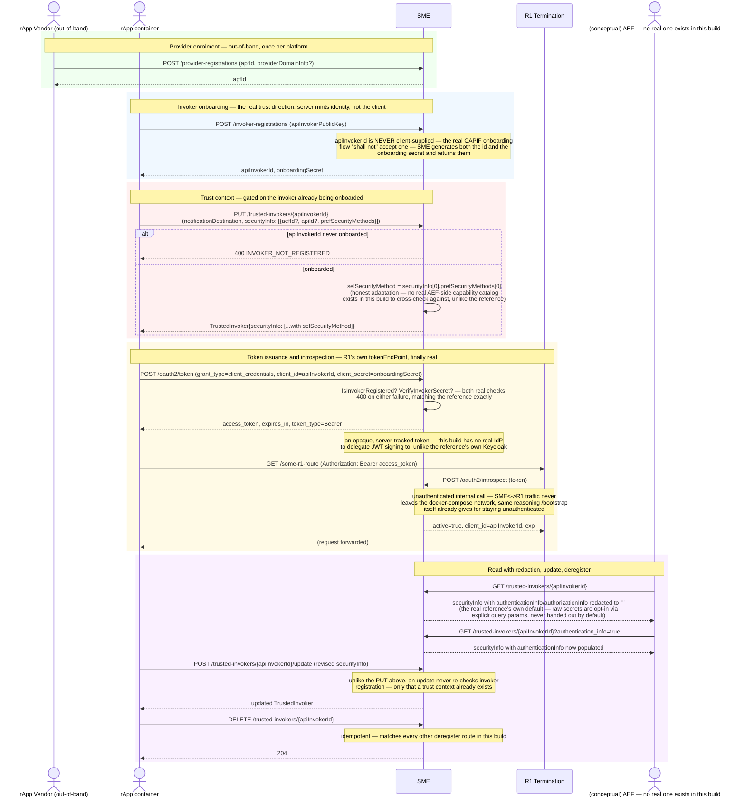

# Call Flow: SME CAPIF Security Lifecycle — Onboard → Trust → Token → Introspect → Update

Stitches together `OPEN_ITEMS.md` sections 2 and 5, and `SPEC_AUDIT.md`'s SME security
findings: Provider (APF) enrolment, API Invoker onboarding, the real CAPIF trust-context
(`TrustedInvoker`) registry, and the `/oauth2/token`+`/oauth2/introspect` pair R1
Termination's own advertised `tokenEndPoint` actually needs — all built, none of it ever
shown in a call flow before this one, despite being exactly the security surface every
other flow's `Container->>R1: obtain OAuth2.0 token` line (call flow 01) glosses over.

**Key decisions this flow depends on:**
- Invoker onboarding flips the trust direction from what a naive implementation would do: the client supplies only its public key; the server generates and returns both `apiInvokerId` and `onboardingSecret`. A self-asserted invoker identity or a client-chosen secret would be the wrong trust model entirely, not just a missing validation.
- `register_trusted_invoker` (`PUT`) is gated on the invoker already being onboarded; `update_trusted_invoker` (`POST .../update`) is not — it only requires a trust context to already exist, matching the real reference's own asymmetric behavior between the two endpoints exactly.
- `selSecurityMethod` is honestly adapted, not fabricated: the real CAPIF core cross-checks a requested security method against a published `AefProfile`'s own declared support; this build has no real AEF publishing that catalog, so it takes the invoker's own first preference instead of inventing a match that doesn't exist.
- `GetTrustedInvokersApiInvokerId` redacts `authenticationInfo`/`authorizationInfo` to empty strings by default — a caller must explicitly ask for each via its own query parameter to see the raw value, mirroring the real reference's own default-deny shape rather than handing out secrets to anyone who can read the record at all.
- `/oauth2/introspect` is deliberately unauthenticated — the same network-isolation reasoning already applied to `/bootstrap` (call flow 01): this is R1 Termination checking a token on the SME<->R1 internal link, never exposed past the docker-compose network boundary.
- This build issues opaque, server-tracked tokens (`IssuedAccessToken`, looked up by hash) rather than self-contained signed JWTs — the real reference delegates that signing to an external Keycloak instance this build has no equivalent of; introspection is the honest substitute, not a cosmetic stand-in.
