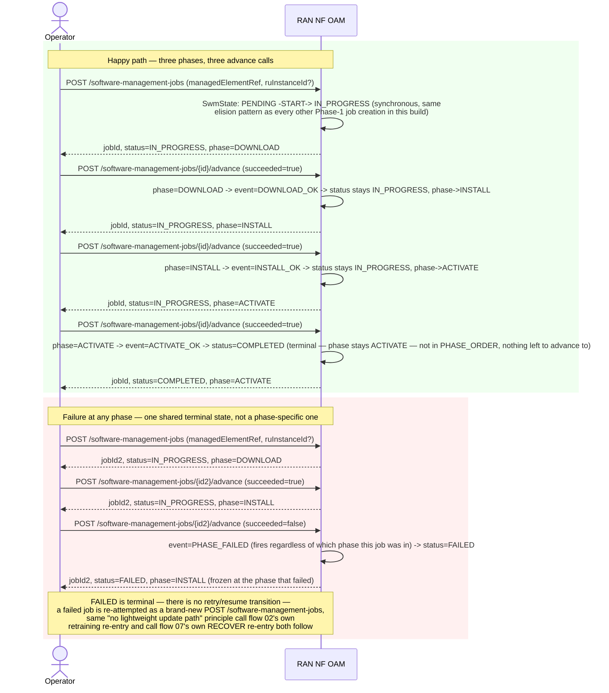

# Call Flow: Software Management Job — DOWNLOAD → INSTALL → ACTIVATE (and a Failed Phase)

Stitches together `SPEC_AUDIT.md`'s DME/O1 Adaptor section item 3 — O-RAN WG4 Software
Management's own `o-ran-software-management.yang` RPC set
(`software-download`/`software-install`/`software-activate`) and their 3 completion
notifications (`download-event`/`install-event`/`activation-event`) — confirmed already
ahead of what the base spec's own RPCs support unaugmented (`SoftwareManagementJob`
already carries `ru_instance_id`, which the workbook flags as missing from the bare spec).
Zero call-flow coverage existed before this one, despite `ran_instance_id`/the 3-phase FSM
both being real, tested code.

**Key decisions this flow depends on:**
- `phase` and `status` are two separate fields tracking two different things: `status` (`PENDING`/`IN_PROGRESS`/`COMPLETED`/`FAILED`) is the job's own overall progress; `phase` (`DOWNLOAD`/`INSTALL`/`ACTIVATE`) is which of the 3 real RPCs it's currently at. A `FAILED` job's `phase` stays frozen at whichever phase actually failed — useful for an operator diagnosing *what* broke, not just *that* something did.
- `PHASE_FAILED` is one shared event regardless of which phase is in progress — `advance_software_job` looks up the current-phase-to-next-event mapping only on the success path (`{"DOWNLOAD": DOWNLOAD_OK, "INSTALL": INSTALL_OK, "ACTIVATE": ACTIVATE_OK}[job.phase]`), and fires the same `PHASE_FAILED` transition regardless of phase on failure — there's no `DOWNLOAD_FAILED`/`INSTALL_FAILED`/`ACTIVATE_FAILED` distinction at the state-machine level, only at the frozen `phase` field's own value.
- This build's own 3-phase FSM already exceeds the bare O-RAN WG4 spec: the workbook underlying `SPEC_AUDIT.md`'s DME/O1 Adaptor audit flags the base RPCs as missing a `ru-instance-id` (or equivalent) parameter "before reuse at an aggregated/RAN-node level" — `SoftwareManagementJob.ru_instance_id` already exists as a first-class field, confirmed a strength rather than a gap.
- `PENDING` is real but never observable from outside — `software_update` fires `START` synchronously within the same request that creates the job, so no caller ever sees a `SoftwareManagementJob` sitting in `PENDING` via a `GET`, the same "real state exists, real dispatch elided synchronously" pattern NFO's own `Instantiate`/`Scale` (call flow 15) and AIMgF's own `RequestTraining` (call flow 02) already use.
