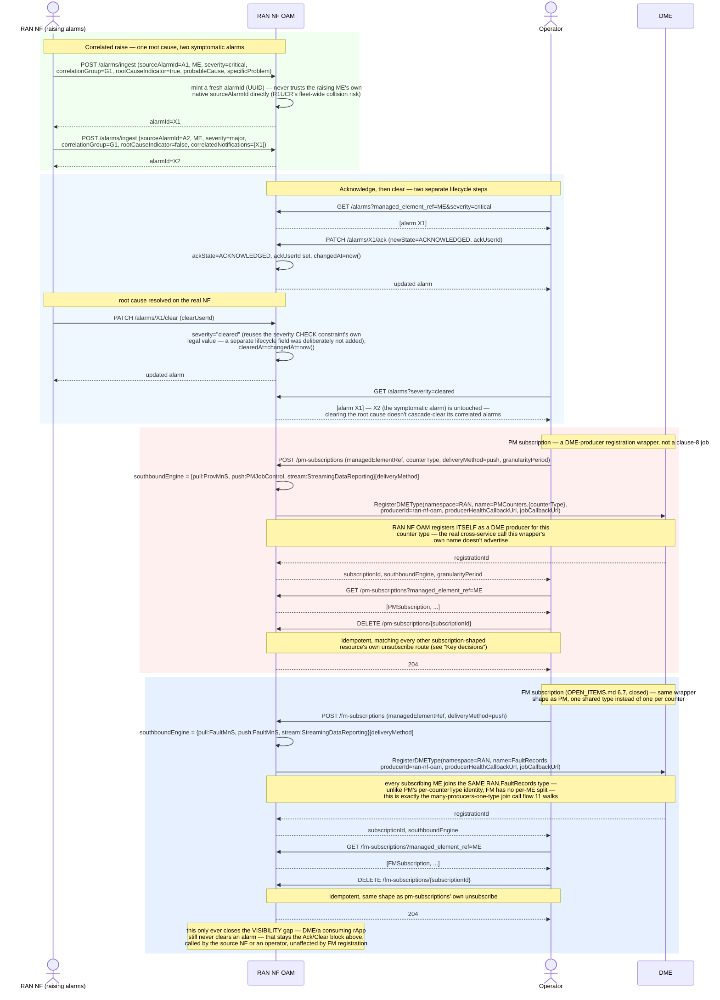

# Call Flow: Alarm Raise → Ack → Clear (Correlated) + PM/FM Subscription → DME Registration

Stitches together `OPEN_ITEMS.md` section 5's fault-lifecycle closure and `SPEC_AUDIT.md`'s
TS28111_FaultNrm/TS28550_PerfMeasJobCtrlMnS findings — both only ever touched in passing
notes elsewhere (call flow 03's own aside on fresh alarm-UUID minting; call flow 01's own
`/dme/production-capabilities` registration for an ordinary rApp producer). This is the
dedicated walkthrough of each on its own terms: a correlated multi-alarm raise/ack/clear
sequence, and `SubscribePM`'s own real side effect of registering RAN NF OAM itself as a
DME producer.

**Closed since this flow was first written** (`OPEN_ITEMS.md` section 6.7): unlike PM,
alarms/FM had no DME producer registration at all — `ingest_alarm` (`POST /alarms/ingest`)
only ever wrote an `Alarm` row; nothing called `RegisterDMEType` the way `subscribe_pm`
does for PM counters. An rApp or AI/ML model that wants outstanding-active-alarm/
alarm-history context during inference (or during Training/Validation/Emulation, call flow
02's own execution runtimes, `OPEN_ITEMS.md` section 6.2) had no DME-mediated way to get it — only a direct
`GET /alarms` call to RAN NF OAM itself, outside DME's data plane entirely. `POST
/fm-subscriptions` (the block above) now mirrors `subscribe_pm`'s own shape, registering
RAN NF OAM as a DME producer for a single, shared `RAN.FaultRecords` type — every
subscribing ME's alarms join that one type rather than getting a type of their own, since
alarms (unlike PM counters) have no natural per-counter-type split to key on. This only
ever closes the *visibility* gap: this build still has no route through which DME or a
consuming rApp clears an alarm — clearing stays RAN NF OAM's own `PATCH
/alarms/{id}/clear`, called by the source NF or an operator, unaffected by whether FM is
DME-registered.

**Key decisions this flow depends on:**
- `correlationGroup`/`correlatedNotifications`/`rootCauseIndicator` are caller-declared, not computed by RAN NF OAM itself — this build carries the correlation a raising source already knows, it doesn't run its own root-cause-analysis algorithm (matching `OPEN_ITEMS.md`'s own confirmed elision: "Alarm-storm correlation algorithm... nothing implemented").
- Clearing an alarm never cascades to its correlated siblings — `clear_alarm` only ever mutates the one `alarmId` it's called against; a correlation group with a cleared root cause and un-cleared symptomatic alarms is a real, representable state, not a bug.
- `SubscribePM` is explicitly *not* a clause-8 PM job — RAN NF OAM LLD section 3.5's own documented design intent, confirmed by this route's very shape: it's a DME-producer registration wrapper (`RegisterDMEType` under the hood) that happens to also record `granularityPeriod`, the one job-control field judged worth keeping despite the wrapper scope cut. `schedule`/`priority`/`multi-instance`/`reportingPeriod` all stay out.
- **Closed since this flow was first written**: every other subscription-shaped resource in this build (DME's type subscriptions, MDAF's, A1 Related's EI jobs, Intent Service's RMIH registration, MLMF's) already had a real `DELETE`/unsubscribe route — `PMSubscription` didn't. `DELETE /pm-subscriptions/{id}` is now real and idempotent, matching all of those; the GUI's own PM subscriptions table gained a matching "Unsubscribe" action alongside MDAF's own.
