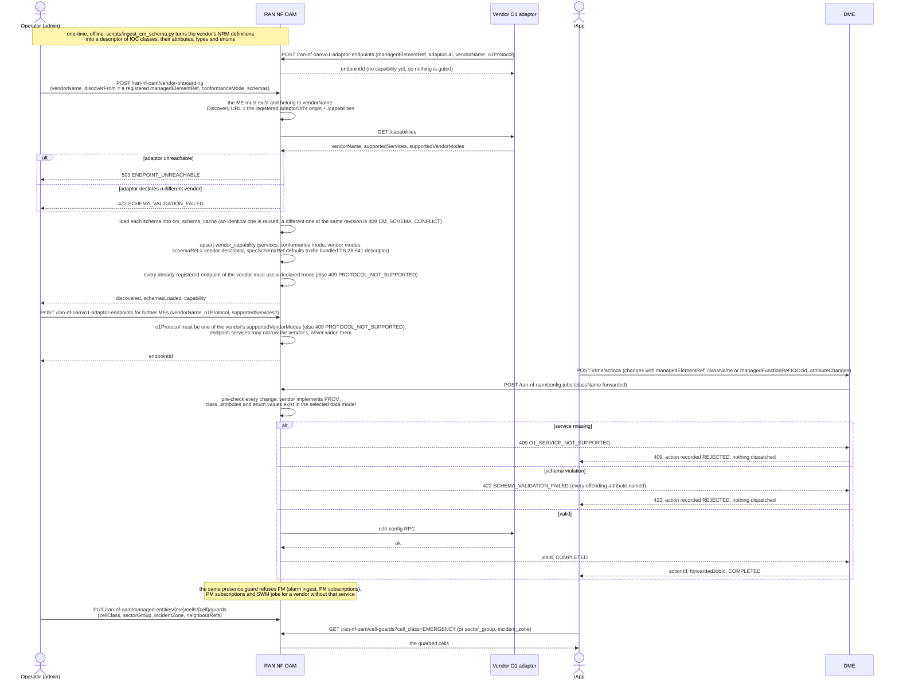

# Call Flow: O1 Vendor Onboarding → Capability-Gated, Schema-Checked CM Write

Wave 9 (`docs/roadmap/WAVES_4_TO_10_WORK_ITEMS.md` W9-01..06) builds
`docs/architecture/O1_VENDOR_ONBOARDING_GUIDE.md`'s sketch. Onboarding a RAN vendor (or a
Digital Twin) is data fed to RAN NF OAM, not new code. The three steps are:

1. **Discover** what the vendor's own O1 adaptor declares. The adaptor registers itself first, and discovery reads only that registered adaptor, never a URL supplied in a request.
2. **Load** the vendor's data-model descriptor.
3. **Declare** its capability.

After that, two generic checks read the registry on every O1 operation:

- the **axis-2 presence guard** — does the vendor implement this MnS service at all;
- the **axis-3 schema check** — does this class, attribute and value exist in the data model the vendor's conformance mode selects.

The vendor's endpoints register through the same `POST /o1-adaptor-endpoints` as before.

**Key decisions this flow depends on:**

- **What conformance mode means.** It decides which descriptor or descriptors the axis-3 check uses:
  - `SPEC`: the spec descriptor only. By default this is `3gpp-ts28541-nrnrm@19.6.0`, generated from `specs/5G_APIs/TS28541_NrNrm.yaml` and bundled in `ran-nf-oam/app/cm_schemas/`.
  - `OWN`: the vendor's own descriptor only.
  - `COMBINED`: the spec descriptor plus the vendor's named augments.

  Values are checked against `enum`s where the descriptor carries them. For example, `NRCellDU.administrativeState` must be `LOCKED` or `UNLOCKED`.
- **How a change's class is found.** It comes from `className`. Failing that, it comes from the `managedFunctionRef` prefix (`NRCellDU=1` → `NRCellDU`). A change that names no class has to name attributes that some class in the model defines.
- **The registry is per vendor; an endpoint may narrow it.** An endpoint can declare a smaller set of `supportedServices` than its vendor, for example an O-RU exposing only FM and HEARTBEAT. It can never claim a service its vendor lacks.
- **No registry means no check.** A managed element whose vendor has no capability registered skips both checks. This is the permissive default the guide specifies, so existing single-vendor deployments behave as before.
- **Discovery never fetches a caller-chosen URL.** The capability declaration is read only from an adaptor already in RAN NF OAM's endpoint registry — the same adaptor CM writes go to — at the fixed path `/capabilities` on its registered origin, through `smo_shared.webhook`'s guard. An earlier draft took a `discoveryUri` from the request body, and CodeQL flagged it as `py/full-ssrf`.
- **A refused write never reaches the adaptor.** The pre-check runs before a `WriteConfigJob` is created. DME passes RAN NF OAM's 4xx straight back to the rApp and records the action as `REJECTED`, instead of failing with a 500.
- **Out of scope (unchanged from the guide):**
  - a YANG front end for the ingestion script (`pyang`);
  - transports other than RFC 6241-shaped `edit-config` over HTTP. `O1_RESTCONF` can be declared as a vendor mode, but an ME provisioned for RESTCONF is still rejected at dispatch with `PROTOCOL_NOT_SUPPORTED`.
