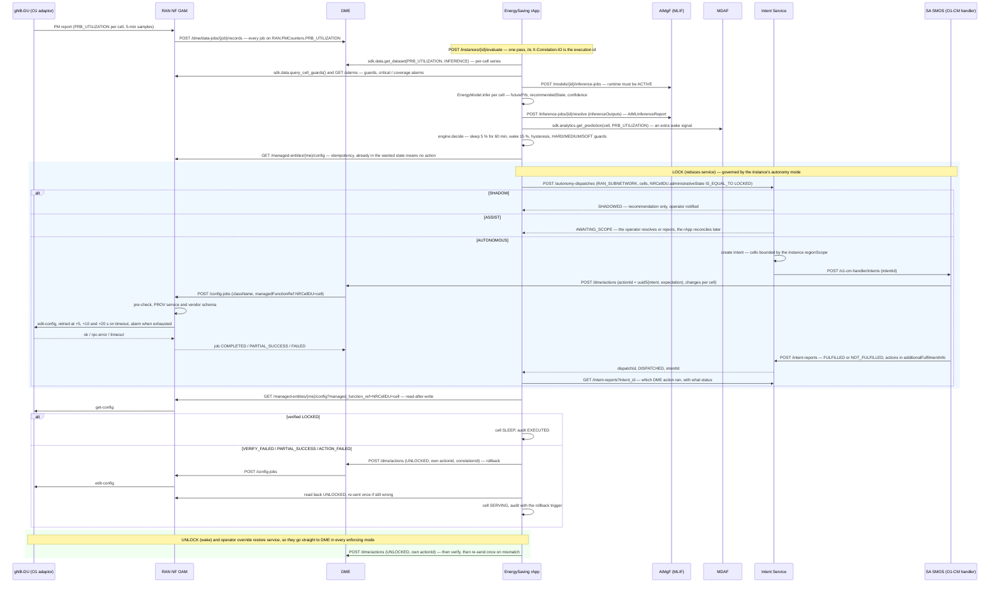

# Call Flow: EnergySaving rApp — PM → Prediction → Safety → O1 Action → Verification → Rollback

The EnergySaving rApp (`samples/energy-saving-rapp/`; Wave 10.1 in `docs/STANDARDS.md`) is
the first reference rApp built on the platform. It uses
O1 PM data only and the R1 control plane only; there is no A1, Near-RT RIC,
xApp or E2.

The diagram follows one pass of the closed loop for an AUTONOMOUS instance.
Training, validation, emulation, certification and deployment come before
it; they are the call flow 02 / 17 lifecycle, driven by the rApp through
the SDK. In the diagram:
* the rApp is a regular R1 consumer and reaches every module through R1
  Termination via the AI Runtime SDK;
* `RAN NF OAM` is both the PM source and the O1 executor;
* `SA SMOS` is the generic O1-CM intent handler (call flow 09).

**Key decisions this flow depends on:**

- **Only PRE_SLEEP → SLEEP and SLEEP → SERVING write to O1** (decision D-3).
  SERVING / PRE_SLEEP / SLEEP are rApp-internal states. The 60-minute
  sustain is measured on the samples' own timestamps, so a decision never
  depends on how often the loop runs.
- **The actuator is configurable per instance** (D-2):
  `NRCellDU.administrativeState` LOCKED/UNLOCKED, verified on the same
  attribute; or `CESManagementFunction.energySavingControl`, verified on
  `energySavingState`.
- **Only a LOCK goes through the autonomy dispatch.** A LOCK reduces
  service, so it is the action the autonomy modes govern. A wake, a
  rollback or an operator override restores service and must not wait for
  an approval, so each goes straight to DME `/actions` in AUTONOMOUS and
  ASSIST. Each carries its own `actionId` (replays are IGNORED) and the
  execution's correlation id.
- **The region scope bounds a dispatch's cells; it never adds to them**
  (Intent Service `_scoped`). An AUTONOMOUS instance acts only on the cells
  it decided about, and only inside its pre-configured region.
- **Guards hold whatever the model's confidence.**
  - HARD: emergency cell, coverage-critical cell, last awake cell of its
    sector group, incident zone.
  - MEDIUM: a neighbour above 80 % PRB; an active critical alarm on the
    cell, on a neighbour it hands its traffic to, or on the managed element
    as a whole (an alarm that names no cell).
  - SOFT: unlocked less than 30 minutes ago.
  Guard data are RAN NF OAM cell attributes (D-5, W9-06). A sector group
  is evaluated in sequence within one pass, so two low cells can't both
  sleep.
- **Reliability.**
  - Timeouts: DME → RAN NF OAM 10 s; NETCONF 30 s.
  - Retries: a timed-out or unreachable NETCONF write is retried
    (attempt 1, then +5/+10/+20 s); an `<rpc-error>` is final.
  - Failure: exhausted retries raise an alarm on the ME; the rApp records
    `ACTION_FAILED`, rolls back, and leaves the AIMgF model and runtime
    lifecycle untouched.
- **The audit trail** (`GET /instances/{id}/decisions`) has one row per
  cell per pass:
  Prediction → Safety → Decision → Intent → Action → Verification →
  Rollback → Final state.
  It joins the platform's own records by id (dispatch, intent, DME action,
  RAN NF OAM job). The GUI's **Energy Saving** page shows the latest row
  per cell with its PRB trend.
