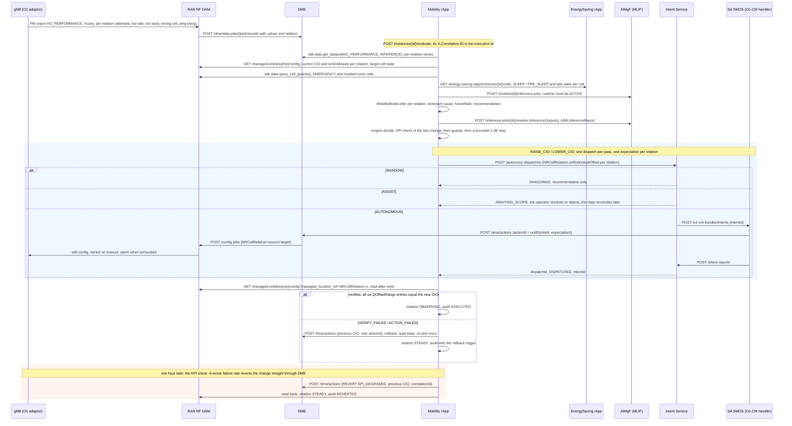

# Call Flow: Mobility Optimization rApp — HO PM → Classification → Prediction → Safety → CIO → Verification → KPI check

The Mobility Optimization rApp (`samples/mobility-optimization-rapp/`; Wave 10.2 in
`docs/ROADMAP.md`) is the second reference rApp. It tunes handover
per neighbour relation from O1 handover PM. Like the EnergySaving rApp (call
flow 22), it uses the R1 control plane only; there is no A1, Near-RT RIC, xApp
or E2.

The diagram follows one pass of the closed loop for an AUTONOMOUS instance.
Before it come training, validation, emulation, certification and
deployment (the call flow 02 / 17 lifecycle). Deployment also writes the
gNB's `DMROFunction` bounds through DME and reads them back.

**Key decisions this flow depends on:**

- **The actuator is the per-relation CIO, bounded by DMRO** (D10.2-1).
  `NRCellRelation.cellIndividualOffset` is a TS 28.541 QOffsetRange list.
  The rApp writes all six entries with the same value and reads all six
  back. At deploy it writes `DMROFunction` bounds of −6/+6 dB with a
  60-minute minimum time between changes, so the gNB's own MRO stays
  inside the same envelope.
- **Classified MRO plus regression** (D10.2-2). The dominant failure class
  sets the direction:
  - too late: +2 dB;
  - too early or ping-pong: −2 dB;
  - wrong cell: −1 dB.

  A persistence-anchored regression predicts the next hour's failure rate.
  The controller acts at 5 % or more, holds between 2 and 5 %, and
  otherwise reports the relation healthy. A one-hour spike straight after a
  healthy hour is predicted to partly revert, so it stays in the hold zone.
- **Bounds and pacing** (D10.2-4a).
  - CIO stays within the baseline ± 6 dB (`AT_BOUND` beyond it).
  - Steps are at most 2 dB.
  - A relation changes at most once per 60 minutes.
  - A window needs at least 50 handover attempts.
- **KPI-verified revert** (D10.2-4b). A changed relation is OBSERVING until
  60 minutes of post-change PM exist. If its failure rate rose by more than
  0.5 points the change is reverted, otherwise it is CONFIRMED. A revert
  restores the earlier state, so it goes straight to DME in every enforcing
  mode, like the EnergySaving rApp's wake.
- **Coordination with EnergySaving** (D10.2-4c). No change aims at a target
  cell that is:
  - asleep on O1 (NRCellDU LOCKED or CES energy saving);
  - in the EnergySaving rApp's SLEEP or PRE_SLEEP state;
  - less than 30 minutes past a wake.

  The rApp reads the EnergySaving rApp's published cell states over R1. It
  never writes them.
- **Respect the network's own limits** (D10.2-4d). These relations are left
  alone:
  - a relation with `isHOAllowed=false`;
  - one whose source or target is an EMERGENCY cell;
  - one whose source or target is in an incident zone.

  Every guard that blocks is recorded in the decision's reason.
- **The CIO is shared with the Traffic Steering rApp** (call flow 25,
  D10.4-1). When the instance is given `trafficSteeringInstanceId`, a
  relation that rApp is observing a CIO step on is held (`MLB_OBSERVING`).
  The two rApps keep the CIO inside the same baseline ± 6 dB envelope.
- **The audit trail** (`GET /instances/{id}/decisions`) has one row per
  relation per pass:
  Prediction → Safety → Decision → Intent → Action → Verification → KPI →
  Rollback → Final state.
  The GUI's **Mobility** page shows the latest row per relation with its
  failure-rate trend.
