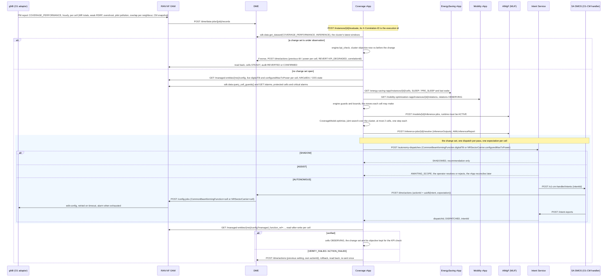

# Call Flow: Coverage Optimization rApp — Coverage PM → Joint plan → Safety → Tilt / power → Verification → KPI check

The Coverage Optimization rApp (`samples/coverage-optimization-rapp/`; Wave 10.3 in
`docs/ROADMAP.md`) is the third reference rApp. It tunes a cluster
of cells' digital tilt and transmit power, jointly, from O1 coverage PM.
Like call flows 22 and 23, it uses the R1 control plane only; there is no
A1, Near-RT RIC, xApp or E2.

The diagram follows one pass of the closed loop for an AUTONOMOUS instance.
Training (on history in which tilt and power varied), validation,
emulation, certification and deployment come before it; they are the call
flow 02 / 17 lifecycle.

**Key decisions this flow depends on:**

- **Tilt plus transmit power** (D10.3-1).
  `CommonBeamformingFunction.digitalTilt` is in tenths of a degree, with
  positive meaning downtilt. `NRSectorCarrier.configuredMaxTxPower` is in
  dBm in this build. One knob moves per cell per change, and each write is
  read back.
- **Joint neighbour optimisation** (D10.3-2). The model has 12 learned
  sensitivities: three problem shares × own tilt, own power, neighbours'
  tilt and neighbours' power. Neighbour effects are weighted by the
  measured overlap. The optimiser scores every move set of up to two cells
  by the cluster objective, plus a cost per moved cell:
  - the objective is the sum of every share's excess over 5 %;
  - a move set must beat doing nothing by at least 0.75;
  - no cell's own excess may be predicted to grow by more than 0.5.

  Because neighbour terms are in the model, pollution is treated at its
  source.
- **Bounds and pacing** (D10.3-4a).
  - Tilt stays within baseline ± 4°, in 1° steps.
  - Power stays within baseline ± 3 dB, in 1 dB steps.
  - A cell changes at most once per 60 minutes.
  - A window needs at least 100 measurement reports.
- **KPI-verified revert of the whole change set** (D10.3-4b). While a set
  is OBSERVING nothing else moves. After 60 minutes of post-change PM the
  measured cluster objective is compared with its value before the change.
  If it is worse by more than 0.5, every cell in the set is reverted
  straight through DME, otherwise the set is CONFIRMED.
- **Coordination** (D10.3-4c). A cell is held in each of these cases:
  - it is asleep (O1 or EnergySaving SLEEP / PRE_SLEEP);
  - a neighbour is asleep;
  - it or a neighbour woke less than 30 minutes ago;
  - the Mobility rApp has one of its relations OBSERVING.

  Both rApps are read over R1, never written.
- **Protected cells** (D10.3-4d). EMERGENCY and incident-zone cells never
  move. An active critical alarm on the managed element holds every cell,
  because alarms carry no cell reference in this build. Every blocking
  guard is named in the decision's reason.
- **The audit trail** (`GET /instances/{id}/decisions`) has one row per
  cell per pass:
  Shares → Joint plan → Safety → Decision → Intent → Action → Verification
  → KPI → Rollback → Final state.
  The GUI's **Coverage** page shows the latest row per cell, the latest
  joint plan, and each cell's excess trend.
