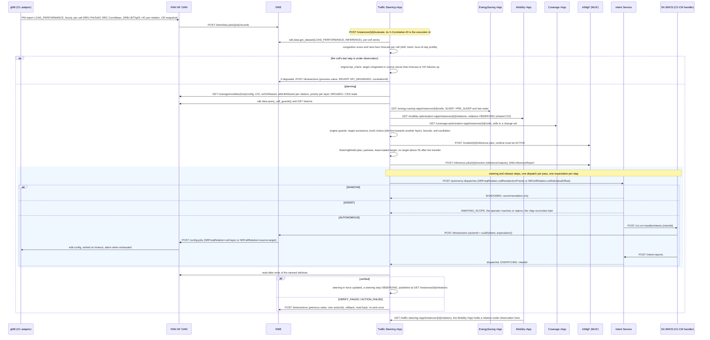

# Call Flow: Traffic Steering rApp — Load PM → Forecast → Safety → Idle priority / CIO → Verification → KPI check

The Traffic Steering rApp (`samples/traffic-steering-rapp/`; Wave 10.4 in
`docs/STANDARDS.md`) is the fourth reference rApp. It moves load off
congested cells:
* idle UEs, by the cell's reselection priority towards another frequency
  layer;
* connected UEs, by the neighbour relation's cell individual offset. That
  CIO is shared with the Mobility rApp (call flow 23).

Like call flows 22–24, it uses the R1 control plane only; there is no A1,
Near-RT RIC, xApp or E2.

The diagram follows one pass of the closed loop for an AUTONOMOUS instance.
Training (on history in which the biases varied), validation, emulation,
certification and deployment come before it; they are the call flow 02 /
17 lifecycle.

**Key decisions this flow depends on:**

- **Idle first, then connected** (D10.4-1).
  - **Idle:** for a target on another frequency layer, the source's
    `NRFreqRelation.cellReselectionPriority` towards that layer is raised by
    one, within baseline ± 2 and 0–7. This moves idle UEs, with no handover
    risk.
  - **Connected:** the relation's `cellIndividualOffset` is raised by 2 dB
    for a target on the same layer, or once the idle knob is at its bound.
  - **Release:** steering is stepped back the same way once the source is
    below 50.
- **Shared CIO** (D10.4-1).
  - **Envelope:** the Mobility and Traffic Steering rApps keep the CIO inside
    one envelope, baseline ± 6 dB, the DMRO bounds.
  - **Mutual hold:** each publishes the relations it is observing, and each
    holds a relation the other is observing.
  - **Release:** Traffic Steering releases only the bias it put on a
    relation itself.
  - **Never biased:** a relation with `isMLBAllowed` or `isHOAllowed` false.
- **Score, forecast and pairwise plan** (D10.4-2).
  - **Score:** 0.5·PRB % + 0.3·UE load % + 0.2·throughput deficit %.
  - **Forecast:** the next hour's score, from persistence, the last-hour
    trend and a learned hour-of-day profile.
  - **Steering:** a source forecast at 70 or more takes one step towards
    its least-loaded eligible neighbour. The transfer is predicted from the
    learned fraction per step, and no target may end above 55.
  - **Hysteresis:** nothing changes between 50 and 70.
- **Bounds and pacing** (D10.4-4a): one step per cell per pass, at least 60
  minutes between changes on a cell, and at least 10 PM samples per window.
- **KPI-verified revert** (D10.4-4b). After 60 minutes a step is reverted
  straight through DME if any of these hold:
  - the target became congested;
  - the source ended more than 2 points above its own no-steering forecast;
  - for a CIO step, the relation's handover failure rate rose by more than
    2 points.
- **Coordination** (D10.4-4c). A source is held if it is asleep or in a
  Coverage change set. A neighbour is not a target if it is asleep,
  pre-sleep, less than 30 minutes past a wake, or in a Coverage change set.
- **Protected cells and anti-oscillation** (D10.4-4d).
  - **Protected:** EMERGENCY and incident-zone cells are neither sources
    nor targets.
  - **Critical alarm:** an active critical alarm raised on a cell holds it
    as a source and excludes it as a target (`TARGET_CRITICAL_ALARM`); one
    that names no cell holds the whole managed element.
  - **Anti-oscillation:** a cell that steered load to this one in the last
    6 hours is not a target, so load does not ping-pong.
- **The audit trail** (`GET /instances/{id}/decisions`) has one row per
  cell per pass:
  Score / forecast → Safety and excluded targets → Plan → Intent → Action →
  Verification → KPI → Rollback → Final state.
  The GUI's **Traffic Steering** page shows the latest row per cell and the
  steering in force.
