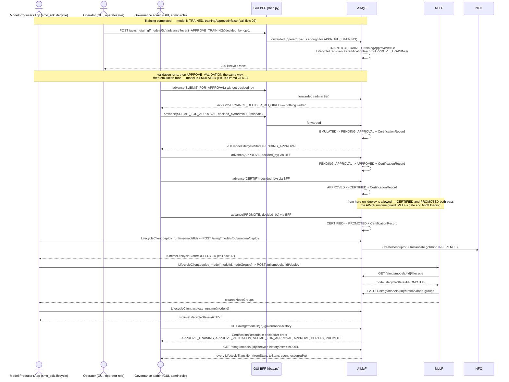
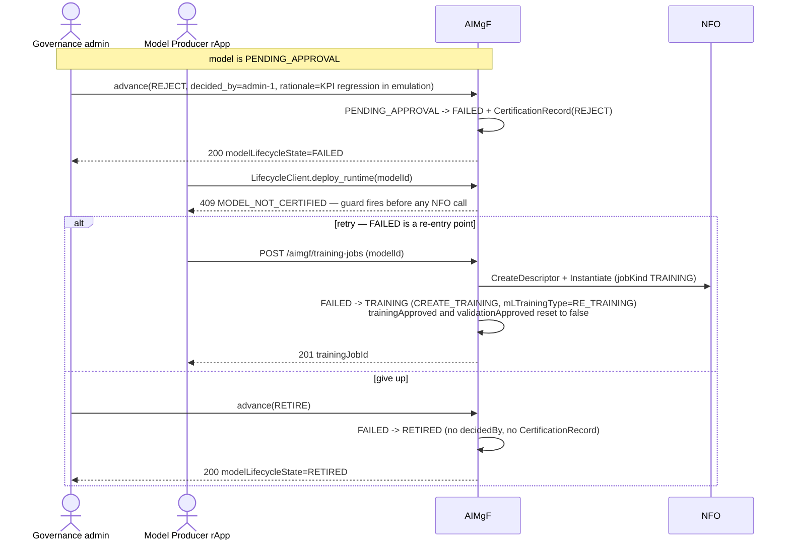
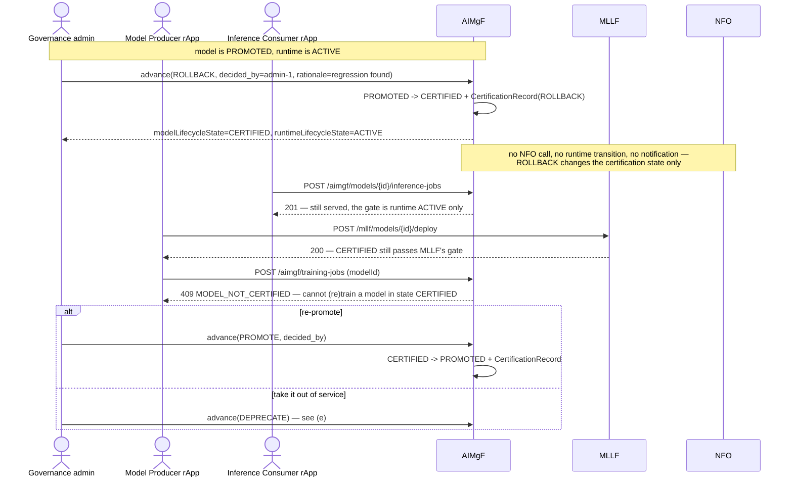
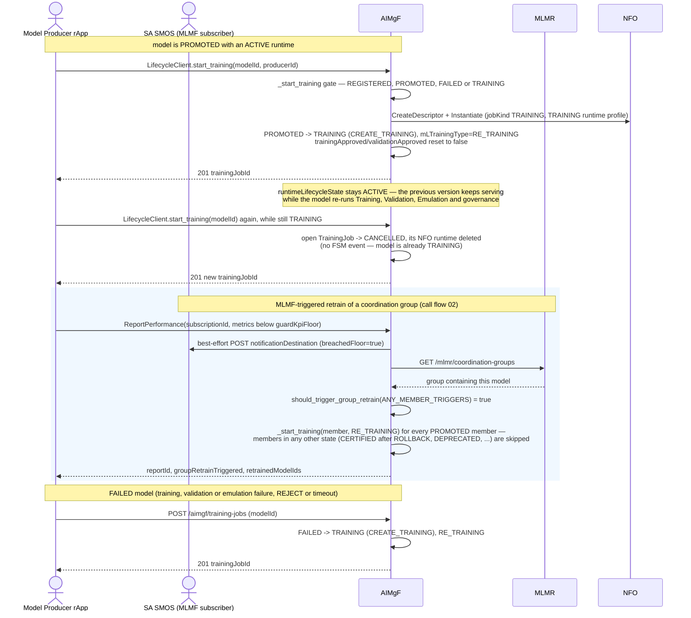
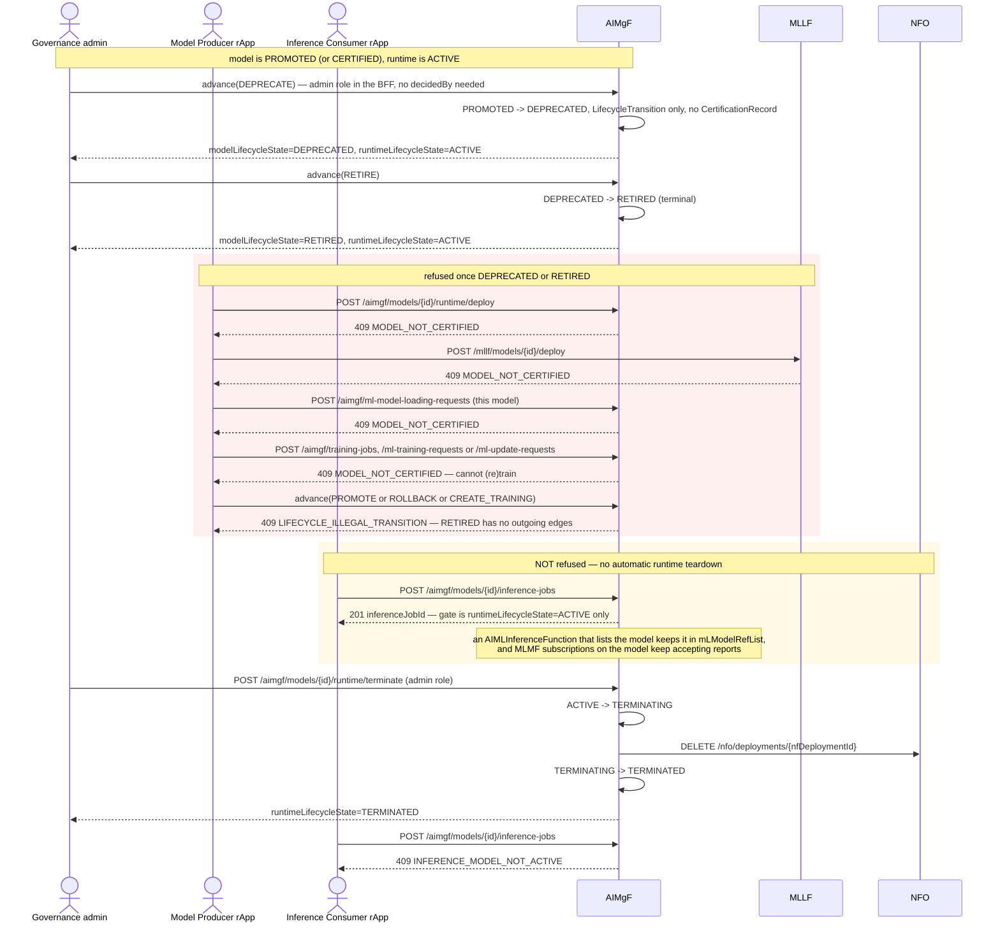

# Call Flow: AI/ML Model Governance and End of Life — Approve → Certify → Promote → Rollback → Deprecate → Retire (and Retrain)

The governance half of AIMgF's 14-state `ModelLifecycle` FSM (`aimgf/app/statemachine.py`):
the operator decisions that take an emulated model to `PROMOTED`, the paths back out of
it (`ROLLBACK`, retrain, `REJECT`), and end of life (`DEPRECATE` → `RETIRE`). Call flow 02
shows the whole pipeline at a high level and call flow 17 the serving runtime; this flow
covers what each governance event does, what it writes, and what it leaves unchanged.

Every event in this flow goes through one route, `POST /aimgf/models/{id}/advance?event=…
&decided_by=…&rationale=…`. Producer rApps call it through
`sdk.lifecycle.LifecycleClient.advance_model_lifecycle(model_id, event, decided_by,
rationale)`, and the GUI calls it through the BFF. `_fire_model_event` (`aimgf/app/main.py`)
fires the FSM and writes a `LifecycleTransition` row (`fsm=MODEL`) for every event. For the
eight `GOVERNANCE_EVENTS` it also requires `decidedBy` (422 `GOVERNANCE_DECIDER_REQUIRED`
otherwise) and writes a `CertificationRecord`. `DEPRECATE` and `RETIRE` are not governance
events: they need no `decidedBy` and leave no `CertificationRecord`. No governance event
sends a notification (no webhook and no MLMF push), and none of them touches the
`RuntimeLifecycle` columns on the same row.

**ModelLifecycle transitions (from `build_model_lifecycle_fsm`):**

| From | Event | To | `decidedBy` + `CertificationRecord` | Fired by |
|---|---|---|---|---|
| `REGISTERED` | `CREATE_TRAINING` | `TRAINING` | — | `POST /training-jobs`, `/ml-training-requests`, `/ml-update-requests` |
| `TRAINING` | `TRAINING_COMPLETE` / `TRAINING_FAILED` | `TRAINED` / `FAILED` | — | `POST /training-jobs/{id}/complete`, timeout sweep (failure only) |
| `TRAINED` | `APPROVE_TRAINING` | `TRAINED` (self-loop, sets `trainingApproved`) | yes | `advance` |
| `TRAINED` | `CREATE_VALIDATION` | `VALIDATING` | — | `POST /validation-jobs`, `/ml-testing-requests` |
| `VALIDATING` | `VALIDATION_COMPLETE` / `VALIDATION_FAILED` | `VALIDATED` / `FAILED` | — | `.../complete`, testing-request cancel, timeout sweep |
| `VALIDATED` | `APPROVE_VALIDATION` | `VALIDATED` (self-loop, sets `validationApproved`) | yes | `advance` |
| `VALIDATED` | `CREATE_EMULATION` | `EMULATING` | — | `POST /emulation-jobs` |
| `EMULATING` | `EMULATION_COMPLETE` / `EMULATION_FAILED` | `EMULATED` / `FAILED` | — | `.../complete`, timeout sweep |
| `EMULATED` | `SUBMIT_FOR_APPROVAL` | `PENDING_APPROVAL` | yes | `advance` |
| `PENDING_APPROVAL` | `APPROVE` | `APPROVED` | yes | `advance` |
| `PENDING_APPROVAL` | `REJECT` | `FAILED` | yes | `advance` |
| `APPROVED` | `CERTIFY` | `CERTIFIED` | yes | `advance` |
| `CERTIFIED` | `PROMOTE` | `PROMOTED` | yes | `advance` |
| `CERTIFIED` | `DEPRECATE` | `DEPRECATED` | — | `advance` |
| `PROMOTED` | `ROLLBACK` | `CERTIFIED` | yes | `advance` |
| `PROMOTED` | `DEPRECATE` | `DEPRECATED` | — | `advance` |
| `PROMOTED` | `CREATE_TRAINING` | `TRAINING` (retrain) | — | training routes, MLMF group retrain |
| `FAILED` | `CREATE_TRAINING` | `TRAINING` (retry) | — | training routes |
| `FAILED` | `RETIRE` | `RETIRED` | — | `advance` |
| `DEPRECATED` | `RETIRE` | `RETIRED` | — | `advance` |
| `RETIRED` | (none) | terminal | — | — |

Any other (state, event) pair returns 409 `LIFECYCLE_ILLEGAL_TRANSITION`. The GUI BFF
(`gui-bff/app/rbac.py`) restricts `SUBMIT_FOR_APPROVAL`, `APPROVE`, `REJECT`, `CERTIFY`,
`PROMOTE`, `ROLLBACK`, `DEPRECATE` and `RETIRE` to the admin role. Every other `advance` event,
including `APPROVE_TRAINING`/`APPROVE_VALIDATION`, is allowed for the operator role.

**What each state allows elsewhere:**

| Model state | Training start | Runtime deploy (AIMgF) / MLLF deploy / NRM loading | Inference (runtime `ACTIVE`) |
|---|---|---|---|
| `REGISTERED`, `FAILED`, `PROMOTED` | allowed | `PROMOTED` only | allowed |
| `TRAINING` | allowed (supersedes the open job) | 409 `MODEL_NOT_CERTIFIED` | allowed |
| `CERTIFIED` | 409 `MODEL_NOT_CERTIFIED` | allowed | allowed |
| `DEPRECATED`, `RETIRED`, any other | 409 `MODEL_NOT_CERTIFIED` | 409 `MODEL_NOT_CERTIFIED` | allowed |

The inference column holds because `request_inference` checks only
`runtimeLifecycleState == ACTIVE` and never reads the model state.

## (a) Governed path to PROMOTED

## (b) REJECT, then retry or retire

## (c) ROLLBACK PROMOTED → CERTIFIED

## (d) Retrain from PROMOTED (direct or MLMF-triggered) and from FAILED

## (e) DEPRECATE → RETIRE, and what is refused afterwards

**Key decisions this flow depends on:**
- One route, `POST /models/{id}/advance`, carries every governance and end-of-life event. The SDK's `advance_model_lifecycle` is a thin pass-through, and the GUI BFF's RBAC is the only place that separates admin-only events from operator-tier ones.
- The eight `GOVERNANCE_EVENTS` (`SUBMIT_FOR_APPROVAL`, `APPROVE`, `REJECT`, `CERTIFY`, `PROMOTE`, `ROLLBACK`, `APPROVE_TRAINING`, `APPROVE_VALIDATION`) require `decidedBy` and each writes a `CertificationRecord` (`GET /models/{id}/governance-history`). Every transition, governance or not, writes a `LifecycleTransition` (`GET /models/{id}/lifecycle-history?fsm=MODEL`). `DEPRECATE` and `RETIRE` appear only in the latter (HISTORY.md OI-6.1).
- `ModelLifecycle` and `RuntimeLifecycle` are independent FSMs on one row. `ROLLBACK`, `DEPRECATE`, `RETIRE` and retraining never change `runtimeLifecycleState`, never call NFO and never notify anyone. Taking a deprecated or retired model out of service is a separate, explicit `runtime/terminate` call (admin role). Until that call, inference keeps working. OPEN_ITEMS.md OI-6.1-runtime-gate covers the related open question of operator gates on runtime transitions.
- The deploy gate is `CERTIFIED` or `PROMOTED`, applied in three places: AIMgF `runtime/deploy` (before any NFO call), MLLF `POST /models/{id}/deploy`, and NRM loading (`_check_loadable`). A rolled-back (`CERTIFIED`) model therefore stays deployable.
- Retraining re-enters at `TRAINING` from `REGISTERED`, `PROMOTED` or `FAILED`, never from `CERTIFIED`, `DEPRECATED` or `RETIRED`. Retraining has no lightweight update path. A fresh `CREATE_TRAINING` resets `trainingApproved`/`validationApproved`, so a new cycle needs new operator approvals. MLMF group retrain only picks up members that are `PROMOTED` at the time of the breach.
- `REJECT` sends the model to `FAILED`, which is the shared failure and retry state, the same one a failed or timed-out Training/Validation/Emulation run lands in (call flow 27). From `FAILED`, the model can be retrained or retired.
- `RETIRED` is terminal: it has no outgoing FSM edge, and AIMgF refuses every route that would start new work on the model with 409.
