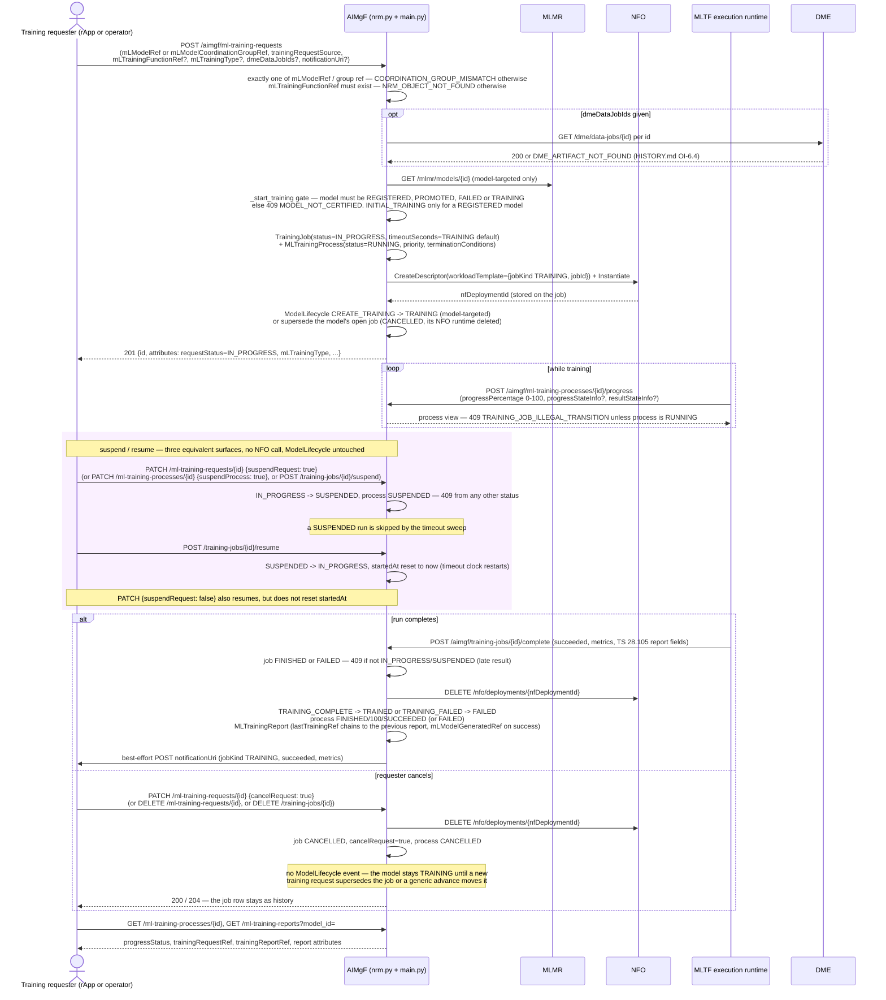
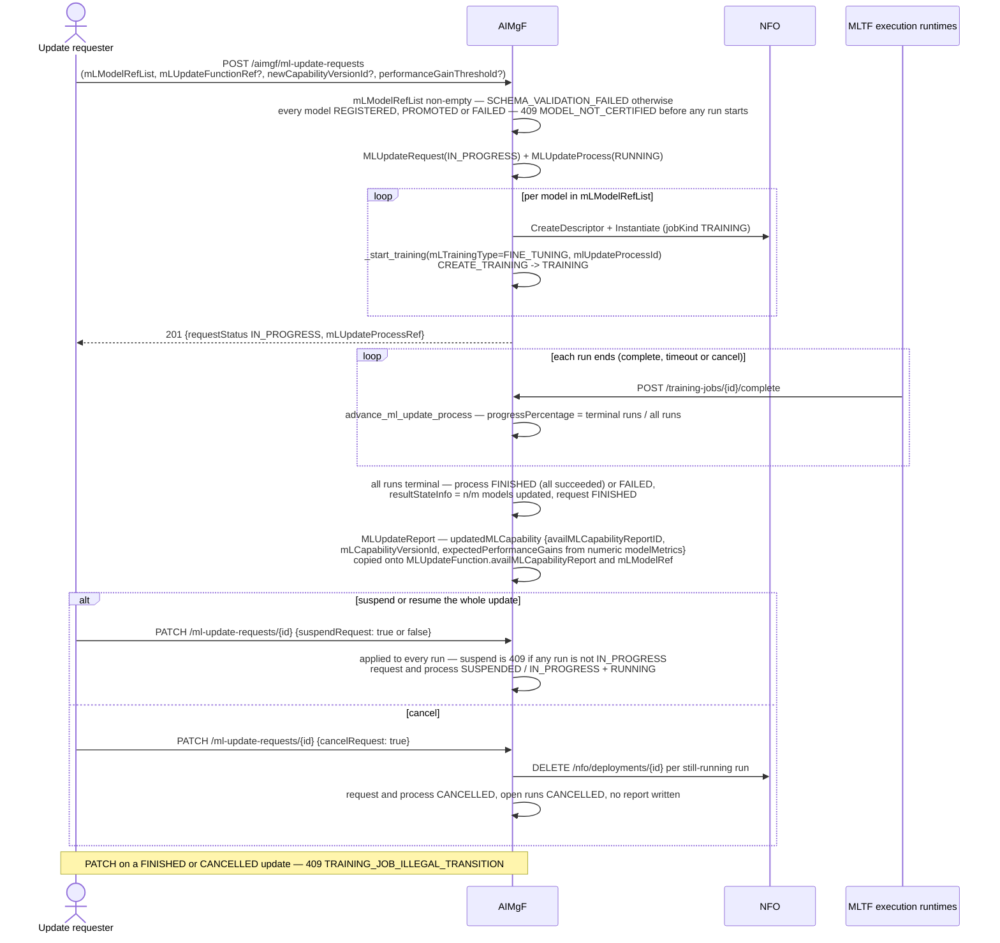
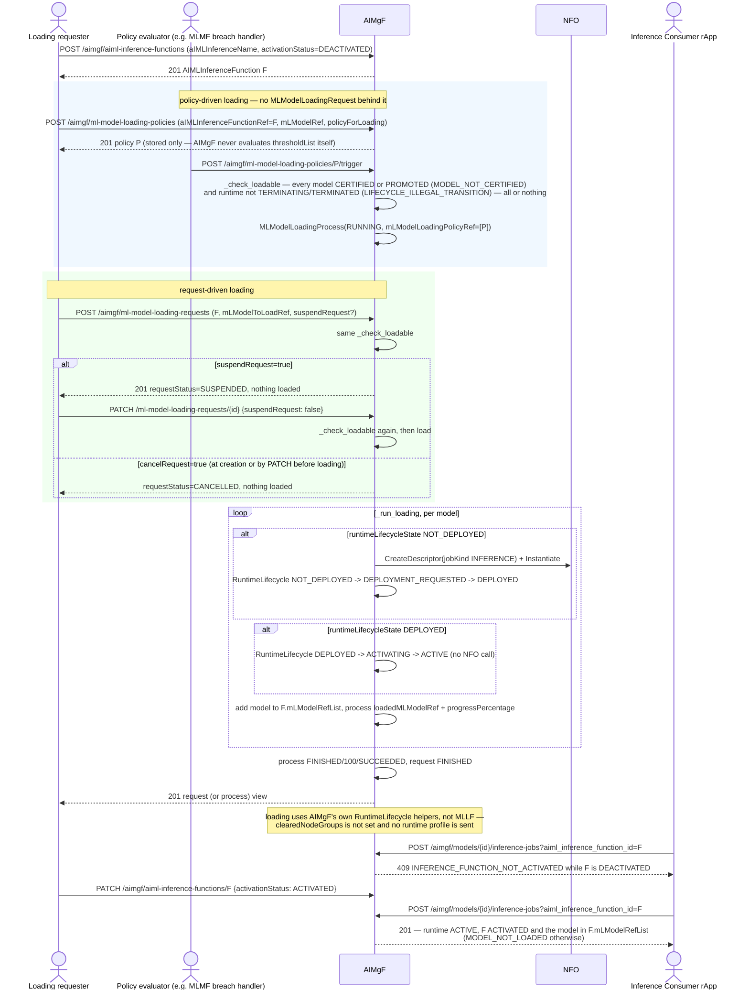
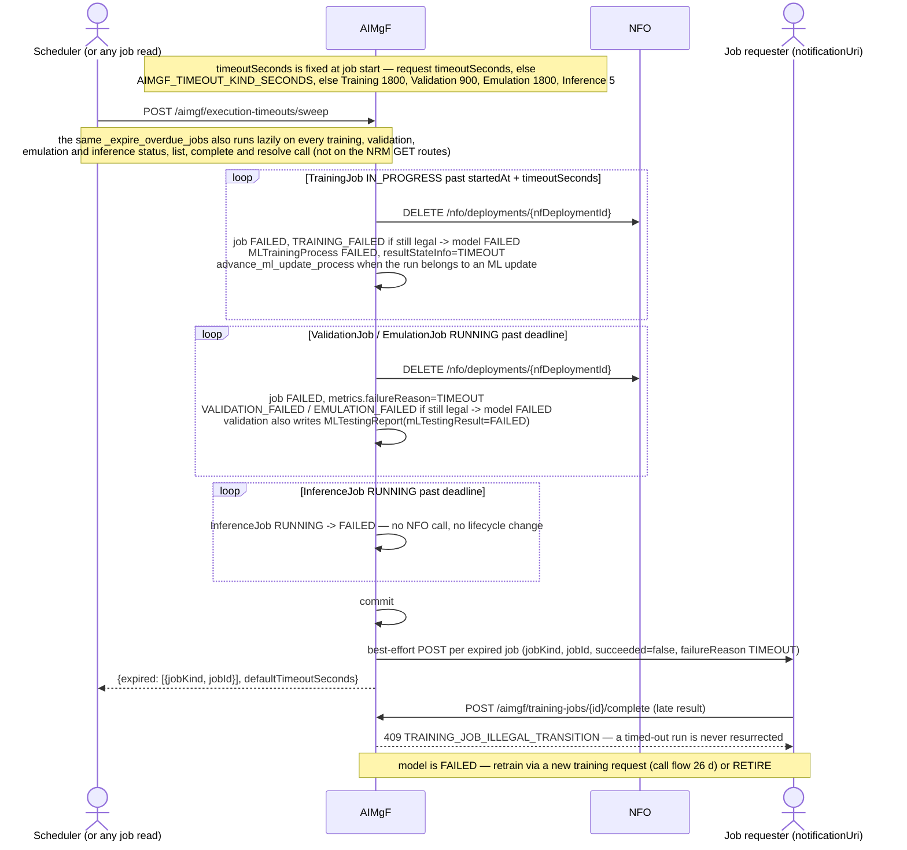

# Call Flow: TS 28.105 Provisioning Resources — Training Request/Process, Update Request, Model Loading Policy/Request, Execution Timeouts

AIMgF exposes every TS 28.105 AI/ML NRM IOC it owns as a flat REST resource with the spec's
own attribute names (`aimgf/app/nrm.py`, HISTORY.md W4, `docs/ROADMAP.md` TS 28.105 matrix).
The request resources are not a separate bookkeeping layer. An `MLTrainingRequest` *is* a
`TrainingJob`, and an `MLTestingRequest` *is* a `ValidationJob`. Both start through the same
`_start_training` / `_start_validation` core as `POST /training-jobs` and
`POST /validation-jobs`. As a result, the `ModelLifecycle` gate, the operator approvals (call
flow 26), the NFO execution runtime and the stage timeouts (HISTORY.md W7) apply the same way
whichever surface a caller uses. This flow covers the provisioning side: training
request/process/report, ML update, model loading, and the per-execution-mode timeout sweep.

**Status vocabularies (from the code):**

| Resource | Values produced | Notes |
|---|---|---|
| `MLTrainingRequest.requestStatus` (= `TrainingJob.status`) | `IN_PROGRESS`, `SUSPENDED`, `FINISHED`, `FAILED`, `CANCELLED` | `NOT_STARTED`/`CANCELLING` never produced: start and cancel are synchronous |
| `MLTrainingProcess.progressStatus.status` | `RUNNING`, `SUSPENDED`, `FINISHED`, `FAILED`, `CANCELLED` | mapped from the job by `_sync_training_process` |
| `MLTestingRequest.requestStatus` | `IN_PROGRESS`, `SUSPENDED`, `FINISHED`, `CANCELLED` | outcome is in `MLTestingReport.mLTestingResult` |
| `MLUpdateRequest.requestStatus` / `MLUpdateProcess` status | `IN_PROGRESS`/`SUSPENDED`/`FINISHED`/`CANCELLED` / `RUNNING`/`SUSPENDED`/`FINISHED`/`FAILED`/`CANCELLED` | request is `FINISHED` even when the process `FAILED` |
| `MLModelLoadingRequest.requestStatus` | `SUSPENDED`, `FINISHED`, `CANCELLED` (`IN_PROGRESS` only inside the call) | loading is synchronous |

## Training request → process → report, suspend/resume, cancel

## ML update request → FINE_TUNING runs → update report

## Model loading — policy trigger and loading request

## Execution timeouts — per-mode sweep (Wave 7)

**Key decisions this flow depends on:**
- One start path. `POST /ml-training-requests`, `POST /training-jobs`, MLMF group retrain and `POST /ml-update-requests` all call `_start_training`, so every run gets the same lifecycle gate, NFO execution runtime, `MLTrainingProcess` and default timeout. The same holds for `POST /ml-testing-requests` and `POST /validation-jobs` through `_start_validation`, including the `APPROVE_TRAINING` gate (HISTORY.md OI-6.1, OI-6.2).
- `mLTrainingType` is derived as `INITIAL_TRAINING` for a `REGISTERED` model and `RE_TRAINING` otherwise. A requester may name `PRE_SPECIALISED_TRAINING` or `FINE_TUNING`, and an ML update always uses `FINE_TUNING`. Naming `INITIAL_TRAINING` for a model that has already been trained returns 409 `LIFECYCLE_ILLEGAL_TRANSITION`.
- Suspend and resume are plain job status flips. They make no NFO call, and the execution runtime stays up while the run is suspended. They do not touch `ModelLifecycle`. A suspended training run never times out, and `POST /training-jobs/{id}/resume` restarts its clock.
- Cancelling a training run tears down its NFO runtime and marks the job and process `CANCELLED`, but fires no `ModelLifecycle` event. Cancelling a testing request (`PATCH /ml-testing-requests/{id} {cancelRequest}`) fires `VALIDATION_FAILED`, which moves the model to `FAILED`.
- An ML update is all-or-nothing at start and per-run afterwards. It finishes when every run is terminal. Its process is `FINISHED` only if every run succeeded, and the `MLUpdateReport` lists only the models that succeeded.
- Model loading checks every model up front (`CERTIFIED`/`PROMOTED`, runtime not terminating), then brings each runtime to `ACTIVE` through AIMgF's own `RuntimeLifecycle` and NFO (call flow 17). MLLF is not involved. A loading policy is stored data plus an explicit `/trigger`, and nothing in AIMgF evaluates its `thresholdList`. There is no unload operation: cancelling a loading request does not remove anything already loaded.
- Inference through an `AIMLInferenceFunction` needs three things: a runtime in `ACTIVE`, a function in `ACTIVATED`, and the model in the function's `mLModelRefList`.
- Execution timeouts (HISTORY.md W7, `docs/ROADMAP.md` "Runtime profiles and timeouts") fail an overdue run cleanly. The run's status becomes `FAILED`, its NFO runtime is deleted, and the model's stage is failed only when that transition is still legal (`_fire_if_legal`), so there is no lifecycle corruption. The requester is notified with `failureReason: TIMEOUT`, and a late completion or resolve returns 409. An inference timeout fails only the `InferenceJob`.
- Runs started through the NRM surface (`MLTrainingRequest`, `MLTestingRequest`, `MLUpdateRequest`) take no `packageId`/`runtimeProfile`/`timeoutSeconds`. Their NFO runtime is unsized and they use the deployment-wide default timeout. Per-run sizing and timeout overrides are available only on the `/training-jobs`-style routes (W7-03, W7-04).
